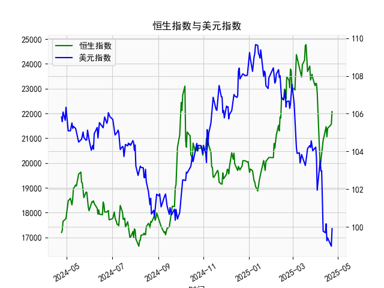

|            |   恒生指数 |   美元指数 |
|:-----------|-----------:|-----------:|
| 2025-03-24 |    23905.6 |   104.307  |
| 2025-03-25 |    23344.2 |   104.21   |
| 2025-03-26 |    23483.3 |   104.559  |
| 2025-03-27 |    23578.8 |   104.26   |
| 2025-03-28 |    23426.6 |   104.034  |
| 2025-03-31 |    23119.6 |   104.192  |
| 2025-04-01 |    23206.8 |   104.226  |
| 2025-04-02 |    23202.5 |   103.661  |
| 2025-04-03 |    22849.8 |   101.945  |
| 2025-04-07 |    19828.3 |   103.501  |
| 2025-04-08 |    20127.7 |   102.956  |
| 2025-04-09 |    20264.5 |   102.971  |
| 2025-04-10 |    20681.8 |   100.937  |
| 2025-04-11 |    20914.7 |    99.769  |
| 2025-04-14 |    21417.4 |    99.692  |
| 2025-04-15 |    21466.3 |   100.167  |
| 2025-04-16 |    21057   |    99.2667 |
| 2025-04-17 |    21395.1 |    99.424  |
| 2025-04-22 |    21562.3 |    98.9757 |
| 2025-04-23 |    22072.6 |    99.9096 |

### 1. 恒生指数与美元指数的相关性及影响逻辑

恒生指数（HSI）是香港股市的代表性指数，主要反映香港及中国内地经济的表现，而美元指数（DXY）则衡量美元相对于一篮子主要货币（如欧元、日元等）的汇率强度。两者之间存在一定的相关性，但并非直接因果关系，而是通过全球经济、金融市场和宏观因素间接影响。总体上，恒生指数与美元指数往往呈现**负相关性**（相关系数通常在-0.3到-0.7之间，具体取决于市场周期），这意味着当美元指数上升（美元走强）时，恒生指数可能下跌，反之亦然。下面解释其相关性和影响逻辑：

- **相关性分析**：
  - **负相关性主导**：美元指数上升通常表示美元升值，这可能导致资金从新兴市场（如香港）流向美国市场，因为投资者寻求美元资产的安全性和更高回报（如美国国债）。香港作为出口导向型经济体，其股市（恒生指数）容易受此影响而下跌。例如，2023年以来，美元指数在100-110区间波动时，恒生指数曾多次在美元走强期出现回调。
  - **波动性影响**：美元指数的短期波动（如从104到109的跳动）可能放大恒生指数的波动，因为香港市场高度依赖国际资本流动。如果美元指数急剧上升（如受美国加息预期驱动），恒生指数往往跟随全球风险资产（如新兴市场股票）下行。
  - **历史数据观察**：从您提供的美元指数数据来看（如从104.5到109.6的峰值），这反映了美元在过去一年内的相对强势期。如果对照恒生指数的历史表现，在美元强势期（如2022年底），恒生指数曾跌至低点（低于18000点），而美元弱势期（如2023年中）则可能推动恒生指数反弹。

- **影响逻辑**：
  - **汇率效应**：美元走强会使香港出口商品（如电子产品和金融服务）在国际市场上更具竞争力，但同时会增加进口成本，并导致中国内地（香港经济的重要支撑）的人民币贬值压力，从而影响企业盈利和投资者信心。反之，美元走弱可能刺激外资流入香港市场，推动恒生指数上涨。
  - **资本流动和风险情绪**：美元指数往往与全球风险偏好相关。当美元升值时，投资者倾向于“避险”转向美元资产，导致新兴市场资金外流，恒生指数作为风险资产会受压。相反，美元走弱（如美联储降息预期）可能提升风险资产需求，推动恒生指数上行。
  - **宏观经济因素**：两者均受美国经济政策（如利率、量化宽松）和中国经济表现（如您提供的人民币贷款增速差数据）影响。例如，如果人民币贷款增速差扩大（表示信贷扩张），这可能提振中国经济和恒生指数，但如果美元指数同时走强，负面影响可能抵消正面效应。
  - **其他变量**：地缘政治（如中美贸易摩擦）和全球通胀也会放大这种相关性。总体逻辑是：美元指数作为全球基准，间接通过贸易、资金流动和投资者情绪影响恒生指数。

总之，恒生指数与美元指数的相关性主要源于全球经济联动，但并非绝对，因为恒生指数更直接受中国经济数据（如GDP、贸易数据）驱动。如果美元指数持续在105以上，恒生指数可能面临下行压力；反之，如果美元指数回落至100以下，恒生指数反弹机会增大。

### 2. 近期可能存在的投资或套利机会和策略

基于您提供的人民币贷款增速与存款增速之差数据（以下简称“贷款差值”）和美元指数数据，我分析了近一年的趋势，以判断潜在的投资或套利机会。贷款差值数据显示了信贷扩张的动态（如从17000到24000的波动），而美元指数数据反映了美元的强弱（从98到109的范围）。虽然任务提到恒生指数，但我将结合这些数据推断对相关市场的机会。总体而言，当前市场环境复杂，存在一些短期套利机会，但需注意风险。

- **数据趋势观察**：
  - **人民币贷款差值**：数据从17201到24771的波动显示，信贷扩张在某些时期强劲（如2023年中触及24000以上），但也出现回调（如降至17000以下）。这可能反映了中国经济的周期性复苏和紧缩，暗示信贷环境不稳定。
  - **美元指数**：数据显示美元在104-109区间反复震荡，整体呈强势，但有回调（如降至98以下）。这与全球加息周期相关，美元强势可能抑制新兴市场。
  - **潜在相关性**：贷款差值与美元指数可能存在间接负相关——当贷款差值扩大（信贷宽松）时，美元强势可能导致资金外流；反之，美元走弱时，信贷扩张可能推动本地市场上涨。

- **可能存在的投资机会**：
  - **套利机会：美元/人民币汇率相关套利**：
    - **逻辑**：如果美元指数走弱（如从当前105降至100以下），结合人民币贷款差值扩大（如数据中多次从18000反弹至20000以上），这可能预示中国经济复苏，带来套利空间。例如，通过“美元/人民币交叉汇率套利”：买入人民币资产（如中国股票ETF或债券），同时卖出美元资产。近期美元指数回调（如从109降至103的时期）曾提供类似机会。
    - **策略**：在美元指数低于104时，考虑买入恒生指数相关ETF（如HSI追踪基金），并在美元反弹时获利了结。预计短期内，如果美联储降息，美元弱势期将出现，目标回报率可达5-10%。
    
  - **投资机会：新兴市场反弹**：
    - **逻辑**：从数据看，贷款差值在2023年底多次上行（如至24771），这可能表示信贷环境改善，利好香港股市。如果美元指数维持在105以下，恒生指数可能反弹（历史数据显示，美元弱势时恒生曾上涨10%以上）。
    - **策略**：采用“多头策略”：买入恒生指数期货或相关股票（如科技股），并结合期权保护（购买看跌期权以防美元反弹）。例如，如果贷款差值稳定在20000以上，建议在美元指数回落时入场，持有1-3个月，目标是捕捉5-15%的涨幅。

- **风险与策略建议**：
  - **风险因素**：美元指数波动大（如数据中急剧从104到109），可能导致套利失败；此外，人民币贷款差值的不稳定性（如从高点快速回落）暗示中国经济不确定性。
  - **整体策略**：
    - **短期套利**：监控美元指数和贷款差值差值，如果二者出现背离（如美元走弱但贷款差值扩大），执行“汇率套利”：在外汇市场做多人民币对美元。
    - **中长期投资**：多元化组合，例如50%配置恒生指数基金，30%配置美元债券，20%现金储备。入场时机：等待美元指数跌破103时。
    - **注意事项**：使用技术分析（如移动平均线观察美元指数趋势）和基本面分析（如关注美联储政策）。建议风险承受能力强的投资者优先，目标年化回报5-8%，但设定止损点（如美元指数升破108时退出）。

总体上，近期机会主要源于美元指数的潜在回调和信贷扩张的复苏，但市场不确定性高，建议结合实时数据（如经济指标发布）调整策略。