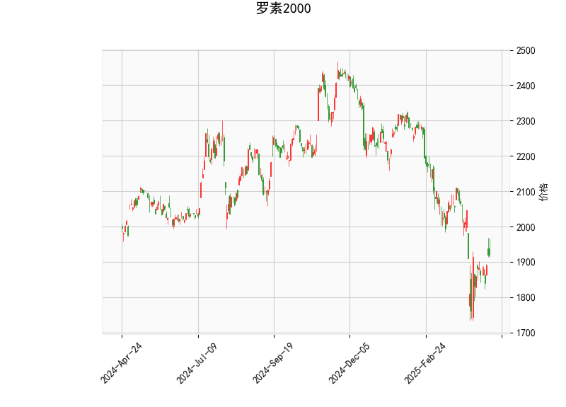

# 分析罗素2000指数的技术分析结果

罗素2000指数（Russell 2000）是代表美国小盘股表现的基准指数，其当前技术指标显示出市场可能处于相对弱势但潜在反弹的阶段。以下是对关键指标的详细分析：

- **当前价格（1919.1398）**：指数当前位于1919.14点，这是一个中性位置，但与历史高点相比处于较低水平。结合其他指标，这可能表示价格接近支撑区，短期内有测试下行风险或反弹的可能性。

- **RSI（相对强弱指数，47.01）**：RSI值处于47左右，表明指数处于中性区域（RSI通常以50为分界线，低于30为超卖，高于70为超买）。这个水平暗示市场没有明显超卖信号，但也未显示强势，潜在疲软状态可能预示短期修正或等待新动量。

- **MACD指标**：
  - MACD线（-44.38）和信号线（-56.67）：MACD线高于信号线（尽管两者均为负值），这形成了一个潜在的看涨交叉（Golden Cross）。这暗示短期内可能有反转信号，但整体MACD仍为负，表明熊市趋势尚未完全逆转。
  - MACD直方图（12.29）：直方图为正值，显示买入动量正在增加，这是一个积极信号，可能预示价格短期反弹。

- **Bollinger Bands（布林带）**：
  - 上轨（2358.56）、中轨（2062.58）和下轨（1766.59）：当前价格（1919.14）位于中轨和下轨之间，接近下轨。这表明指数处于波动率较低的区间，可能接近支撑位。如果价格触及或跌破下轨，可能会触发反弹；反之，如果向上突破中轨，则可能确认新趋势。

- **K线形态（CDLMATCHINGLOW）**：这是一个经典的看涨形态，通常出现在价格见底阶段，暗示市场可能从低点反弹。该形态结合其他指标（如MACD的正直方图），增强了短期乐观观点，但需警惕假突破风险。

总体而言，罗素2000指数的技术面显示出混合信号：RSI和MACD暗示潜在弱势和反转机会，而Bollinger Bands和K线形态支持短期反弹。指数可能正处于筑底阶段，但需关注外部因素如经济数据或市场情绪，以确认趋势。

# 近期可能存在的投资或套利机会和策略

基于上述分析，罗素2000指数短期内可能存在投资机会，特别是如果看涨信号（如MACD交叉和K线形态）得到确认。以下是对潜在机会的判断及策略建议：

### 投资机会分析
- **潜在机会**：指数当前价格接近Bollinger下轨，且K线形态显示看涨信号，结合MACD的正直方图，这可能预示短期反弹（例如，价格向上测试中轨或更高）。RSI接近中性水平，也为新多头动量提供了空间。然而，整体市场若继续下行（如受经济衰退影响），则风险较高。
- **风险因素**：小盘股指数如罗素2000对经济周期敏感，当前MACD仍为负值表明熊市压力未消。可能的下行风险包括通胀数据或美联储政策变化导致的波动。

### 投资策略建议
- **买入策略**：如果确认MACD交叉和K线形态，可考虑在当前价格附近买入罗素2000相关ETF（如IWM）或指数基金。目标位可设在中轨（2062.58）附近，止损位设在下轨以下（1766.59以下），以控制风险。等待RSI回升至50以上作为入场确认。
- **持有或观望策略**：对于现有持仓，短期内可持有以捕捉反弹，但设置动态止损（如低于当前价5%）。若RSI跌破40，则考虑减仓。
- **波段交易策略**：利用Bollinger Bands进行交易——在价格反弹至中轨时获利了结，或在触及下轨时加仓。结合K线形态，短期内可尝试小额建仓测试反弹。

### 套利机会分析
- **潜在套利机会**：罗素2000作为小盘股指数，可能与大盘股指数（如S&P 500）存在估值差异，尤其在市场动荡期。小盘股往往在经济复苏初期表现更强，因此当前的技术信号（如MACD正直方图）可能提供跨市场套利空间。同时，期权市场可用于低风险套利。
- **风险因素**：套利需依赖市场效率，任何突发事件（如地缘政治风险）可能放大波动，导致套利失败。

### 套利策略建议
- **指数套利策略**：如果罗素2000相对于S&P 500被低估（通过比较历史相关性），可进行多头罗素2000、空头S&P 500的配对交易。利用当前MACD信号，预计罗素2000反弹时获利。示例：买入IWM ETF，同时卖出SPY ETF的等值头寸，目标价差收敛。
- **期权套利策略**：卖出看跌期权（Put Option）以获利自当前低位（例如，卖出1915点附近看跌期权），并买入看涨期权（Call Option）以捕捉反弹。结合K线形态，这可形成牛市价差策略（Bull Call Spread），成本较低。若价格反弹至中轨，期权价值将增加。
- **统计套利策略**：监控罗素2000与大盘指数的均值回归——如果历史数据显示当前价差异常，可构建多/空组合。短期内，MACD的看涨交叉可作为触发点。

总之，近期投资机会主要聚焦于短期反弹策略，而套利机会强调跨资产或衍生品操作。建议结合基本面分析（如经济数据）和风险管理（如分散投资）来执行。最终决策应视个人风险偏好和市场条件而定。