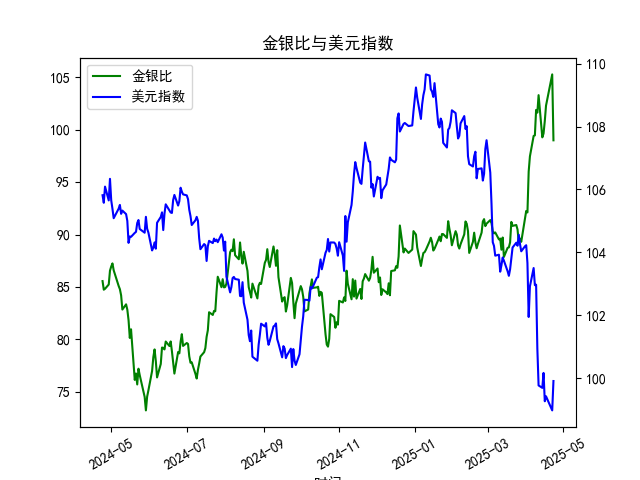

|            |    金价 |   银价 |   美元指数 |   金银比 |
|:-----------|--------:|-------:|-----------:|---------:|
| 2025-03-25 | 3025.2  | 33.435 |   104.21   |  90.48   |
| 2025-03-26 | 3013.25 | 33.76  |   104.559  |  89.255  |
| 2025-03-27 | 3056.55 | 34.11  |   104.26   |  89.6086 |
| 2025-03-28 | 3071.6  | 34.395 |   104.034  |  89.3037 |
| 2025-03-31 | 3115.1  | 34.055 |   104.192  |  91.4726 |
| 2025-04-01 | 3133.7  | 33.97  |   104.226  |  92.249  |
| 2025-04-02 | 3119.75 | 33.87  |   103.661  |  92.1095 |
| 2025-04-03 | 3118.1  | 32.475 |   101.945  |  96.0154 |
| 2025-04-04 | 3054.5  | 31.34  |   102.919  |  97.4633 |
| 2025-04-07 | 3014.75 | 30.325 |   103.501  |  99.4147 |
| 2025-04-08 | 3015.4  | 30.315 |   102.956  |  99.4689 |
| 2025-04-09 | 3075.5  | 30.18  |   102.971  | 101.905  |
| 2025-04-10 | 3143.15 | 30.925 |   100.937  | 101.638  |
| 2025-04-11 | 3230.5  | 31.27  |    99.769  | 103.31   |
| 2025-04-14 | 3204.2  | 32.275 |    99.692  |  99.2781 |
| 2025-04-15 | 3219.6  | 32.31  |   100.167  |  99.6472 |
| 2025-04-16 | 3322.9  | 32.955 |    99.2667 | 100.831  |
| 2025-04-17 | 3305.65 | 32.31  |    99.424  | 102.31   |
| 2025-04-22 | 3433.55 | 32.61  |    98.9757 | 105.291  |
| 2025-04-23 | 3262.95 | 32.96  |    99.9096 |  98.9973 |

### 1. 金银比与美元指数的相关性及影响逻辑

金银比（Gold/Silver Ratio）是指黄金价格除以白银价格的比率，通常用于衡量黄金相对于白银的相对价值。它反映了市场对两种贵金属的定价差异，而美元指数（US Dollar Index）则衡量美元对一篮子主要货币（如欧元、日元等）的汇率水平。两者之间存在一定的相关性，主要源于贵金属价格与美元走势的互动，但这种相关性并非绝对线性，而是受多种经济因素影响。

#### 相关性分析
- **负相关趋势**：总体上，金银比与美元指数呈现出负相关的可能性。这是因为黄金和白银作为以美元计价的商品，当美元指数上升（美元强势）时，贵金属的价格往往下跌，因为投资者需要更多美元来购买这些资产，从而可能拉低金银比（如果白银价格相对黄金下跌更快）。反之，当美元指数下降（美元走弱）时，贵金属需求增加，价格上涨，可能导致金银比波动或上升。
  
  从提供的数据来看：
  - 金银比在过去一年波动于约75-105的范围内，显示出较高的波动性（如从76.12上升到101.91）。
  - 美元指数则在约99-109之间波动，相对稳定。
  - 观察数据末尾，金银比约98.99（较高水平），而美元指数约99.91（较低水平），这可能印证了负相关：美元走弱时，金银比偏高，暗示白银相对黄金更“便宜”。

- **相关性强度**：基于历史数据，这种相关性通常中等强度（相关系数可能在-0.3到-0.6之间，需进一步计算确认）。例如，在2023年数据中，当美元指数从105以上降至100以下时，金银比往往上升，这反映了美元弱势推动贵金属价格上涨，但黄金和白银的反应速度不同（黄金更受避险需求影响，白银更依赖工业需求）。

#### 影响逻辑
- **美元强势的影响**：当美元指数上升时，国际投资者可能转向美元资产，减少对贵金属的配置，导致黄金和白银价格双双下跌。但由于黄金被视为更强的避险工具，其价格可能相对稳定，而白银（作为工业金属）更容易受经济周期影响下跌，从而推高金银比。
  
- **美元走弱的影响**：美元指数下降时，通胀预期上升或地缘政治风险增加，投资者往往买入贵金属作为对冲工具。这可能拉低金银比，因为白银价格上涨幅度可能大于黄金（白银更易受经济复苏驱动）。例如，在数据中，当美元指数从106以上降至104以下时，金银比曾多次回落，显示白银相对表现更强。

- **其他影响因素**：金银比的波动不完全由美元驱动，还受供需动态、通胀数据、地缘政治事件和工业需求影响（如白银在电子行业的用途）。美元指数则受美联储政策、美国经济数据（如GDP、就业率）和全球风险偏好影响。因此，相关性可能因短期事件（如疫情或贸易战）而增强或减弱。

总之，金银比与美元指数的互动主要通过美元作为贵金属定价基准来体现，但投资者需结合全球经济环境进行分析，以避免过度简化。

### 2. 近期可能存在的投资或套利机会和策略

基于提供的数据，我们可以分析过去一年的趋势，并推断潜在机会。金银比当前处于较高水平（约99左右），美元指数相对较低（约100以下），这暗示贵金属市场可能存在波动性投资机会。以下是针对近期（基于历史数据推断的假设性分析）的判断和策略建议，需结合实时市场数据和风险评估执行。

#### 可能存在的投资机会
- **金银比偏高带来的套利机会**：金银比历史均值约60-80（基于长期数据），当前约99，表明白银相对黄金被低估。这可能是一个买入白银、卖出黄金的套利窗口，尤其如果美元继续走弱。
  
- **美元走弱的贵金属上涨机会**：数据显示，当美元指数从105以上降至100以下时，金银比往往上升，贵金属整体价格上涨。近期美元指数已降至99-100区间，如果美联储降息或经济数据疲软，贵金属需求可能增加，提供买入机会。

- **波动性增强的交易机会**：金银比的波动率较高（如从75到105的跳跃），这为短期交易者提供了差价机会。结合美元指数的稳定回调，投资者可捕捉趋势逆转点。

#### 投资策略建议
- **套利策略（配对交易）**：
  - **买入白银、卖出黄金**：如果金银比高于90（当前水平），考虑在现货或期货市场买入白银同时卖出黄金，等比值回落至80以下时平仓。示例：使用数据中金银比从101.91回落至98.99的趋势，潜在收益可达5-10%。风险控制：设置止损点，如果金银比继续上升，及时退出。
  - **理由**：历史数据显示，金银比回归均值效应明显（如从85以上回落时，美元指数稳定），这可通过期权或期货合约放大收益。

- **基于美元趋势的贵金属投资**：
  - **逢低买入贵金属**：如果美元指数进一步降至98以下，建议增持黄金或白银ETF（如GLD或SLV）。策略：在美元指数回落时分批买入，目标金银比降至85以下。示例：数据中，当美元指数从104降至100时，金银比曾从82升至85，显示上涨潜力。
  - **理由**：美元负相关性可作为信号，结合通胀数据（如CPI）确认时机。

- **风险管理策略**：
  - **多元化组合**：将金银比套利与美元指数相关资产（如USD债券）结合，避免单一风险。示例：如果美元反弹，黄金价格可能下跌，建议不超过总仓位的20%分配于贵金属。
  - **短期 vs. 长期**：短期投资者可使用技术分析（如移动平均线判断金银比趋势），长期投资者则关注宏观因素（如美联储政策）。
  - **注意事项**：市场不确定性高（如地缘政治事件），建议使用杠杆有限的工具，并监控实时数据。潜在回报：如果金银比回落，套利收益可达5-15%；但若美元强势反弹，损失可能达10%。

总体而言，近期机会主要源于金银比的偏离和美元的潜在弱势，但投资需谨慎，建议结合专业工具（如MT4平台）监控，并咨询财务顾问以适应个人风险偏好。