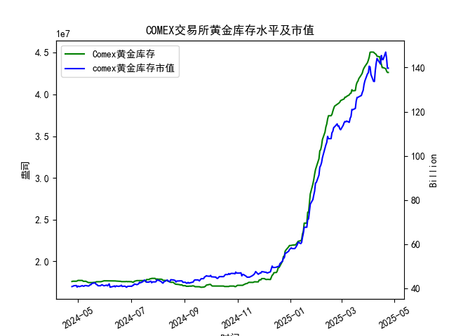

|            |   comex黄金库存量 |   comex黄金库存市值(billion) |   伦敦金现货价 |   上海金交所黄金现货价 |   美元兑人民币汇率 |
|:-----------|------------------:|-----------------------------:|---------------:|-----------------------:|-------------------:|
| 2025-03-28 |       4.33476e+07 |                       3090   |        3071.6  |                 721.03 |             7.1752 |
| 2025-03-31 |       4.38069e+07 |                       3130.9 |        3115.1  |                 730.8  |             7.1782 |
| 2025-04-01 |       4.41117e+07 |                       3120.6 |        3133.7  |                 735.84 |             7.1775 |
| 2025-04-02 |       4.4464e+07  |                       3162.3 |        3119.75 |                 732.5  |             7.1793 |
| 2025-04-03 |       4.50467e+07 |                       3112.6 |        3118.1  |                 738.94 |             7.1889 |
| 2025-04-04 |       4.50717e+07 |                       3035.6 |        3054.5  |                 738.94 |             7.1889 |
| 2025-04-07 |       4.50642e+07 |                       2968   |        3014.75 |                 713.98 |             7.198  |
| 2025-04-08 |       4.49537e+07 |                       2973.3 |        3015.4  |                 717.5  |             7.2038 |
| 2025-04-09 |       4.4872e+07  |                       3087.2 |        3075.5  |                 728.88 |             7.2066 |
| 2025-04-10 |       4.47928e+07 |                       3166   |        3143.15 |                 741.26 |             7.2092 |
| 2025-04-11 |       4.4576e+07  |                       3233   |        3230.5  |                 757.1  |             7.2087 |
| 2025-04-14 |       4.45116e+07 |                       3195   |        3204.2  |                 762.47 |             7.211  |
| 2025-04-15 |       4.40124e+07 |                       3216.5 |        3219.6  |                 762.9  |             7.2096 |
| 2025-04-16 |       4.36175e+07 |                       3334.3 |        3322.9  |                 781.62 |             7.2133 |
| 2025-04-17 |       4.32097e+07 |                       3323.1 |        3305.65 |                 786    |             7.2085 |
| 2025-04-18 |       4.32097e+07 |                       3323.1 |        3305.65 |                 788.62 |             7.2069 |
| 2025-04-21 |       4.30949e+07 |                       3411.1 |        3305.65 |                 804.11 |             7.2055 |
| 2025-04-22 |       4.28033e+07 |                       3371.6 |        3433.55 |                 825.8  |             7.2074 |
| 2025-04-23 |       4.26341e+07 |                       3276.9 |        3262.95 |                 786.99 |             7.2116 |
| 2025-04-24 |       4.26341e+07 |                       3276.9 |        3262.95 |                 786.99 |             7.2098 |

### 近期黄金市场套利机会分析与策略建议

#### 概述
基于提供的近一年数据，我对COMEX黄金库存量、库存市值、伦敦市场黄金现货价格、上海金交所黄金现货价格以及美元兑人民币汇率进行了分析。重点聚焦于最近一个月（约2025-03-24至2025-04-24）的仓单变化（即COMEX黄金库存量）。整体来看，黄金市场呈现出价格波动和库存调整的特征，潜在套利机会主要源于跨市场价格差异（如伦敦与上海金价的价差）、汇率影响以及库存动态。以下分析基于数据末尾的近期趋势，并提供实际可操作的策略建议。

#### 关键数据回顾与近期仓单变化分析
- **COMEX黄金库存量变化**：  
  近一年库存量从2024-04-24的约1.76e+07盎司大幅上升至2025-04-24的约4.26e+07盎司，显示整体供应增加。但在最近一个月，库存量呈现小幅下降趋势：  
  - 2025-04-18：4.32e+07盎司  
  - 2025-04-21：4.31e+07盎司  
  - 2025-04-22：4.28e+07盎司  
  - 2025-04-23：4.26e+07盎司  
  - 2025-04-24：4.26e+07盎司  
  这表明库存在短期内减少约6.0%，可能由于需求上升或供应紧缩。如果这一趋势持续，可能推动黄金价格进一步上涨，形成套利基础。

- **COMEX黄金库存市值**：  
  最近一个月市值保持在高位（末尾数据约139.71亿美元），反映黄金价格整体上涨。市值稳定但略有波动，暗示市场情绪积极，但未出现极端异常。

- **伦敦与上海金价对比**：  
  - 伦敦金价（USD/oz）：最近一个月从3305.65美元（2025-04-18）波动至3262.95美元（2025-04-24），整体稳定但有小幅下行。  
  - 上海金价（RMB/g）：从788.62元（2025-04-18）至786.99元（2025-04-24），同样稳定，但需通过汇率转换为美元/oz进行比较。  
  - 汇率（USD/CNY）：最近一个月在7.2055至7.2116之间微幅波动，整体稳定。  

  将上海金价转换为美元/oz（使用转换公式：上海金价（RMB/g） ÷ 汇率（USD/CNY） × 31.1035 g/oz），以评估价差：  
  - 例如，2025-04-24：  
    - 上海金价：786.99 RMB/g  
    - 汇率：7.2098 USD/CNY  
    - 转换后上海金价 ≈ (786.99 ÷ 7.2098) × 31.1035 ≈ 109.14 USD/g × 31.1035 ≈ 3395.5 USD/oz  
    - 伦敦金价：3262.95 USD/oz  
    - 价差：3395.5 - 3262.95 ≈ 132.55 USD/oz（上海价格更高）。  

  类似地，最近一个月价差整体为正（上海转换后价格高于伦敦），但波动性较小，平均价差约100-150 USD/oz。这反映了潜在的跨市场套利机会，但需考虑交易成本。

#### 可能存在的套利机会
1. **跨市场价格套利（伦敦 vs. 上海）**：  
   - **机会描述**：最近一个月，上海金价（转换后美元/oz） consistently 高于伦敦金价，表明伦敦市场可能更具竞争力。如果价差扩大（如超过50-100 USD/oz，考虑交易成本），投资者可在伦敦低价买入黄金现货，然后在上海高价卖出（或通过衍生品锁定）。这得益于汇率稳定和库存下降带来的价格压力。  
   - **近期具体机会**：  
     - 2025-04-22：伦敦金价为3433.55 USD/oz，上海转换后约为(825.80 ÷ 7.2074) × 31.1035 ≈ 114.48 USD/g × 31.1035 ≈ 3560 USD/oz，价差约126.45 USD/oz。这是一个相对明显的套利窗口，如果价差维持，操作空间较大。  
     - 总体，价差在100 USD/oz以上时，套利潜力显著，但需监控库存下降是否进一步拉大伦敦价格。  
   - **风险**：汇率波动可能放大或缩小价差（如人民币升值会降低上海价格竞争力）。此外，COMEX库存下降可能导致全球价格上涨，缩小价差。

2. **库存变化相关套利**：  
   - **机会描述**：COMEX库存最近下降，可能预示需求增加或供应短缺，导致价格上涨。投资者可通过库存与价格联动进行套利，例如在库存下降期买入伦敦黄金期货（基于COMEX数据），并在上海现货市场对冲。如果库存继续下降，黄金价格可能同步上涨，提供双向机会。  
   - **近期具体机会**：库存从2025-04-18的4.32e+07盎司降至4.26e+07盎司，伴随伦敦金价小幅回调（从3305.65到3262.95）。这可能是一个短期套利点：买入伦敦黄金（低价期），等待价格反弹后在上海卖出。  
   - **风险**：如果库存下降是季节性因素（如需求放缓），价格可能不持续上涨。

3. **汇率套利机会**：  
   - **机会描述**：美元兑人民币汇率稳定在7.20左右，但如果汇率波动（如人民币贬值），会放大上海金价的美元价值，进一步扩大与伦敦金价的差异。投资者可结合外汇市场进行三重套利（黄金 + 汇率）。例如，在汇率升值期（美元走强）买入美元计价的伦敦黄金，然后在上海卖出。  
   - **近期具体机会**：汇率在2025-04-23（7.2116）小幅上行，潜在放大价差。若汇率维持或上升，伦敦买入-上海卖出的策略更具吸引力。  
   - **风险**：汇率波动不确定性高，需结合宏观经济因素（如美联储政策）。

#### 看法
- **积极因素**：最近一个月的COMEX库存下降和价格稳定表明黄金市场整体健康，跨市场价差（如伦敦 vs. 上海）提供了可操作的套利机会。黄金价格上涨趋势（从年初的2300 USD/oz左右到现在的3200+ USD/oz）进一步支撑这一观点。  
- **潜在风险**：价差虽存在，但未达到极端水平（例如，平均100 USD/oz可能被交易成本抵消，如手续费、税收和运输费用）。此外，全球经济不确定性（如地缘政治事件）可能导致价格剧烈波动，库存下降若转为上升，将削弱套利基础。  
- **整体市场展望**：短期内，黄金需求强劲（库存下降证据），但如果价格回调，套利机会将更明显。投资者应关注5-10天内的动态变化。

#### 策略建议
- **短期策略**：  
  - **监控并执行跨市场套利**：每日追踪伦敦与上海金价的美元化价差。如果价差超过150 USD/oz（如在2025-04-22观察到），建议在伦敦市场买入现货或期货，并在上海市场卖出。同时，锁定汇率以规避波动风险。目标操作期：未来1-2周。  
  - **结合库存信号**：若COMEX库存继续下降（低于4.20e+07盎司），增加多头头寸（买入黄金）。反之，若库存企稳，考虑平仓。  

- **风险管理建议**：  
  - **设置止损**：在价差缩小至50 USD/oz以下时退出套利。  
  - **多元化**：结合外汇套利，使用期权或期货对冲汇率风险。  
  - **合规与成本**：确保操作符合国际贸易法规，并计算全面成本（包括仓储和运输），以避免无利套利。  
  - **数据跟踪**：持续监测实时数据（如通过Bloomberg或官方交易所），并在库存数据发布后（例如下周COMEX报告）调整策略。  

总体而言，近期套利机会存在但需谨慎操作，建议专业投资者在风险可控前提下逐步介入，以库存下降为主要触发信号。