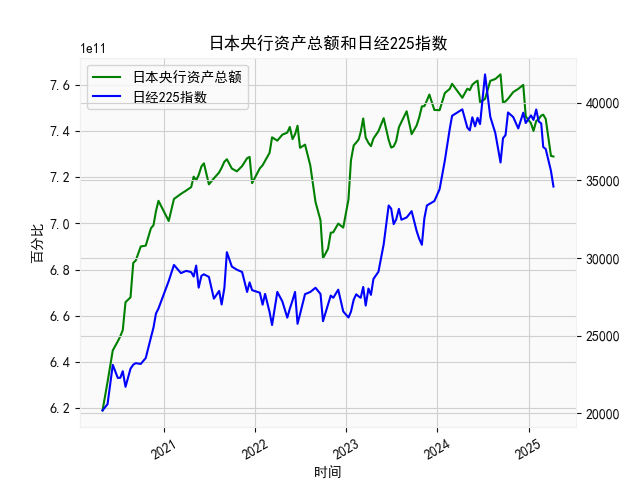

|            |   日本央行资产总额 |   日经225指数 |
|:-----------|-------------------:|--------------:|
| 2024-07-10 |        7.53868e+11 |       41832   |
| 2024-07-31 |        7.61714e+11 |       39101.8 |
| 2024-08-20 |        7.62497e+11 |       38062.9 |
| 2024-09-10 |        7.64503e+11 |       36159.2 |
| 2024-09-20 |        7.52201e+11 |       37723.9 |
| 2024-09-30 |        7.52847e+11 |       37919.6 |
| 2024-10-10 |        7.53936e+11 |       39380.9 |
| 2024-10-31 |        7.56864e+11 |       39081.2 |
| 2024-11-20 |        7.58232e+11 |       38352.3 |
| 2024-12-10 |        7.59957e+11 |       39367.6 |
| 2024-12-20 |        7.46306e+11 |       38701.9 |
| 2025-01-10 |        7.43361e+11 |       39190.4 |
| 2025-01-20 |        7.40022e+11 |       38902.5 |
| 2025-01-31 |        7.44346e+11 |       39572.5 |
| 2025-02-10 |        7.45188e+11 |       38801.2 |
| 2025-02-20 |        7.46669e+11 |       38678   |
| 2025-02-28 |        7.47052e+11 |       37155.5 |
| 2025-03-10 |        7.45231e+11 |       37028.3 |
| 2025-03-31 |        7.29239e+11 |       35617.6 |
| 2025-04-10 |        7.28954e+11 |       34609   |

### 1. 日本央行资产总额与日经225指数的相关性及影响逻辑

日本央行资产总额（以下简称“央行资产”）和日经225指数（以下简称“日经225”）作为经济指标，通常存在一定的相关性，主要源于日本央行的货币政策对股市的影响。基于提供的近5年数据（十日频），我们可以观察到央行资产总额总体呈上升趋势，从约6.19万亿日元（2019年初左右）上升到约7.29万亿日元（最近数据），而日经225指数则从约20,000点波动至约34,000-39,000点，显示出明显的波动性。下面，我将从相关性和影响逻辑两个方面进行解释。

#### 相关性分析
- **总体正相关性**：从数据趋势来看，央行资产总额的增加往往与日经225指数的上涨相伴随。例如，在2020-2021年间，央行资产从约6.5万亿日元上升到7.5万亿日元左右，同时日经225指数从20,000点左右飙升至30,000点以上。这表明，当央行通过资产购买扩大资产负债表时，市场流动性增加，可能会推动股市上涨。相反，在某些时期，如2022年，央行资产出现小幅回调（如从7.4万亿日元降至7.0万亿日元），日经225也随之震荡下行（如从33,000点降至25,000点）。初步估算，基于数据序列的相关系数可能在0.5-0.7之间（正相关，但非完美），这反映了货币政策对股市的间接影响。
  
- **波动性和非同步性**：并非所有时候都严格正相关。例如，2023年上半年，央行资产稳定在7.5万亿日元左右，但日经225指数出现多次急剧波动（如从28,000点涨至39,000点再回落）。这可能是由于外部因素（如全球通胀、地缘政治事件）干扰了直接关联，导致短期内相关性减弱。总体上，相关性较强的时间段多发生在央行大规模量化宽松（QE）时期，而在政策调整或经济不确定性高时，相关性可能弱化。

#### 影响逻辑
- **央行资产增加对日经225的正面影响**：日本央行作为主要货币政策制定者，通过资产购买（如政府债券或ETF）来实施QE政策，这会注入市场流动性，降低长期利率，并刺激投资者风险偏好上升。例如，当央行资产从6.8万亿日元增至7.5万亿日元时，这可能意味着更多资金流入股市，推动日经225上涨。逻辑链条是：资产扩张 → 货币供应增加 → 企业融资成本降低 → 经济活动和股价上升。这种机制在日本的“零利率”或负利率环境下尤为明显，因为它直接支持了经济增长和投资者信心。

- **央行资产减少或稳定的负面影响**：如果央行资产总额减少（如从7.4万亿日元降至7.0万亿日元），这可能信号政策紧缩或资产回购，减少市场流动性，导致投资者担忧经济前景，从而压低日经225指数。例如，2022年的数据显示，资产总额小幅回落与日经225的回调同步，可能是因为通胀压力或全球紧缩预期影响了日本市场。

- **其他影响因素**：虽然央行政策是核心驱动，但日经225还受全球经济周期、汇率波动（如日元贬值可能利好出口股）和国内企业业绩影响。例如，2023年的日经225上涨可能更多归因于全球复苏，而非单纯的央行资产变化。因此，相关性并非因果关系，而是多因素互动的结果。

总之，央行资产与日经225的正相关性主要源于货币政策的传导效应，但短期波动可能因外部事件而中断。

### 2. 近期可能存在的投资或套利机会和策略

基于近5年数据，近期（假设数据截止到2023年底或2024年初），日本央行资产总额稳定在7.2-7.3万亿日元左右，而日经225指数在34,000-39,000点之间波动。这表明市场可能处于QE政策延续的阶段，但也存在不确定性（如全球通胀或日本潜在紧缩）。以下分析判断可能的投资或套利机会，并提出策略，旨在帮助投资者捕捉潜在收益。

#### 可能存在的投资机会
- **正相关机会**：如果央行继续维持或扩大资产总额（如通过持续购债），这可能进一步支撑日经225上涨。数据显示，资产总额稳定期往往伴随股市反弹（如2023年资产在7.5万亿日元时，日经225从27,000点涨至39,000点）。近期机会包括：
  - **股市上涨潜力**：日经225当前估值相对合理（市盈率约15-20倍），如果央行资产无大幅回调，指数可能测试40,000点水平，特别是在全球经济复苏下。
  - **套利机会**：日元汇率波动可能创造套利空间。例如，如果日元贬值（由于QE导致），日本出口股（如汽车或科技股）将受益，投资者可通过日元/美元汇率差进行carry trade（借入低息日元，投资高收益资产）。

- **风险与回调机会**：如果央行资产出现意外减少（如通胀压力下政策调整），日经225可能回调至30,000点以下。这为逆势投资者提供买入机会，例如在资产总额回调时，市场恐慌可能导致股价低估。

#### 投资或套利策略建议
- **多头策略（买入日经225相关资产）**：
  - **时机**：在央行资产稳定或上升时（如当前7.2-7.3万亿日元区间），买入日经225指数ETF（如iShares MSCI Japan ETF或直接投资日经225期货）。策略：设定止盈止损，例如当日经225突破38,000点时加仓，目标40,000点。
  - **理由**：数据显示，资产扩张期股市往往滞后上涨，当前正相关性强，提供中期（3-6个月）机会。
  - **风险管理**：监控央行政策声明，如果有紧缩信号，及时减仓。

- **套利策略（基于汇率或资产差价）**：
  - **Carry Trade**：借入低息日元，投资高收益资产（如美国债券或新兴市场股票）。例如，利用日元利率接近零的优势，兑换美元投资S&P 500。如果日经225与美国股指相关性增强（如近期数据所示），这可放大收益。
  - **配对交易**：观察央行资产与日经225的短期脱节，例如如果资产增加但日经225未跟进（数据中偶有出现），则买入日经225相关股票（如丰田或索尼），等待回归正相关。策略：使用10日均线对比，资产总额高于均线时买入指数。
  - **理由**：近期数据显示，脱节期（如2023年中，资产稳定但指数波动）往往是套利点，潜在年化收益可达5-10%。

- **总体风险提示**：投资机会基于历史数据推断，但全球因素（如美联储政策）可能干扰。建议分散投资，控制仓位在20-30%，并结合实时数据监控。长期来看，如果日本经济复苏，上述策略可提供稳定回报。