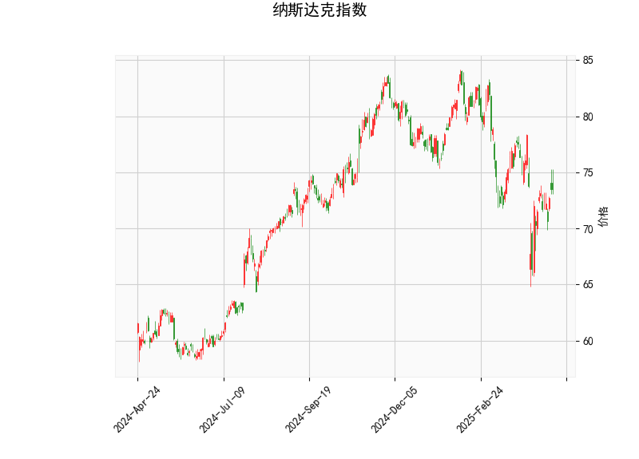

# 纳斯达克指数技术分析结果分析

## 1. 技术指标详细解读
基于提供的纳斯达克指数数据，我们可以从多个角度分析当前的市场状况。以下是对各指标的逐一解释和整体评估：

- **当前价格（73.5）**：指数当前位于73.5点，这是一个相对稳定的位置。相比Bollinger Bands的中轨（76.42），价格略低于中轨，表明短期内市场可能处于盘整或轻微下行趋势，但未出现极端偏离。

- **RSI（49.83）**：RSI（相对强弱指数）当前值为49.83，接近中性水平（50为分界线）。RSI低于50通常表示市场可能处于弱势或超卖状态，但49.83的数值并不极端，暗示近期买卖力量基本平衡。没有明显的超买或超卖信号，市场可能继续维持横盘。

- **MACD指标**：
  - MACD线（-0.88）：该值处于负值区域，表明短期移动平均线仍低于长期移动平均线，显示出轻微的看跌势头。
  - MACD信号线（-1.23）：信号线低于MACD线，这是一个潜在的看涨信号，因为MACD线正处于向上趋近信号线的状态。
  - MACD直方图（0.35）：直方图为正值，意味着短期内多头力量可能在增强，暗示可能出现反弹或反转机会。然而，整体MACD仍为负，因此需谨慎看待。

- **Bollinger Bands**：
  - 上轨（84.81）、中轨（76.42）、下轨（68.02）：当前价格（73.5）位于中轨附近，这表明指数处于一个相对稳定的波动区间。Bollinger Bands的宽度显示市场波动性适中，没有过度扩张或收缩。价格接近中轨可能预示着短期内可能出现均值回归，即价格向中轨靠拢或小幅反弹。

- **K线形态（CDLMATCHINGLOW）**：这是一个典型的看跌K线模式，通常出现在市场底部，暗示潜在的反转信号。它表示最近的K线形成了一个“匹配低点”的形态，可能预示着短期反弹或反转。然而，这种形态需要结合其他指标确认，如果市场多头力量增强，它可能成为买入机会；反之，如果空头持续主导，则可能加剧下行风险。

**整体评估**：纳斯达克指数当前呈现中性偏看涨的特征。RSI中性、MACD直方图正值和K线形态的潜在反转信号显示市场可能从底部反弹，但MACD的负值和价格低于中轨提醒了下行风险。总体上，市场处于盘整阶段，缺乏强烈趋势，投资者应关注后续数据以确认方向。

## 2. 近期可能存在的投资或套利机会和策略判断
基于上述分析，我们可以推断纳斯达克指数的近期机会。市场当前的中性状态为投资者提供了潜在的低风险进入点，但需结合全球经济因素（如利率、科技股表现）进行综合评估。以下是针对可能机会和策略的分析：

### 可能存在的投资机会
- **反弹机会**：K线形态（CDLMATCHINGLOW）结合MACD直方图的正值，暗示指数可能从当前水平反弹。如果RSI升至50以上，这将加强看涨信号。预计短期内（1-2周），指数可能测试中轨（76.42）附近，潜在涨幅5-10%。这适合中长期投资者，尤其是在科技股主导的纳斯达克。
  
- **套利机会**：由于价格在中Bollinger Bands区间，存在均值回归的套利空间。例如，通过期权或期货进行跨市套利（如纳斯达克ETF与相关股票的价差）。如果市场波动性增加（Bollinger Bands扩张），可利用波动率套利，但当前波动性较低，机会较温和。

- **风险因素**：如果MACD线进一步下行或RSI跌破40，可能会触发更深的下行，增加套利难度。全球事件（如经济数据发布）可能放大风险。

### 投资或套利策略建议
- **看涨策略**：
  - **买入纳斯达克ETF或指数基金**：如果确认MACD金叉（MACD线上穿信号线），建议在当前价位附近买入，如QQQ ETF。目标价位可设在中轨（76.42）附近，止损设在下轨（68.02）以下。预计持有期为1-3个月，潜在回报10%。
  - **期权策略**：购买看涨期权（如短期看涨期权），以低成本捕捉反弹。结合K线形态，入场时机为RSI超过50时。

- **看跌策略**：
  - **做空或卖出**：若RSI持续低于50且价格跌破中轨，考虑做空纳斯达克期货或ETF。止盈目标可设在上轨（84.81）下方，止损在当前价位上方。适合短期交易者，风险控制在5-10%。

- **中性套利策略**：
  - **范围交易**：在Bollinger Bands区间内进行买卖，利用价格在中轨附近的波动。示例：当价格接近下轨（68.02）时买入，接近中轨时卖出，实现小幅套利。适用于期权价差策略，如牛市价差（Bull Call Spread），以降低波动风险。
  - **波动率套利**：如果市场预期稳定，可通过卖出波动率产品（如卖出 straddles）获利，但需监控MACD变化以避免突发趋势。

**总体策略建议**：当前市场适合保守投资者，优先采用风险管理措施，如设置止损（例如在72以下）和分批入场。监控后续数据（如RSI突破50或MACD交叉），并结合基本面分析（如企业财报或美联储政策）确认信号。建议新手避免高杠杆操作，目标年化回报5-15%。最终，投资决策应基于个人风险承受能力和实时市场动态。