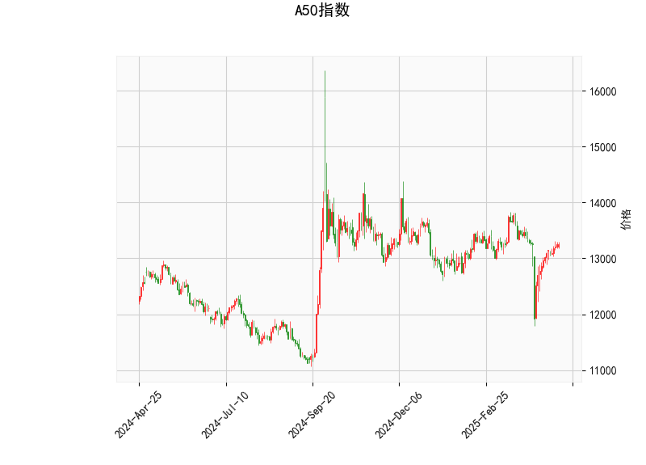

### A50指数技术分析结果解读

#### 1. 对技术分析结果的详细分析
以下是对A50指数当前技术指标的逐项分析，基于提供的实时数据。A50指数当前价格为13247.0点，整体市场显示出中性偏向看涨的信号，但需注意潜在波动。

- **RSI (相对强弱指数)**: 当前值为53.88。这是一个中性水平（RSI通常在30-70之间视为中性），表明A50指数短期内没有明显的超买或超卖状态。RSI高于50暗示轻微的强势，但尚未达到70的超买阈值，这意味着市场可能继续保持稳定或缓慢上升，而非急剧变动。

- **MACD (移动平均收敛散度)**: 
  - MACD线值为-6.58，信号线值为-53.68，MACD柱状图（Hist）为47.10。
  - MACD线高于信号线（-6.58 > -53.68），且柱状图为正值，这是一个看涨信号，表明短期动量可能向上。柱状图的正值（47.10）显示买方力量正在增强，但MACD线本身仍为负值，暗示多头尚未完全主导市场。这可能表示一个潜在的反弹机会，但如果柱状图开始减弱，可能会转为中性或看跌。

- **布林带指标**:
  - 上轨（Upper Band）: 13804.57
  - 中轨（Middle Band）: 13221.64
  - 下轨（Lower Band）: 12638.70
  - 当前价格（13247.0）位于中轨附近（略高于中轨），这表明价格处于一个相对稳定的区间。布林带整体宽度适中（上轨与下轨之间约有1165.87点的差距），没有明显收窄或扩张，暗示市场波动性一般。如果价格向上突破上轨，可能触发强势上涨；反之，向下触及下轨则可能出现支撑位测试。

- **K线形态**:
  - 'CDLGAPSIDESIDEWHITE': 这表示一种跳空向上白线形态，通常暗示短期价格跳空上涨，显示多头主导。但它也可能伴随回调风险，因为跳空往往是市场情绪的突发反应。
  - 'CDLSHORTLINE': 这代表一个短线小实体蜡烛，表明近期价格波动较小，市场可能处于观望或整理阶段。这两种形态结合，显示A50指数可能在短期内有小幅上行潜力，但缺乏强烈趋势。

总体而言，A50指数的技术面显示中性偏看涨的格局。RSI和MACD的组合暗示潜在的上行动量，但布林带的位置和K线形态表明市场可能在13200-13800点之间震荡，缺乏强烈突破信号。投资者应关注外部因素（如经济数据或全球市场情绪），因为技术指标目前未显示极端情况。

#### 2. 近期可能存在的投资或套利机会和策略
基于上述分析，A50指数短期内可能存在一些交易机会，但风险需谨慎评估。以下是针对当前指标的判断和建议策略，重点关注技术面信号。

##### 可能的机会
- **投资机会**:
  - **看涨机会**: MACD柱状图的正值和K线跳空形态暗示短期上行潜力。如果价格向上突破布林带上轨（13804.57），可能触发进一步上涨，目标可设在13500-13800点区间。这适合多头投资者，尤其在RSI保持中性（未超买）的情况下。
  - **回调机会**: 当前价格接近布林带中轨，RSI中性可能意味着小幅回调（例如回落至13000点附近）。这为逢低买入提供机会，但需警惕如果MACD柱状图转为负值，则可能转为看跌。
  - **套利机会**: A50指数作为期货或ETF产品，可能存在跨市场套利（如A50期货与相关股票指数的价差）。例如，如果A50现货价格与期货价格出现异常偏差（当前技术面中性，可能在高波动期出现），投资者可通过期货套利锁定收益。但需注意，当前指标未显示明显价差信号，套利机会更依赖市场事件（如政策公告）。

- **风险因素**:
  - 如果RSI快速上升至70以上，市场可能超买并回调。
  - MACD信号线若上穿MACD线，可能强化看涨，但当前负值基数较大，需观察柱状图的持续性。
  - 全球经济不确定性（如利率变动）可能放大布林带的波动。

##### 推荐策略
- **短期投资策略**:
  - **买入策略**: 在价格稳定在中轨以上（13200点附近）时考虑买入，止损设在下轨12638.70以下。目标位可设定为上轨13804.57附近，结合MACD柱状图的正值作为进场信号。适合风险偏好中等的投资者。
  - **卖出策略**: 如果RSI接近70或价格触及上轨，考虑部分卖出以锁定利润。观察K线形态，如果出现更多短线形态而非跳空，建议观望。
  - **波段交易**: 利用布林带区间进行高抛低吸。例如，在13200-12600点买入，在13800点以上卖出，控制仓位不超过50%以应对波动。

- **套利策略**:
  - **跨品种套利**: 如果A50指数与相关资产（如中国A股或全球指数）出现相关性偏差，可通过多头A50和空头相关资产的方式套利。但当前中性指标下，需等待更明显的价差（如期货贴水或升水超过1%）。
  - **期权或衍生品策略**: 使用期权保护投资，例如买入看涨期权（Call Option）以对冲潜在上行，但若MACD弱化，则转向看跌期权。风险管理是关键，建议设置严格的止损点。

总体策略建议：当前市场适合保守操作，优先监控MACD和RSI的变化。如果外部环境（如经济数据正面），看涨机会更大；反之，保持现金储备。建议结合基本面分析（如中国经济指标）以增强决策准确性。风险控制是首要，任何策略均应包括止损机制。