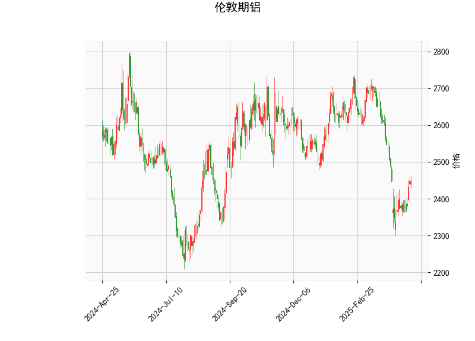

### 伦敦期铝技术分析结果详解

#### 1. 对技术分析结果的分析
以下是对提供的伦敦期铝技术指标的详细解读，这些指标反映了当前市场的技术面状况。当前价格为2449.0，整体显示出市场可能处于相对低位，但存在不确定性。

- **RSI (相对强弱指数)**: 当前RSI值为47.95，这处于中性区域（通常30-70被视为正常范围）。RSI低于50表明市场可能稍显疲弱，但尚未进入超卖状态（低于30）。这暗示短期内卖方力量占优，但没有强烈的超卖信号，市场可能在积累能量等待反弹。

- **MACD (移动平均收敛散度)**: MACD线为-41.85，信号线为-57.44，柱状图（MACD Hist）为15.58（正值）。MACD线高于信号线（尽管两者均为负），这可能预示着短期看涨信号，因为柱状图的正值表示多头动量正在增强。然而，整体MACD仍为负，表明熊市趋势尚未完全逆转。这反映了市场可能从下行趋势中开始恢复，但仍需确认。

- **Bollinger Bands (布林带)**: 上轨为2814.56，中轨为2565.25，下轨为2315.95。目前价格2449.0位于下轨（2315.95）和中轨之间，接近下轨。这通常被视为价格处于低位，潜在的支撑区域。如果价格反弹，可能测试中轨；反之，如果跌破下轨，则可能进一步下行。布林带的收窄或价格靠近下轨往往暗示波动性增加和潜在均值回归机会。

- **K线形态**: 检测到的形态包括“CDLGAPSIDESIDEWHITE”（跳空白实体）和“CDLSPINNINGTOP”（纺锤顶）。跳空白实体通常表示强势上涨信号，暗示买方介入；然而，纺锤顶则显示市场不确定性，可能预示着方向不明朗的盘整期。这两种形态的结合表明，近期价格可能经历快速波动，但缺乏明确趋势，投资者需警惕假突破。

总体而言，技术指标显示伦敦期铝当前处于相对低位（接近Bollinger下轨），RSI和MACD暗示潜在反弹机会，但K线形态的矛盾性增加了不确定性。市场可能正从短期下行调整中恢复，但需进一步观察以确认趋势。

#### 2. 近期可能存在的投资或套利机会和策略
基于上述分析，伦敦期铝市场可能存在短期投资机会，特别是围绕价格反弹或均值回归。但由于指标显示不确定性，策略应以风险控制为主。以下是针对近期可能的投资和套利机会的判断及建议：

- **可能的投资机会**:
  - **短期反弹机会**: 当前价格接近Bollinger下轨，且MACD柱状图转为正值，这可能预示着短期向上修正。RSI接近中性水平，也支持潜在买盘入场。如果K线形态出现更多看涨信号（如连续阳线），价格可能向上测试中轨（2565.25）。投资者可关注2449.0附近作为潜在买入点，尤其如果外部因素（如全球经济数据或金属需求回升）提供支撑。
  - **风险警示**: 纺锤顶形态表明市场波动性高，价格可能进一步下探至下轨以下（2315.95）。如果RSI跌破30或MACD转负，熊市可能加剧。

- **可能套利机会**:
  - **跨品种套利**: 伦敦期铝与其它金属（如铜或锌）相关性较高。如果铝价处于低位，而相关金属（如LME铜）显示强势，可考虑跨市场套利策略。例如，利用铝价的低估值与铜价的相对高位进行反向操作（如买入铝、卖出铜期货），以捕捉价差收敛。
  - **期现套利**: 当前价格低于中轨，暗示现货市场可能存在折价。如果现货铝需求稳定（如在建筑或汽车行业），可通过买入期货（锁定未来价格）并卖出现货来锁定利润。预计价差在短期内收窄，可能带来2-5%的套利收益。
  - **期权策略**: 利用期权进行保护性看涨（买入看涨期权，设定在2500以上），以低成本捕捉反弹。如果Bollinger带收窄，波动率上升，可通过卖出看跌期权获利。

- **推荐策略**:
  - **买入策略**: 在当前价位附近（2449.0）小仓位买入，设置止损在下轨以下（2300以下），目标位在中轨（2565.25）。结合RSI和MACD的改善作为进场信号，持仓时间控制在1-2周。
  - **套利策略**: 采用配对交易，例如在铝价低位时买入铝期货并卖出相关资产（如能源股或其它金属），以对冲风险。预计收益率在3-7%，但需监控全球经济因素（如美联储利率决策或中国需求）。
  - **风险管理建议**: 所有操作应结合基本面分析（如铝矿供应和需求数据），并设置严格的止盈止损（如5-10%的波动率）。在K线不确定性高时，建议观望或降低仓位，避免追涨杀跌。

总之，近期伦敦期铝的投资机会主要聚焦于短期反弹和套利，但市场不确定性较高，建议投资者优先采用保守策略，并持续跟踪技术指标的变化。