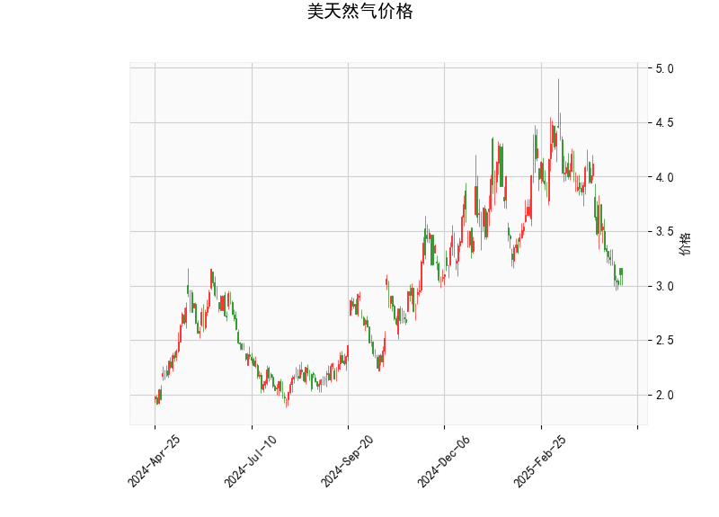

# 美天然气价格的技术分析结果分析

## 1. 对技术分析结果的详细解读
以下是对提供的美天然气价格技术指标的逐一分析，基于当前价位（3.106美元）和相关数据。整体来看，这些指标显示价格可能处于超卖区域，暗示潜在的反弹机会，但仍需警惕市场波动。

- **当前价格（3.106美元）**：  
  当前价格位于Bollinger Bands的下轨（3.011美元）附近，这通常表示价格已接近超卖水平。价格在下轨附近徘徊往往是短期反弹的信号，但如果跌破下轨，可能进一步下行。

- **RSI（34.607）**：  
  RSI值低于30，表明美天然气价格处于超卖状态。这暗示市场可能过度抛售，短期内存在修正或反弹的可能性。投资者应关注RSI是否开始向上反弹（如超过40），这可能预示趋势逆转。

- **MACD指标**：  
  - MACD线（-0.237）低于信号线（-0.203），且直方图（-0.034）为负，这反映出短期看跌趋势，价格可能继续承压。  
  - 然而，直方图的负值较小（接近零），表明卖方动能正在减弱。如果MACD线向上交叉信号线，这将是一个看涨信号，可能标志着趋势反转。

- **Bollinger Bands**：  
  - 上轨（4.620美元）、中轨（3.816美元）和下轨（3.011美元）。当前价格接近下轨，显示价格波动收窄并处于超卖区域。这种情况通常是价格反弹的先兆，尤其是如果伴随其他指标的改善。但如果价格持续在下轨下方，可能加剧下行风险。

- **K线形态（CDLBELTHOLD和CDLMATCHINGLOW）**：  
  - CDLBELTHOLD：这是一种看涨形态，表明多头力量占优，价格可能在短期内企稳或反弹。  
  - CDLMATCHINGLOW：这表示价格触及前期低点但未进一步下破，暗示存在强支撑位。这增强了潜在反弹的概率，但需观察后续K线是否确认向上突破。

总体而言，技术指标显示美天然气价格短期内可能从超卖状态反弹，但MACD的负值提醒了下行风险。市场正处于关键转折点，需结合成交量和外部因素（如天气或地缘政治事件）进行综合评估。

## 2. 近期可能存在的投资或套利机会和策略判断
基于上述技术分析，以当前市场环境为背景，我对美天然气价格的近期投资或套利机会进行了判断。天然气市场受季节性需求（如冬季取暖）和全球供应影响较大，因此策略应以短期为主，并注重风险管理。以下是关键机会和建议策略：

### 可能的投资机会
- **反弹买入机会**：  
  由于RSI超卖、价格接近Bollinger下轨，以及K线形态显示支撑，短期内存在价格反弹的可能性。例如，如果价格从3.106美元反弹至中轨（3.816美元）附近，潜在涨幅约为23%。这适合多头投资者在确认信号（如RSI向上交叉或MACD金叉）后入场。

- **套利机会**：  
  - **跨期套利**：天然气期货市场（如NYMEX）可能存在期现价差。如果当前现货价格（3.106美元）低于期货合约（如近期合约），投资者可考虑在现货市场买入并在期货市场卖出空头，以锁定价差收益。但需监控库存和需求数据，避免季节性波动放大风险。  
  - **相关资产套利**：天然气与能源股（如天然气生产商股票）或相关商品（如原油）价格相关。如果天然气价格反弹而原油价格相对稳定，可通过多头天然气和空头原油的组合策略捕捉价差。但当前指标显示天然气更可能反弹，因此需评估相关性。

### 推荐投资策略
- **短期多头策略**：  
  建议在RSI从34.607向上突破40时买入，设置止损在Bollinger下轨下方（如3.000美元）。目标位可设在中轨（3.816美元）或上轨（4.620美元）。这适用于风险偏好较高的投资者，利用技术反弹获利。

- **观望与风险控制策略**：  
  如果MACD直方图继续恶化（更负值），则建议观望或轻仓操作。采用金字塔加仓法：在反弹初期小额买入，待确认趋势后再加仓。同时，设置2-5%的止损比例，以应对突发事件（如飓风影响供应）。

- **套利策略细节**：  
  对于经验丰富的投资者，可探索无风险套利，如利用交易所价差（例如，NYMEX和ICE平台的价差）。但需注意交易成本和流动性。总体策略应结合基本面分析（如EIA库存报告），避免纯技术驱动的风险。

### 风险与注意事项
- **下行风险**：如果全球需求疲软或供应过剩，价格可能进一步下跌至2.500美元以下。  
- **市场波动性**：天然气价格易受天气、地缘政治和宏观经济影响，建议结合新闻监控和技术信号使用。  
- **总体建议**：当前技术面偏向中性偏多，但非强买信号。投资者应根据个人风险承受能力和资金规模调整策略，并考虑多样化投资以降低单一资产风险。