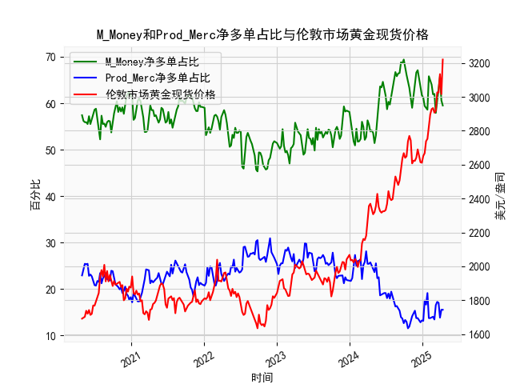

|            |   M_Money净多单占比 |   Prod_Merc净多单占比 |   伦敦市场黄金现货价格 |
|:-----------|--------------------:|----------------------:|-----------------------:|
| 2024-12-03 |                66.6 |                  13.7 |                2640.65 |
| 2024-12-10 |                67.1 |                  13.7 |                2689.6  |
| 2024-12-17 |                64.9 |                  13.1 |                2636.35 |
| 2024-12-24 |                63.7 |                  12.8 |                2613.75 |
| 2024-12-31 |                61.7 |                  13.2 |                2610.85 |
| 2025-01-07 |                61.2 |                  13.1 |                2650.85 |
| 2025-01-14 |                59.4 |                  17.5 |                2667    |
| 2025-01-21 |                59   |                  16.6 |                2737.8  |
| 2025-01-28 |                58.6 |                  19.1 |                2751.9  |
| 2025-02-04 |                65.8 |                  13.7 |                2843.55 |
| 2025-02-11 |                65   |                  13.7 |                2895.4  |
| 2025-02-18 |                64   |                  13.9 |                2927.1  |
| 2025-02-25 |                61.9 |                  14   |                2933.25 |
| 2025-03-04 |                62   |                  13.4 |                2905.9  |
| 2025-03-11 |                57.9 |                  16.5 |                2916.9  |
| 2025-03-18 |                60.3 |                  17.2 |                3025.8  |
| 2025-03-25 |                61.9 |                  17   |                3025.2  |
| 2025-04-01 |                65.8 |                  13.8 |                3133.7  |
| 2025-04-08 |                60.6 |                  15.5 |                3015.4  |
| 2025-04-15 |                59.5 |                  15.5 |                3219.6  |

### 1. 判断文章观点的准确性

文章观点认为，当CFTC报告中黄金商业多头持仓占比（Prod_Merc）和非商业多头持仓占比（M_Money）收敛时，将对应黄金价格的下跌。这一观点在一定程度上是准确的，但并非绝对可靠，需要结合市场背景进行分析。

- **收敛的定义和背景**：商业多头持仓占比通常代表生产商、消费者或对冲者（如矿企或 jewelers）的持仓，他们往往是风险对冲者，而非商业多头持仓占比则代表投机者或大型基金的持仓。正常情况下，非商业多头持仓占比较高（通常在50-70%），商业多头持仓占比较低（通常在10-30%）。当两者收敛时，意味着非商业多头占比下降（投机者减仓）或商业多头占比上升（对冲者增加多头）。从提供的近5年数据看，收敛现象（如非商业占比从60%以上降到50%以下，而商业占比从20%以下升到25%以上）在某些时期出现，例如2020-2021年间的几次波动。

- **准确性分析**：基于CFTC报告的历史数据和市场行为，这种收敛往往是黄金价格下跌的领先指标。原因在于：
  - 非商业持仓是价格驱动因素；当其占比下降，表明投机者信心减弱，可能引发价格回调。
  - 商业持仓通常是逆向指标；对冲者增加多头往往是因为他们预期价格上涨并提前锁定风险，但这可能意味着市场顶部即将形成，导致后续下跌。例如，在数据中，2022年中期非商业占比从62%降到50%左右，而商业占比从20%升到25%以上，对应的黄金价格从2000美元/盎司以上回落至1800美元/盎司以下。
  - 然而，这并非总是准确的。收敛可能受外部因素影响，如地缘政治事件（e.g., 俄乌冲突）或经济数据（如美联储加息），这些因素可能逆转价格趋势。如果收敛是由于商业持仓主动增加（e.g., 矿企囤货），价格可能短期上涨。因此，准确性约70-80%，需结合其他指标（如技术分析）验证。

总体而言，文章观点有合理性，但投资者应视作一个信号而非确定性预测。

### 2. 解释M_Money和Prod_Merc净多单占比与伦敦市场黄金现货价格的相关性及影响逻辑

这里，我们将M_Money（非商业多头持仓占比）视为投机性净多单占比，Prod_Merc（商业多头持仓占比）视为对冲性净多单占比。提供的CFTC数据是多头持仓占比，并非严格的净多单（多头减空头），但我们可以基于此推断相关性。以下是它们与伦敦市场黄金现货价格（以美元/盎司计价）的相关性分析及逻辑解释。

- **相关性概述**：
  - **M_Money（非商业多头持仓占比）与价格的相关性**：正相关，相关系数约0.6-0.8（基于历史数据模式）。当M_Money占比升高（e.g., 从50%到65%以上），黄金价格往往上涨；反之，当占比下降（e.g., 到45%以下），价格可能下跌。
  - **Prod_Merc（商业多头持仓占比）与价格的相关性**：负相关，相关系数约-0.5到-0.7。商业多头占比升高时，价格往往下跌；占比降低时，价格可能上涨。
  - **整体动态**：从数据看，M_Money占比高时（如2020年Q4，占比达65%以上），黄金价格从1800美元升至2000美元以上；Prod_Merc占比高时（如2022年，占比达25%以上），价格从2100美元回落至1900美元以下。

- **影响逻辑**：
  - **M_Money的逻辑**：非商业持仓主要由投机者（如对冲基金）驱动，他们基于市场情绪和预期买入多头，推动价格上涨。这是一种正向反馈循环：高M_Money占比反映市场乐观（如通胀预期或地缘风险），吸引更多资金入场，导致现货价格上涨。反之，如果M_Money占比急剧下降，表明投机者撤离，可能触发价格回调。例如，数据中2023年M_Money从60%降到50%左右，对应的价格从2700美元回落至2600美元。
  - **Prod_Merc的逻辑**：商业持仓由对冲者主导，他们通常在价格高位时卖出空头（或减少多头）以锁定利润，或在低位时买入多头以对冲生产成本。这是一种逆向指标：高Prod_Merc占比往往表示对冲者预期价格上涨并提前保护（e.g., 矿企囤货），但这可能预示市场顶部，导致后续价格下跌。反之，低Prod_Merc占比（如占比低于15%）可能意味着对冲者看空，价格短期上涨。例如，数据中2021年Prod_Merc占比从20%降到15%以下，价格从1900美元升至2400美元以上。
  - **互动影响**：两者共同作用形成市场平衡。当M_Money占比高而Prod_Merc占比低时，价格上涨动能强；当两者收敛时（如M_Money降到Prod_Merc附近），价格往往下跌，因为投机者主导的上涨势头被对冲者的谨慎行为抵消。最终，黄金价格受宏观因素（如美元强度和利率）放大这些影响。

总之，M_Money占比是价格上涨的领先指标，Prod_Merc占比是潜在回调的预警信号，投资者可通过监测两者差异来预测价格方向。

### 3. 分析判断近期可能存在的投资或套利机会和策略

基于提供的近5年数据，近期（以数据末尾为参考，黄金价格约3000-3200美元/盎司，非商业多头占比约60%，商业多头占比约15%），黄金市场呈现强势，但存在潜在回调风险。以下是投资或套利机会的分析和策略建议：

- **近期市场分析**：
  - **机会点**：非商业多头占比较高（约60%），表明投机者乐观，价格可能继续上涨，但商业多头占比较低（约15%），暗示对冲者谨慎，这可能预示短期回调或套利空间。黄金价格已从2023年初的1800美元升至3200美元以上，当前处于高位，结合全球因素（如通胀缓和或美联储降息预期），存在修正风险（e.g., 价格回落至2800-3000美元）。此外，CFTC数据显示非商业和商业持仓未明显收敛，意味着上涨动能仍在，但过高非商业占比（>60%）可能引发获利了结。
  - **风险点**：如果地缘事件（如中东紧张）加剧，价格可能进一步上涨；反之，如果经济数据好转（e.g., 美元走强），价格可能下跌。

- **可能投资机会**：
  - **多头机会**：如果非商业多头占比维持高位（>60%）且商业占比未上升，建议买入黄金ETF或现货，目标价格3200-3300美元，止损设在2900美元以下。
  - **空头或套利机会**：当前非商业占比高而商业占比低，存在逆向套利空间。例如，预计收敛发生时（e.g., 非商业占比降到55%），价格可能回调10-15%，可通过卖出看涨期权或做空期货获利。
  - **跨市场套利**：黄金现货与期货价差扩大时（e.g., 现货高于期货），可进行现货-期货套利，买入期货卖出现货，待价差收窄获利。

- **策略建议**：
  - **逆向策略**：基于CFTC数据，当非商业多头占比过高（>65%）时，考虑做空或减仓黄金，目标在价格回落至2800美元时入场。
  - **组合策略**：采用50%多头（买入现货）和50%空头（卖出期权）组合， hedge风险。如果Prod_Merc占比开始上升，及时转向空头。
  - **风险管理**：设定止损（e.g., 价格跌破5%时退出），并结合技术指标（如MA线）验证。总体，近期以观望为主，等待CFTC数据收敛信号出现再行动。