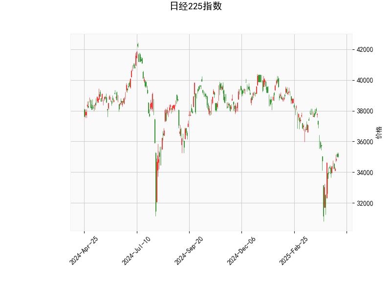

# 日经225指数的技术分析结果分析

## 1. 技术指标分析
以下是对日经225指数当前技术分析结果的详细解读，基于提供的指标数据。日经225指数当前价位为35039.15，整体市场呈现出中性偏看涨的信号，但需注意潜在的波动性。

### RSI（相对强弱指数）
- **当前值**：49.16
- **解读**：RSI处于中性区域（30-70之间），表明日经225指数目前未出现明显的超买或超卖状态。这反映出市场力量相对平衡，短期内可能维持横盘整理或小幅波动。如果RSI继续上升至70以上，将可能进入超买区，增加回调风险；反之，若跌破30，将暗示超卖反弹机会。

### MACD（移动平均收敛散度）
- **当前值**：MACD线为-510.72，信号线为-766.96，直方图为256.25
- **解读**：MACD线高于信号线（-510.72 > -766.96），且直方图显示正值（256.25），这暗示短期内可能出现看涨信号，表明多头势头正在增强。然而，MACD线整体仍为负值，显示指数尚未完全摆脱熊市影响，可能处于反弹初期。如果直方图继续扩大，正向动能将加强；反之，若直方图转为负值，可能预示回调。

### 布林带（Bollinger Bands）
- **当前值**：上轨为40750.22，中轨为36699.17，下轨为32648.11
- **解读**：当前价35039.15位于中轨（36699.17）和下轨（32648.11）之间，偏向下轨。这表明价格处于布林带的收缩或波动区间，暗示市场可能在经历整理期。价格接近下轨往往是潜在的支撑位，如果反弹，可能向中轨或上轨移动；若跌破下轨，则可能触发进一步下行风险。布林带的宽度显示当前波动性适中，但需警惕突破后的急剧变动。

### K线形态
- **当前形态**：CDLMATCHINGLOW和CDLSHORTLINE
- **解读**：CDLMATCHINGLOW表示最近的K线出现两个相似的低点，这通常被视为看涨反转信号，暗示市场可能从底部反弹。CDLSHORTLINE则显示一根实体较小的K线，反映出市场不确定性或短期整理。结合两者，短期内日经225可能出现小幅反弹，但需确认后续K线形态以避免假突破。

总体而言，技术指标显示日经225指数处于中性偏看涨状态。RSI的中性、MACD的潜在转强和K线形态的看涨暗示可能有反弹机会，但价格在布林带下半部的定位提醒投资者注意下行风险。外部因素如日本经济数据或全球市场情绪可能进一步影响这些信号。

## 2. 近期可能存在的投资或套利机会和策略判断
基于上述技术分析，日经225指数短期内可能存在反弹或套利机会，但市场不确定性较高。以下是针对近期可能的投资策略分析，强调风险控制。

### 可能的投资机会
- **反弹机会**：当前指标显示潜在看涨信号（如MACD直方图正值和K线形态），结合价格接近布林带下轨，短期内日经225可能从35000附近反弹至中轨（约36700）或更高。这为多头投资者提供入场点，尤其如果全球风险偏好提升（如日本央行政策变化或美股上涨）。
- **套利潜力**：日经225作为期货和衍生品活跃的指数，可能存在跨市场套利机会。例如，利用日经225期货与现货ETF的价格差异，或通过期权策略捕捉波动性。当前中性RSI和布林带收缩暗示低波动期，可能适合波动率套利。

### 推荐投资策略
- **多头策略（买入机会）**：
  - **买入日经225 ETF或期货**：如果预期MACD信号加强，可在当前价位附近买入，目标设在中轨（36700）附近。止损位可设在下轨以下（约32600），以控制下行风险。理由：K线形态的看涨暗示短期反弹。
  - **期权策略**：购买看涨期权（Call Option），例如以当前价为基准的短期期权，成本较低。若指数反弹至上轨（40750），可获利。该策略适合风险偏好较高的投资者，利用MACD的正直方图作为触发点。
  
- **套利策略**：
  - **跨市套利**：比较日经225期货与相关资产（如美元/日元汇率或亚洲其他指数）的价差。如果日经225相对其他亚洲指数（如恒生指数）被低估，可进行多头日经225和空头其他指数的组合套利。当前布林带位置暗示价差可能收窄，提供机会。
  - **均值回归套利**：价格在布林带下轨附近时，买入日经225并在接近中轨时卖出。该策略基于历史均值回归原理，适合短期交易者。示例：买入当前价位，目标卖出价36700，风险控制在下轨突破时平仓。

### 风险与注意事项
- **下行风险**：若RSI跌破30或MACD直方图转为负值，指数可能进一步下探至32000以下。投资者应监控全球事件，如地缘政治紧张或美联储政策，以避免突发回调。
- **整体建议**：短期策略优先于长期持有，结合基本面分析（如日本GDP数据）。风险厌恶者可采用小仓位测试水温，并设置严格的止盈止损。最终，投资决策应参考实时数据和专业咨询，技术分析仅作为参考。