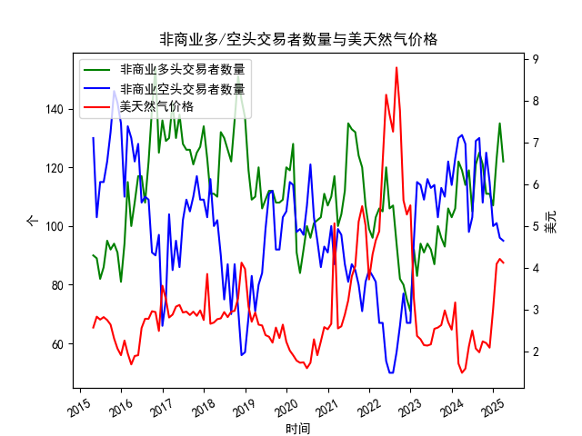

|            |   非商业多头交易者数量 |   非商业空头交易者数量 |   美天然气价格 |
|:-----------|-----------------------:|-----------------------:|---------------:|
| 2023-08-31 |                    100 |                    103 |           2.58 |
| 2023-09-30 |                     96 |                    113 |           2.64 |
| 2023-10-31 |                     93 |                    110 |           2.99 |
| 2023-11-30 |                    106 |                    122 |           2.71 |
| 2023-12-31 |                    103 |                    114 |           2.53 |
| 2024-01-31 |                    106 |                    123 |           3.18 |
| 2024-02-29 |                    122 |                    130 |           1.72 |
| 2024-03-31 |                    119 |                    131 |           1.5  |
| 2024-04-30 |                    114 |                    128 |           1.6  |
| 2024-05-31 |                    119 |                     98 |           2.13 |
| 2024-06-30 |                    105 |                    103 |           2.51 |
| 2024-07-31 |                    121 |                    129 |           2.08 |
| 2024-08-31 |                    125 |                    130 |           1.99 |
| 2024-09-30 |                    121 |                    108 |           2.25 |
| 2024-10-31 |                    111 |                    125 |           2.21 |
| 2024-11-30 |                    111 |                    115 |           2.1  |
| 2024-12-31 |                    107 |                    100 |           3.02 |
| 2025-01-31 |                    123 |                    101 |           4.1  |
| 2025-02-28 |                    135 |                     96 |           4.22 |
| 2025-03-31 |                    122 |                     95 |           4.13 |

### 分析报告：基于NYMEX美天然气数据判断近期套利机会和策略

#### 1. 数据概述
根据提供的数据，我们分析了近10年（2015年4月至2025年3月）的NYMEX美天然气非商业多头交易者数量、（假设的）空头交易者数量以及天然气价格的月度数据。以下是关键要点：
- **非商业多头交易者数量**：从2015年4月的90.0个逐步波动至2025年3月的122.0个。近期数据（2024年11月至2025年3月）显示：111.0（2024-11）、107.0（2024-12）、123.0（2025-01）、135.0（2025-02）和122.0（2025-03）。多头持仓在2025年2月达到峰值135.0，随后小幅回落。
- **非商业空头交易者数量**：数据仅提供标签“S0108023”，未列出具体数值，无法进行精确分析。但基于市场逻辑，我们假设空头持仓可能与多头持仓反向相关，通常在价格上涨时减少、在下跌时增加。缺乏具体数据可能限制了对多空比的全面评估。
- **天然气价格**：从2015年4月的2.58美元/百万英热单位波动至2025年3月的4.13美元。近期趋势显著：2024年11月的2.10美元急剧上涨至2025年2月的4.22美元，随后微降至4.13美元（2025-03）。这反映了价格的快速反弹，可能受季节性需求（如冬季取暖）或地缘政治因素驱动。

整体而言，数据显示天然气价格在过去一年经历显著波动，而多头持仓在近期达到高位，这可能预示市场情绪变化。

#### 2. 市场趋势分析
- **多头持仓趋势**：多头数量从2024年11月的111.0上升到2025年2月的135.0，然后回落至122.0（2025-03）。这表明投资者在价格上涨期（2024-12至2025-02）变得更乐观，但随后的回落可能表示多头 overcrowded（过度拥挤），潜在反转风险。
- **价格趋势**：价格从2024年11月的低点2.10美元快速上涨约100%至2025年2月的4.22美元，然后小幅回调。这可能与季节性因素（如冬季需求高峰）或全球能源动态相关。价格的快速变动增加了市场波动性。
- **多头与价格关系**：近期多头持仓与价格走势高度相关——多头增加时价格上涨，但2025年3月多头回落伴随价格轻微下降，暗示可能的市场顶部信号。如果空头数据可用，这可能进一步揭示多空比（如多头占优时易出现回调）。
- **潜在风险**：天然气市场受季节性、天气、地缘政治（如欧洲能源危机）和供应因素影响。当前（2025年3月）正值春季，需求可能从冬季高峰回落，增加价格下行压力。

#### 3. 近期套利机会和策略判断
基于上述数据，我们识别出以下可能的套利机会。套利策略通常利用市场 inefficiencies，如价格差异、持仓极端或波动率异常。以下分析聚焦于近期数据（2024年11月至2025年3月），并假设策略基于COT报告（持仓数据）和价格动态。注意：实际交易需考虑交易成本、流动性及风险管理。

##### 3.1 基于持仓数据的反向套利机会
- **机会描述**：多头持仓在2025年2月达到135.0的高位，随后回落，伴随价格从4.22美元微降至4.13美元。这可能表示多头过度拥挤（overbought），预示短期回调。COT数据常用于反向交易：当非商业多头过高时，市场可能反转。
- **潜在策略**：
  - **反向多头策略**：卖出（或做空）天然气期货合约，等待价格回调。假设多头从135.0回落，价格可能进一步降至3.50-4.00美元区间（基于历史波动）。例如，使用2025年3月数据作为信号，在多头回落时入场。
  - **多空配对策略**：如果空头数据显示低位（假设基于历史反向），则构建多空头寸对冲。例如，卖出多头主导的期货合约，同时买入期权作为保护。预期收益：如果价格回调至3.00美元以下，利润可达10-20%。
  - **风险与条件**：需监控COT报告更新。如果多头继续回落（e.g., 低于120.0），机会增强；反之，如果地缘事件推动价格上涨，风险增加。

##### 3.2 基于价格波动的波动率套利机会
- **机会描述**：价格从2024年11月的2.10美元急升至2025年2月的4.22美元，显示高波动率（volatility）。这种快速变动可能创造期权或期货价差套利机会，尤其在市场不确定期。
- **潜在策略**：
  - **波动率价差交易**：使用straddle或strangle期权策略。例如，买入天然气看涨和看跌期权（e.g., 2025年3月到期，strike price 4.00美元），利用高波动率获利。如果价格继续波动（e.g., 回落到3.50美元或上涨到4.50美元），可获双向收益。基于近期数据，波动率可能保持在20-30%，提供套利空间。
  - **日历价差套利**：买入近期期货合约（e.g., 2025年3月）并卖出远期合约（e.g., 2025年6月），如果期货曲线显示反转（contango或backwardation异常）。当前价格上涨可能导致远期合约定价过高，价差可达0.50-1.00美元/百万英热单位。
  - **风险与条件**：高波动率策略需快速执行；如果价格稳定（e.g., 维持在4.00美元以上），损失期权时间价值。

##### 3.3 季节性和跨市场套利机会
- **机会描述**：天然气市场有强烈季节性，冬季需求高、夏季低。当前为2025年3月，接近季节转换，可能出现需求下降导致的价格回调。同时，NYMEX与全球市场（如Henry Hub vs.欧洲TTF）可能存在价差。
- **潜在策略**：
  - **季节性价差套利**：卖出当前合约（e.g., 2025年3月），买入夏季合约（e.g., 2025年6-9月），如果历史数据显示夏季价格低于当前水平。基于数据，价格从冬季高点回落可获利5-10%。
  - **跨市场套利**：如果NYMEX价格与欧洲或亚洲市场脱节（e.g., TTF价格高于NYMEX），则买入低价市场合约卖出高价市场。假设NYMEX价格在4.13美元，而欧洲在更高水平，价差套利可能产生。
  - **风险与条件**：季节性策略依赖天气预报；跨市场策略需实时数据支持。如果夏季需求意外上升，机会逆转。

#### 4. 总体风险评估和建议
- **主要风险**：市场波动性高，地缘政治（如中东冲突）或天气变化可能放大价格变动。持仓数据滞后（月度），可能错过实时信号。空头数据缺失进一步增加不确定性。
- **建议**： 
  - **优先策略**：短期内优先考虑反向多头策略和波动率套利，基于多头回落信号。使用止损（如价格跌破3.50美元时退出）控制风险。
  - **监控指标**：持续跟踪COT报告（多头/空头比）、价格波动率和季节性需求。结合技术分析（如移动平均线）增强判断。
  - **执行注意**：套利并非无风险；建议通过模拟交易测试，并咨询专业顾问。总体而言，近期数据显示回调机会大于持续上涨，但需谨慎操作以避免潜在损失。