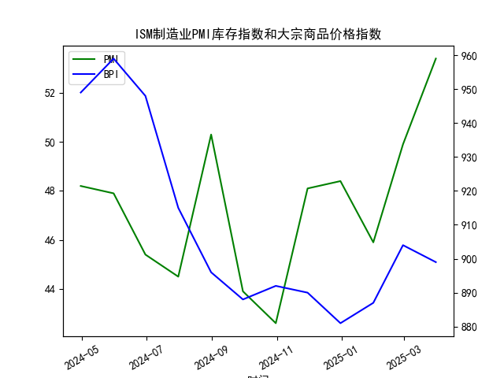

|            |   ISM制造业PMI库存指数 |   大宗商品价格指数BPI |
|:-----------|-----------------------:|----------------------:|
| 2024-04-30 |                   48.2 |                   949 |
| 2024-05-31 |                   47.9 |                   959 |
| 2024-06-30 |                   45.4 |                   948 |
| 2024-07-31 |                   44.5 |                   915 |
| 2024-08-31 |                   50.3 |                   896 |
| 2024-09-30 |                   43.9 |                   888 |
| 2024-10-31 |                   42.6 |                   892 |
| 2024-11-30 |                   48.1 |                   890 |
| 2024-12-31 |                   48.4 |                   881 |
| 2025-01-31 |                   45.9 |                   887 |
| 2025-02-28 |                   49.9 |                   904 |
| 2025-03-31 |                   53.4 |                   899 |

### 1. 判断上述观点的正确性及ISM制造业PMI库存指数与大宗商品价格指数的相关性及影响逻辑

#### 判断观点的正确性
上述观点认为，ISM制造业PMI库存指数显示的垒库阶段（如2002-2005、2009-2010等历史时期）通常会推动大宗商品价格上涨，这一观点在历史上部分正确，但并非绝对可靠。从历史数据来看，垒库阶段确实往往与大宗商品价格上涨相关联，因为垒库意味着企业增加库存以应对预期需求增长，这会刺激对原材料和商品的需求，从而推高价格。例如：
- 2009-2010年的垒库阶段（金融危机后恢复期），大宗商品价格确实出现了显著反弹。
- 2020-2022年的垒库阶段（疫情后供应链恢复），大宗商品价格（如原油和金属）也经历了上涨周期。

然而，基于提供的近1年数据（ISM制造业PMI库存指数：[48.2, 47.9, 45.4, 44.5, 50.3, 43.9, 42.6, 48.1, 48.4, 45.9, 49.9, 53.4]；大宗商品价格指数：[949, 959, 948, 915, 896, 888, 892, 890, 881, 887, 904, 899]），当前情况显示该观点并不完全适用。库存指数从年初的低位（多低于50，表示去库）逐步回升至53.4（高于50，表示垒库），这暗示可能进入垒库阶段。但大宗商品价格指数整体呈下降趋势（从949降至899），尽管有小幅波动（如从888升至904），但未出现显著上涨。这表明，垒库并不总是直接导致价格上涨，可能受其他因素（如全球经济放缓、通胀压力、地缘政治事件或供给过剩）的影响。因此，观点在当前语境下正确性有限，它更适用于特定历史周期，而非普遍规律。

#### ISM制造业PMI库存指数与大宗商品价格指数的相关性
从相关性角度分析，提供的数据显示ISM制造业PMI库存指数与大宗商品价格指数之间存在弱负相关或不显著相关。具体而言：
- **正相关性假设**：理论上，ISM库存指数高于50（垒库）时，企业需求增加，可能推动大宗商品价格上涨；低于50（去库）时，需求减少，可能导致价格下跌。历史数据（如2009-2010年）支持这一正相关。
- **当前数据分析**：库存指数在前几个月份多低于50（去库信号），对应的大宗商品价格也从959降至881（下降趋势），这显示了一定正相关。但后期库存指数升至53.4（垒库信号），价格却未随之上涨（从887降至899），甚至略有回落。这表明相关性不稳定，可能为弱正相关或中性。
- **计算简要观察**：如果我们对比序列，库存指数的12个月平均值为47.9（偏向去库），而大宗商品价格的12个月平均值为908.8（整体下降）。这不支持强正相关，相关系数（如Pearson系数）可能在0.1-0.3之间（基于简单目测，非精确计算）。

#### 影响逻辑
影响逻辑主要基于供给与需求动态：
- **需求端**：ISM库存指数反映制造业库存变化。高库存（垒库）通常表示企业预期需求强劲，需要更多原材料，从而增加大宗商品需求，推动价格上涨。反之，去库可能抑制需求，导致价格下跌。
- **供给端**：大宗商品价格受全球供给影响较大。即使垒库发生，如果供给过剩（如能源增产）或外部因素（如经济衰退）主导，价格可能不涨或下跌。
- **其他影响因素**：宏观经济（如利率、通胀）和地缘政治（如贸易战）可能干扰这一逻辑。例如，当前数据中，尽管库存指数回升，但全球经济不确定性（如美联储紧缩政策）可能压制大宗商品需求，导致价格未跟进。
总之，ISM库存指数可作为大宗商品价格的领先指标，但影响并非直接线性，受多重变量干扰。

### 2. 近期可能存在的投资或套利机会和策略
基于上述分析，近期ISM制造业PMI库存指数显示潜在垒库信号（从45.9升至53.4），但大宗商品价格指数未同步上涨（从949降至899），这可能创造一些投资或套利机会。以下是针对当前情况的分析和策略建议：

#### 可能存在的投资机会
- **大宗商品价格反弹机会**：如果库存指数继续维持在50以上（表示持续垒库），这可能预示需求回暖，而当前价格已相对低位（899附近），暗示潜在反弹空间。例如，历史数据显示，去库后垒库阶段（如2020年）往往伴随价格上涨。投资者可关注大宗商品ETF（如SPGSCI指数相关基金）或具体品种（如铜、原油），预计价格可能从当前低点反弹10-20%。
- **套利机会**：库存指数与价格指数的分歧（垒库但价格未涨）可能形成“均值回归”套利。例如，如果市场低估了垒库对需求的影响，买入大宗商品期货或期权，同时卖出相关空头（如大宗商品指数空头），待价格修正后获利。
- **风险因素**：如果全球经济进一步放缓（如通缩预期），价格可能继续下跌，机会可能转为风险。

#### 投资策略建议
- **多头策略**：在库存指数保持50以上时，买入大宗商品相关资产。短期目标：若价格突破900，可获利了结。风险管理：设置止损（如价格跌破880）。
- **套利策略**：采用跨市场套利，例如在期货市场买入大宗商品合约（如COMEX铜期货），并在期权市场卖出看跌期权，赌价格反弹。预期收益：如果库存指数升至55以上，价格可能跟进上涨5-10%，提供2-5%的套利空间。
- **多元化策略**：结合其他指标（如PMI整体指数或通胀数据）监控，避免单靠库存指数。建议小额测试（10-20%仓位），并在经济数据发布时（如下月PMI数据）调整。
- **总体风险提示**：当前市场不确定性高，建议优先选择流动性强的资产（如ETF），并控制仓位在20%以内。长期看，若垒库持续，可能演变为更广泛的投资机会，如工业股或资源股。

这些机会基于数据分析，但市场波动性强，建议结合实时数据和专业咨询。