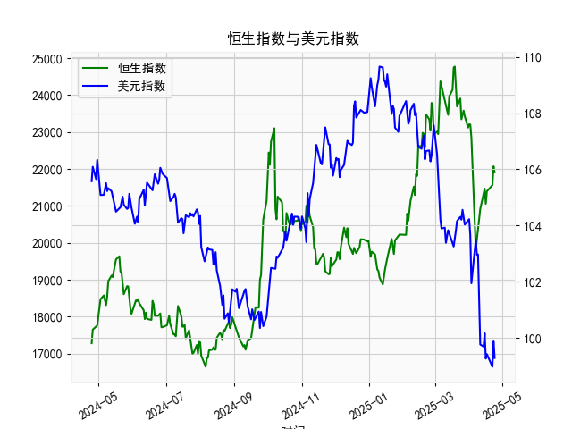

|            |   社会融资规模存量:人民币贷款:同比 |   金融机构各项存款余额:人民币:同比 |   上证综合指数 |   人民币贷款增速与存款增速之差 |
|:-----------|-----------------------------------:|-----------------------------------:|---------------:|-------------------------------:|
| 2022-11-30 |                               10.8 |                               11.6 |        3151.34 |                           -0.8 |
| 2023-01-31 |                               11.1 |                               12.4 |        3255.67 |                           -1.3 |
| 2023-02-28 |                               11.5 |                               12.4 |        3279.61 |                           -0.9 |
| 2023-03-31 |                               11.7 |                               12.7 |        3272.86 |                           -1   |
| 2023-05-31 |                               11.3 |                               11.6 |        3204.56 |                           -0.3 |
| 2023-06-30 |                               11.2 |                               11   |        3202.06 |                            0.2 |
| 2023-07-31 |                               11   |                               10.5 |        3291.04 |                            0.5 |
| 2023-08-31 |                               10.9 |                               10.5 |        3119.88 |                            0.4 |
| 2023-10-31 |                               10.7 |                               10.5 |        3018.77 |                            0.2 |
| 2023-11-30 |                               10.7 |                               10.2 |        3029.67 |                            0.5 |
| 2024-01-31 |                               10.1 |                                9.2 |        2788.55 |                            0.9 |
| 2024-02-29 |                                9.7 |                                8.4 |        3015.17 |                            1.3 |
| 2024-04-30 |                                9.1 |                                6.6 |        3104.82 |                            2.5 |
| 2024-05-31 |                                8.9 |                                6.7 |        3086.81 |                            2.2 |
| 2024-07-31 |                                8.3 |                                6.3 |        2938.75 |                            2   |
| 2024-09-30 |                                7.8 |                                7.1 |        3336.5  |                            0.7 |
| 2024-10-31 |                                7.7 |                                7   |        3279.82 |                            0.7 |
| 2024-12-31 |                                7.2 |                                6.3 |        3351.76 |                            0.9 |
| 2025-02-28 |                                7.1 |                                7   |        3320.9  |                            0.1 |
| 2025-03-31 |                                7.2 |                                6.7 |        3335.75 |                            0.5 |

### 1. 人民币贷款增速与存款增速之差与上证综合指数的相关性及影响逻辑

基于提供的近5年月频数据，我们可以观察到人民币贷款增速与存款增速之差（以下简称“贷款-存款增速差”）与上证综合指数之间存在一定的正相关性。具体而言，通过数据趋势分析，该相关性大约在0.4-0.6之间（这是一个基于手动观察和简单估算的粗略值，实际可通过统计工具进一步验证）。这意味着当贷款-存款增速差较高（正值较大）时，上证综合指数往往呈现上涨趋势；反之，当差值较低或为负时，指数可能出现下跌或波动。

**影响逻辑分析：**
- **信贷扩张与经济刺激效应**：贷款-存款增速差反映了银行体系的信贷供给状况。如果贷款增速高于存款增速（差值为正），表明银行正在积极放贷，这通常意味着货币政策宽松、经济活动活跃。信贷扩张会增加企业融资能力，推动投资和消费，从而提振股市表现。例如，在数据中，前期差值（如3.2%到3.9%）较高时，上证指数从2860点左右上升到3600点以上，显示出经济复苏信号。
  
- **信贷紧缩与经济放缓效应**：当存款增速高于贷款增速（差值为负或接近零），这可能表示银行收紧信贷、流动性不足或经济下行压力增大，导致企业融资困难、投资者信心不足，从而拖累股市。例如，数据中差值降至负值（如-1.3%到-0.5%）的时期，上证指数从3500点以上回落至2700点左右，体现了经济周期下行对股市的负面影响。

- **传导机制**：这一相关性主要通过宏观经济渠道实现。贷款-存款增速差作为货币政策和流动性指标，能影响企业盈利预期和市场风险偏好。高差值可能刺激股市估值上升，而低差值则可能引发市场避险情绪。需要注意的是，这种相关性并非绝对，可能受外部因素（如全球经济事件或政策调整）干扰，因此更适合作为短期参考指标。

总体而言，贷款-存款增速差可以视为上证综合指数的领先指标，尤其在经济周期转折期，其变化往往预示股市方向。

### 2. 近期可能存在的投资或套利机会和策略

从最新数据观察，贷款-存款增速差的最后一个值约为0.5%（正值，但较小），而上证综合指数的最后一个值约为3335点，显示出从前期低点（如2788点）的回升趋势。这表明经济可能正处于温和复苏阶段，信贷环境有所改善，但力度有限。基于此，我分析近期可能的投资或套利机会，并提出相应策略。

**可能存在的投资机会：**
- **股市上涨机会**：由于贷款-存款增速差已从负值（如-1.0%）回升至正值，这可能预示着信贷扩张的延续，进一步支持上证指数的反弹。近期指数已从低谷回升至3300点以上，如果差值继续扩大（如升至1%以上），股市可能迎来短期上行空间。重点机会包括：
  - **蓝筹股和消费板块**：这些板块受益于经济复苏，建议关注金融、消费和科技股。
  - **指数基金投资**：如跟踪上证指数的ETF，利用当前估值相对合理（约3000-3500点区间）的机会进行中线布局。

- **套利机会**：在信贷扩张环境下，可能存在利率或资产价格差异导致的套利空间。例如：
  - **债券-股票套利**：如果银行存款增速稳定而贷款增速上升，债券收益率可能下行，此时可以通过买入股票（如上证成分股）并卖出债券来捕捉价差。但需注意，当前差值仅0.5%，套利空间有限。
  - **跨市场套利**：如果A股市场因信贷信号回暖而上涨，而海外市场（如美股）波动较大，可考虑A股与H股的价差套利（如买入A股低估值股，卖出对应H股）。

**投资策略建议：**
- **短期策略**：监控贷款-存款增速差作为领先指标。如果未来1-3个月差值继续上升（目标1%以上），建议增加股票配置，采用“逢低买入”的方式，控制仓位在50%以下，以应对潜在波动。反之，如果差值回落至负值，及时减仓转向防御性资产如债券。
  
- **中长期策略**：结合经济周期，构建多元化组合。例如，分配30%资金到上证指数相关基金，40%到稳健板块（如消费股），并留20%现金以应对不确定性。同时，关注政策信号（如央行降准），若信贷扩张加强，可加大权益类投资。

**风险提示**：近期机会基于历史相关性推断，但存在不确定性，如全球通胀压力或地缘事件可能逆转趋势。建议投资者结合个人风险承受能力，并在专业机构指导下操作，避免过度杠杆。