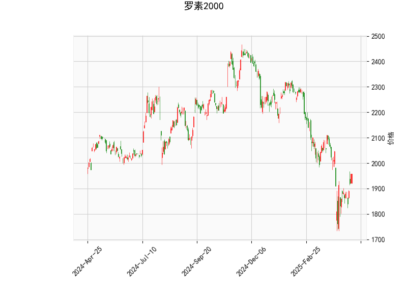

# 罗素2000指数的技术分析结果分析

## 1. 当前市场指标概述
基于提供的技术分析数据，我们可以对罗素2000指数（代表美国小盘股市场）的当前状态进行全面评估。以下是对关键指标的逐一分析：

- **当前价格（1957.5888）**：指数当前位于1957.59点，这是一个相对稳定的水平。相比布林带的中轨（2056.92），价格略低于中轨，但高于下轨（1768.41），表明指数处于中性波动区间，没有明显超买或超卖的极端情况。这可能反映出市场在近期调整后保持了平衡，但尚未突破上轨（2345.43），暗示潜在的上行空间。

- **RSI（51.0207）**：RSI值约为51，处于中性区域（一般50以上表示轻微强势）。这表明指数没有过度买入或卖出，市场动力较为均衡。RSI未达到70的超买阈值或30的超卖阈值，暗示短期内可能有进一步的波动，但无立即逆转风险。

- **MACD指标**：
  - MACD线（-33.9123）和信号线（-51.6290）：MACD线高于信号线，且直方图（17.7167）为正值，这是一个潜在的看涨信号。直方图正值表示动量正在从负向正转变，可能预示短期反弹。然而，MACD整体仍为负，意味着熊市势头尚未完全逆转，需要进一步确认。
  - 总体而言，MACD的这一配置显示出市场可能从之前的下行趋势中恢复，但仍需观察是否形成金叉（MACD线上穿信号线）。

- **布林带**：
  - 上轨（2345.43）、中轨（2056.92）和下轨（1768.41）：当前价格位于中轨附近，表明指数处于正常波动范围内。布林带的宽度相对适中，显示市场波动性不高。如果价格向上突破中轨并接近上轨，可能触发强势上涨；反之，向下触及下轨则可能引发支撑测试。

- **K线形态（['CDLBELTHOLD', 'CDLCLOSINGMARUBOZU', 'CDLLONGLINE', 'CDLMARUBOZU']）**：这些形态整体偏向看涨：
  - CDLBELTHOLD：表示一种强势持有模式，通常在趋势中出现，暗示多头控制了市场。
  - CDLCLOSINGMARUBOZU：这是一个强烈的看涨形态，代表蜡烛实体大且无上影线，显示买家主导了收盘，预示短期上行潜力。
  - CDLLONGLINE：指实体较长的蜡烛，表明市场有显著单向移动，可能为上涨趋势的延续。
  - CDLMARUBOZU：无影线蜡烛，强调强势趋势，通常是多头信号。

综合这些指标，罗素2000指数当前呈现出中性偏看涨的特征。RSI和MACD显示市场动力在恢复，而K线形态强化了短期上行可能性。但整体仍需警惕潜在回调风险，因为MACD未完全转正。

## 2. 近期可能存在的投资或套利机会和策略
基于上述分析，罗素2000指数的近期走势可能提供一些投资或套利机会。以下是针对当前数据的判断和建议策略：

### 可能的机会
- **投资机会**：
  - **看涨潜力**：K线形态（如CDLCLOSINGMARUBOZU和CDLMARUBOZU）暗示短期强势反弹，结合MACD直方图的正值，指数可能向上测试中轨或上轨。如果RSI保持在中性水平，上涨空间较大，尤其在小盘股市场复苏的背景下（如经济数据向好）。
  - **套利机会**：罗素2000作为小盘股指数，可能存在基于期货与现货的价差套利。例如，如果IWM ETF（追踪罗素2000的ETF）与指数期货间出现暂时的价格偏差，可以通过多头现货+空头期货的组合进行套利。当前价格在中轨附近，可能有波动性套利机会，但需监控市场情绪。

- **风险因素**：
  - 如果MACD信号线未被有效上穿，或RSI快速升至70以上，可能会出现回调风险。
  - 外部因素如通胀数据、美联储政策或地缘事件，可能放大小盘股的波动。

### 推荐策略
- **多头投资策略**：
  - **买入时机**：在确认K线形态持续（如出现更多看涨蜡烛）并MACD形成金叉时，考虑买入罗素2000相关ETF（如IWM）或期货合约。目标位可设在中轨（2056.92）以上，甚至上轨（2345.43）。
  - **风险管理**：设置止损在下轨（1768.41）附近，以控制潜在损失。结合RSI监控，如果升至60以上，适度减仓。
  - **持有期**：短期（1-3周），等待RSI或MACD确认趋势。

- **套利策略**：
  - **价差套利**：监控罗素2000期货与现货价差。如果现货价格低于期货（反向套利机会），可以买入现货并卖出期货；反之亦然。利用当前中性波动，预计价差在0.5%-1%范围内进行操作。
  - **波动率套利**：如果布林带收窄（波动性降低），可通过期权策略（如卖出看涨和看跌期权）获利。但需在MACD正直方图时执行，以捕捉潜在反弹。

- **总体建议**：
  - **多元化**：结合基本面分析（如就业数据或企业盈利），避免单纯依赖技术指标。
  - **监控与调整**：每日跟踪RSI和MACD变化，如果K线形态转向（如出现看跌模式），及时退出多头头寸。
  - **适合人群**：此策略更适用于经验丰富的投资者或机构，初学者应谨慎，考虑使用模拟账户测试。

总之，罗素2000指数当前的技术面显示出潜在的上行机会，但需谨慎管理风险。投资决策应结合实时市场数据和个人风险偏好。