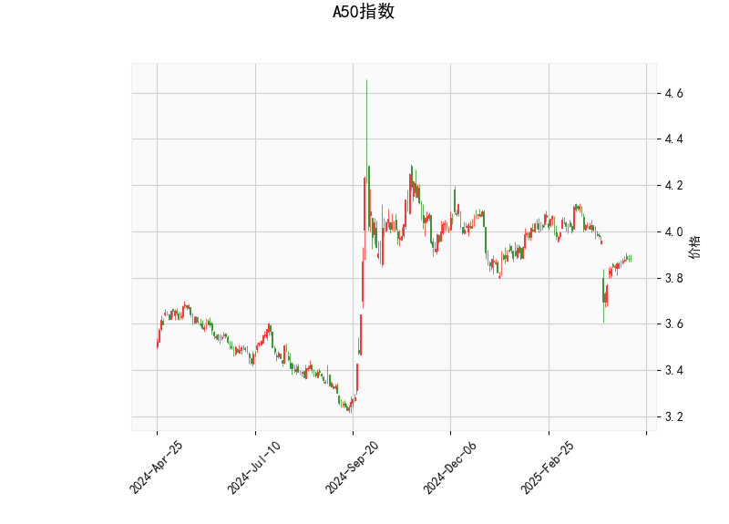

### A50指数技术分析

#### 1. 指标分析
以下是对A50指数当前技术分析结果的详细解读，基于提供的指标数据。我们将逐一分析关键指标及其含义，以评估市场趋势和潜在信号。

- **当前价格（Current Price）**: 当前价格为3.882，这是一个相对稳定的水平。相比布林带的中间带（3.974）和下带（3.784），价格位于下带之上但低于中间带，表明指数可能处于一个波动区间内，短期内可能面临支撑或反弹压力。如果价格进一步接近下带（3.784），这可能被视为一个潜在的买入点；反之，如果突破上带（4.164），则可能预示上行趋势。

- **RSI（Relative Strength Index）**: RSI值为45.525，这处于中性区域（低于50），暗示市场可能偏向弱势或超卖状态。RSI通常用于识别超买（高于70）和超卖（低于30）情况。目前的水平表示卖方力量稍占上风，但尚未极端，短期内可能出现修正或反弹。如果RSI回升至50以上，将是看涨信号；反之，如果跌破30，可能加剧下行风险。

- **MACD（Moving Average Convergence Divergence）**: MACD线为-0.0276，信号线为-0.0368，柱状图（MACD Hist）为0.0092（正值）。MACD线高于信号线，这是一个潜在的看涨交叉信号，表明短期内多头力量可能正在增强。尽管整体MACD仍为负（显示熊市趋势），但柱状图的正值暗示动量可能开始转向。如果MACD线继续上行并突破信号线，将强化买入信号；否则，可能会维持震荡。

- **布林带（Bollinger Bands）**: 上带为4.164、中间带为3.974、下带为3.784。目前价格（3.882）位于下带和中间带之间，显示指数处于一个窄幅波动区间。这通常表示市场不确定性较高，价格可能随时反弹或测试上带。如果价格触及下带并反弹，这可能是一个买入机会；反之，如果突破上带，则可能触发更强的上行趋势。布林带的收窄（上下带较接近）也暗示了潜在的波动性增加。

- **K线形态**: 检测到的K线形态包括CDLDOJI、CDLHIGHWAVE、CDLLONGLEGGEDDOJI和CDLSPINNINGTOP。这些形态整体反映了市场的犹豫和不确定性：
  - CDLDOJI和CDLLONGLEGGEDDOJI：表示买卖力量均衡，市场可能处于十字路口，预示潜在反转或持续震荡。
  - CDLHIGHWAVE：显示高波动性，价格可能出现剧烈波动，但方向不明。
  - CDLSPINNINGTOP：暗示市场缺乏明确方向，短期内可能维持横盘。
  这些形态结合表明，A50指数近期可能处于整理阶段，投资者需警惕突发性突破或回调。

总体而言，技术指标显示A50指数当前处于弱势震荡状态。RSI和MACD的信号略显矛盾（RSI偏弱，但MACD有看涨迹象），而K线形态和布林带强调了市场的不确定性。这可能预示短期内小幅反弹的潜力，但整体趋势仍需进一步确认。

#### 2. 近期投资或套利机会和策略
基于上述分析，我们判断A50指数的近期机会，主要聚焦于短期波动和潜在反转。以下是针对投资和套利策略的评估和建议，强调风险管理，因为市场不确定性较高。

- **投资机会**:
  - **潜在买入机会**: 当前价格接近布林带下带，且MACD显示看涨交叉，这可能是一个短期买入点。如果RSI从45.525回升，结合K线形态的犹豫信号，指数可能反弹至中间带（3.974）或上带（4.164）。建议在价格稳定于3.800以上时考虑小仓位买入，目标设为4.000附近，但需监控全球经济事件（如中国经济数据或地缘风险）以避免意外下行。
  - **卖出或观望机会**: 如果RSI跌破40或价格跌破下带（3.784），这将强化卖出信号，投资者可考虑短期做空或减仓。K线形态的波动性表明，急于追涨可能导致损失。

- **套利机会**:
  - **跨市场套利**: A50指数（通常指中国A50股指期货）与相关资产（如沪深300或全球指数期货）可能存在价差机会。例如，如果A50相对于沪深300出现低估（基于当前弱势），投资者可通过期货套利（如多头A50、空头沪深300）来捕捉价差收敛。当前MACD的看涨信号可能放大这种机会，但需注意成交量和流动性。
  - **期权套利**: 利用布林带的窄幅波动，投资者可考虑买入看涨期权（Call Option）作为保护性策略。如果价格在下带附近，买入廉价看涨期权（如执行价3.800）并结合卖出看跌期权（Put Option）形成牛市价差套利，能在小幅上涨中获利。K线的不确定性使这种策略风险较低，但需关注隐含波动率。
  - **风险因素**: 套利机会依赖市场效率，近期不确定性可能导致价差扩大而非收敛。建议仅在高流动性时操作，并使用止损（如价格跌破3.750触发退出）。

- **总体策略建议**:
  - **风险管理**: 优先采用小仓位操作，并设置止损（如在3.750以下）。结合RSI和MACD的动态，采用趋势跟踪策略：若MACD柱状图持续扩大，逐步加仓；若K线形态转向熊市信号，及时离场。
  - **时间框架**: 适合短期交易者（1-5天），如等待RSI反弹或MACD确认。长期投资者可观望，等待更明确趋势。
  - **注意事项**: 技术分析并非万能，需结合基本面（如中国经济复苏或政策变化）进行决策。当前全球市场波动（如美股影响）可能放大A50的波动性，建议多元化投资以降低风险。

总之，A50指数短期内可能存在小幅反弹的投资机会，但不确定性较高。投资者应以谨慎为主，关注关键技术水平的突破作为行动信号。