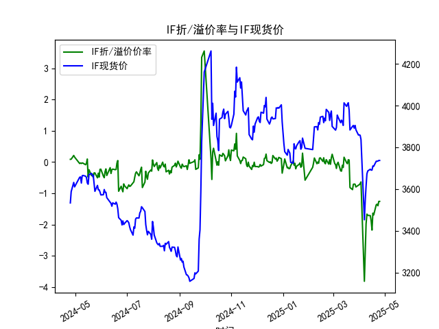
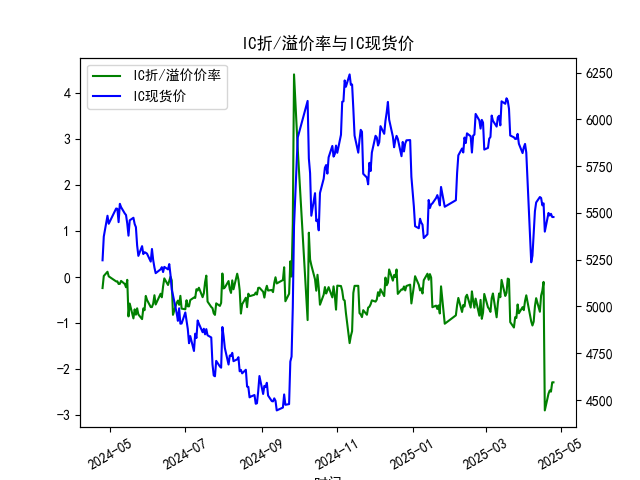

|            |   IF折/溢价率 |   IF现货价 |   IH折/溢价率 |   IH现货价 |   IC折/溢价率 |   IC现货价 |   IH折/溢价率 |   IH现货价 |
|:-----------|--------------:|-----------:|--------------:|-----------:|--------------:|-----------:|--------------:|-----------:|
| 2025-03-28 |     -0.796038 |     3884   |     -0.78484  |     5869.6 |     -0.78484  |     5869.6 |      -3.02986 |     6078.4 |
| 2025-03-31 |     -0.738445 |     3858.6 |     -0.651649 |     5819.6 |     -0.651649 |     5819.6 |      -2.85304 |     6049   |
| 2025-04-01 |     -0.722386 |     3859.6 |     -0.716974 |     5850.6 |     -0.716974 |     5850.6 |      -3.11981 |     6064.2 |
| 2025-04-02 |     -0.689576 |     3857.6 |     -0.5168   |     5868.6 |     -0.5168   |     5868.6 |      -2.82374 |     6100   |
| 2025-04-03 |     -0.634556 |     3837   |     -0.395252 |     5822.4 |     -0.395252 |     5822.4 |      -2.76398 |     6031.8 |
| 2025-04-07 |     -3.81231  |     3452.6 |     -0.961471 |     5236.2 |     -0.961471 |     5236.2 |      -1.16153 |     5432.6 |
| 2025-04-08 |     -2.92977  |     3543.8 |     -1.04965  |     5271   |     -1.04965  |     5271   |      -3.91353 |     5313.6 |
| 2025-04-09 |     -1.97446  |     3614   |     -0.96643  |     5387.2 |     -0.96643  |     5387.2 |      -3.9405  |     5429.6 |
| 2025-04-10 |     -1.663    |     3673   |     -0.632471 |     5509   |     -0.632471 |     5509   |      -3.56785 |     5578.2 |
| 2025-04-11 |     -1.70421  |     3686.6 |     -0.457211 |     5555.8 |     -0.457211 |     5555.8 |      -3.2409  |     5672.2 |
| 2025-04-14 |     -1.71162  |     3694.8 |     -0.752381 |     5584.8 |     -0.752381 |     5584.8 |      -4.13446 |     5693   |
| 2025-04-15 |     -1.88329  |     3690.4 |     -0.402211 |     5580   |     -0.402211 |     5580   |      -3.95041 |     5680.4 |
| 2025-04-16 |     -2.17398  |     3690.8 |     -0.296286 |     5540.4 |     -0.296286 |     5540.4 |      -3.98173 |     5603   |
| 2025-04-17 |     -1.63358  |     3710.6 |     -0.104562 |     5551.2 |     -0.104562 |     5551.2 |      -3.18113 |     5653.8 |
| 2025-04-18 |     -1.68913  |     3708.8 |     -2.89029  |     5400   |     -2.89029  |     5400   |      -3.25269 |     5642   |
| 2025-04-21 |     -1.36545  |     3733.2 |     -2.52696  |     5499.8 |     -2.52696  |     5499.8 |      -3.06818 |     5770   |
| 2025-04-22 |     -1.34653  |     3733   |     -2.45739  |     5486   |     -2.45739  |     5486   |      -3.02072 |     5769.6 |
| 2025-04-23 |     -1.39646  |     3734   |     -2.48358  |     5495   |     -2.48358  |     5495   |      -2.75012 |     5820   |
| 2025-04-24 |     -1.25668  |     3736.8 |     -2.28117  |     5478   |     -2.28117  |     5478   |      -2.58556 |     5767.4 |
| 2025-04-25 |     -1.25668  |     3736.8 |     -2.28117  |     5478   |     -2.28117  |     5478   |      -2.58556 |     5767.4 |

# 1. 股指期货折/溢价率与现货价的相关性及影响逻辑

股指期货的折/溢价率（即期货价格相对于现货价格的百分比差异）是衡量期货市场与现货市场之间关系的重要指标。以下是对其相关性和影响逻辑的解释：

### 相关性分析
- **正相关性**：在某些情况下，折/溢价率与现货价格呈正相关。例如，如果市场预期经济向好，现货价格上涨可能带动期货价格进一步溢价（如数据中ANAL在2024年4月的正溢价与现货价上升相伴）。这反映了投资者对未来价格的乐观预期，导致期货价格高于现货。
- **负相关性**：在其他情境下，二者可能呈负相关，尤其是当市场情绪转向谨慎时。现货价格上涨但期货折价加深（如数据中IH、IC和IM在2025年4月的显著负折价），这可能表示投资者对未来风险的担忧，导致期货价格低于现货。
- **整体相关性动态**：从提供的数据看，四个股指（ANAL、IH、IC、IM）的折/溢价率在过去一年内从正/小负转向显著负值，而现货价格总体上涨。这暗示了短期内负相关性增强，可能是由于市场波动性增加或外部因素（如政策不确定性）影响。

### 影响逻辑
- **基础理论**：股指期货价格理论上应等于现货价格加上持有成本（包括融资成本、交易费用和时间价值）。如果期货价格高于现货（溢价），可能反映市场预期现货价格将上涨；反之，折价可能表示预期下跌。这种差异源于无套利原理：当二者偏离时，套利机会出现。
- **市场因素影响**：
  - **供需动态**：期货市场流动性不足或投资者情绪波动（如风险厌恶）可能导致折价加深。例如，数据中后期IH和IC的折价率从0.02左右降至-2.5左右，可能是由于市场避险情绪增强。
  - **经济与政策因素**：利率上升、宏观经济不确定性（如通胀或地缘政治事件）会放大折/溢价率。现货价格上涨但期货折价（如ANAL从正0.09到负1.26），可能源于投资者对政策紧缩的预期。
  - **时间与期限结构**：期货合约的到期日会影响折/溢价率。近期的负折价（如2025年4月数据）可能与合约临近到期和市场预期调整相关。
  - **交易机制**：股指期货的保证金交易和杠杆效应会放大价格波动，从而影响与现货价的相关性。如果现货市场强势但期货市场承压，折价率会扩大。

总之，折/溢价率与现货价的相关性并非固定，而是受市场预期、流动性和社会环境动态影响。投资者需结合实时数据分析，以避免误判。

# 2. 近期可能存在的投资或套利机会和策略

基于提供的数据，近期（尤其是2025年4月）股指期货普遍出现显著折价（例如IH和IC的折价率在-2.28到-2.53之间），这为潜在投资和套利机会提供了基础。以下是对机会的分析和策略建议：

### 可能存在的机会
- **套利机会**：当前数据显示四个股指的期货价格均低于现货价格，且折价率在过去一年内加深（ANAL从正值转为负1.26，IH从0.02转为-2.28）。这可能源于市场过度悲观或流动性问题，创造出正套利空间。例如，买入折价期货并卖出现货（或通过股指期货对冲现货头寸）可能获利。
- **投资机会**：如果现货价格持续上涨（如数据中所有股指现货价从2024年4月的5000-6000区间升至2025年4月的5400-5800），而期货折价被视为暂时的低估，则买入期货可捕捉反弹。IH和IC的显著折价可能表示市场低点，适合长线投资者。
- **风险因素**：尽管机会存在，但需警惕市场波动（如股指急跌）、交易成本（如手续费和保证金）和政策变化（如利率调整），这些可能放大损失。

### 投资或套利策略建议
- **正向套利策略**：
  - **操作方法**：买入折价期货（如IH或IC），同时卖出等额现货或使用相关股票篮子对冲。这利用了期货价格低于现货的差异，待价格收敛获利。
  - **适用条件**：基于数据，IH和IC的折价率已达-2.28到-2.53，选择折价率超过-1%的日子入场（如2025年4月数据）。预计收敛期为1-3个月。
  - **风险控制**：设置止损点（如折价率进一步扩大到-3%），并监控市场情绪。初始资金需覆盖保证金需求。
  
- **投资策略**：
  - **多头期货策略**：在现货价格稳定上涨的背景下（如ANAL现货从3533到3736），买入折价期货（如IM的-2.59折价）并持有，预期折价率收窄。适合对经济复苏乐观的投资者。
  - **组合策略**：结合期权或多品种套利（如同时操作IH和IC），分散风险。示例：如果IH折价率低于IC，选择IH作为主要头寸。
  - **时机选择**：从数据看，2025年4月的折价已持续数日，建议在折价率稳定或现货强势时入场，避免节假日或数据缺失期（如2024年5月的间隙）。

总体而言，近期折价提供套利窗口，但策略需基于实时市场监控和风险评估。建议投资者结合个人风险偏好和小额测试，避免过度杠杆。

