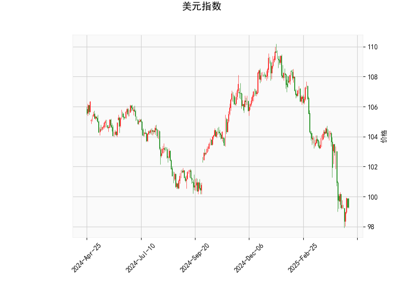

### 1. 美元指数的技术分析结果解读

美元指数当前价位为99.288，基于提供的指标，我们可以从多个技术角度对其进行分析，以评估其短期趋势和潜在风险。

- **RSI（相对强弱指数）分析**：RSI值为35.259，处于超卖区域（一般低于30被视为超卖）。这表明美元指数可能已被过度抛售，短期内存在反弹的可能性。但如果市场情绪持续负面，超卖状态可能进一步加剧，导致更多抛压。

- **MACD（移动平均收敛散度）分析**：MACD线为-1.380，低于信号线-1.354，且直方图（MACD Hist）为-0.026（负值）。这显示出看跌信号，暗示短期内美元指数可能继续下行或维持弱势。MACD的负直方图表示卖方力量占优，但差距较小（仅-0.026），可能预示着潜在的转折点，如果买方入场，行情可能逆转。

- **布林带（Bollinger Bands）分析**：当前价99.288接近下轨98.321，而中轨为103.903，上轨为109.486。这表明价格已触及布林带的支撑位，处于“挤压”状态。价格在下轨附近通常是超卖信号，可能引发反弹；然而，如果突破下轨（低于98.321），则可能进一步下跌至更低水平。

- **K线形态分析**：形态包括“CDLMATCHINGLOW”（匹配低点）和“CDLSHORTLINE”（短线）。CDLMATCHINGLOW暗示价格可能在低点附近形成潜在反转模式，表明卖方动能可能减弱；CDLSHORTLINE表示短期波动，可能是一个小幅整理或回调信号。整体上，这些形态支持短期反弹的可能，但需结合其他指标确认。

**总体判断**：美元指数当前处于弱势，RSI超卖和K线形态暗示潜在反弹机会，但MACD的看跌信号和接近布林下轨的风险表明下行压力仍存。短期内（1-2周），美元指数可能在98-103区间震荡，如果突破100以上，则可能转为中性；反之，若跌破98，则可能测试更低支撑。投资者需关注全球经济数据（如美联储政策）和地缘政治事件，这些可能放大波动。

### 2. 近期A股和港股的投资或套利机会及策略分析

基于美元指数的弱势信号（超卖状态和潜在下行），我们推断其对A股和港股的影响，主要通过资金流动和汇率渠道体现。美元指数走弱通常利好新兴市场股票，因为投资者可能从美元资产转向高增长市场（如中国股市），推动资金流入A股和港股。以下是针对近期（1-3个月）的机会分析和策略建议：

#### **投资机会分析**
- **对A股的影响**：A股（以上证指数或深证指数为代表）往往对美元弱势敏感，尤其是出口导向型行业（如消费电子、汽车和制造业）。当前美元指数RSI超卖，可能预示美元进一步走弱，这将利好人民币升值预期，并吸引外资流入A股。A股近期可能存在反弹机会，特别是如果中国经济数据（如PMI或GDP）向好。潜在机会包括：
  - **周期股和消费股**：如家电、汽车和科技板块，可能受益于全球需求回暖。
  - **风险点**：若美元意外反弹（如美联储加息），A股可能面临回调，因此需关注短期波动。

- **对港股的影响**：港股（以恒生指数为代表）更受全球市场影响，美元走弱可能推动港股上涨，尤其是在中概股（如科技和互联网公司）领域。港股的估值相对A股更低，且流动性更好，适合外资参与。如果美元指数维持在99以下，港股可能迎来资金流入。潜在机会包括：
  - **科技和互联网股**：如腾讯、阿里等H股，可能受益于全球风险偏好提升。
  - **风险点**：港股易受中美关系影响，若美元反弹或地缘事件升级，可能增加波动。

#### **套利机会分析**
- **A-H股套利**：A股和港股间存在价差机会，尤其是同一公司A股（在内地上市）和H股（在香港上市）的估值差异。目前，美元弱势可能放大这一价差，因为外资更倾向于港股作为进入中国市场的渠道。典型套利包括：
  - **正向套利**：如果A股价格高于H股（常见于强势期），可卖出A股并买入H股；反之，如果H股更具吸引力（如当前美元弱势下），可买入H股并卖出A股。
  - **潜在价差**：例如，某些银行或能源股的A-H股价差可能扩大到10-20%，提供无风险或低风险收益。

#### **投资策略建议**
- **买入策略**：
  - **A股**：建议在美元指数低于100时，逐步买入蓝筹股或ETF（如沪深300 ETF），目标板块为消费和科技。设置止损在RSI回升至50以上时减仓。
  - **港股**：买入H股或相关ETF（如恒生科技指数ETF），尤其在美元MACD转正前布局。短期目标是恒生指数反弹至18000以上。

- **套利策略**：
  - **A-H股跨市套利**：监控价差，例如使用工具跟踪招商银行A股和H股的比价；若A-H股价差扩大至15%以上，可进行套利操作（买入低价一方，卖出高价一方）。预计在美元弱势期，这种机会将在1-2周内出现。
  - **期权策略**：在港股市场购买看涨期权（如腾讯期权），以低成本放大收益；若美元指数反弹，及时平仓。

- **风险管理**：
  - **总体风险**：美元指数的潜在反弹（如MACD信号逆转）可能逆转A股和港股的积极趋势，建议控制仓位在50%以内，并结合基本面（如中国经济数据）调整。
  - **时机建议**：短期内（下周起），若美元指数保持在99以下，进入机会窗口；中期（1-3月），关注美联储会议结果作为调整信号。

总之，美元指数的弱势为A股和港股提供了潜在上行空间，投资者可通过买入核心资产或进行A-H股套利来捕捉机会，但需密切监控技术指标和宏观事件以规避风险。