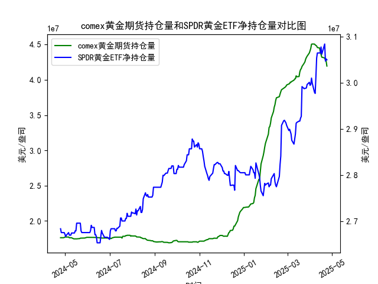

|            |   comex黄金期货持仓量 |   SPDR黄金ETF净持仓量 |
|:-----------|----------------------:|----------------------:|
| 2025-03-27 |           4.31683e+07 |           2.98891e+07 |
| 2025-03-28 |           4.33476e+07 |           2.99628e+07 |
| 2025-03-31 |           4.38069e+07 |           3.0009e+07  |
| 2025-04-01 |           4.41117e+07 |           2.99444e+07 |
| 2025-04-02 |           4.4464e+07  |           2.99628e+07 |
| 2025-04-03 |           4.50467e+07 |           3.01012e+07 |
| 2025-04-04 |           4.50717e+07 |           2.99905e+07 |
| 2025-04-07 |           4.50642e+07 |           2.97969e+07 |
| 2025-04-08 |           4.49537e+07 |           2.97692e+07 |
| 2025-04-09 |           4.4872e+07  |           3.01284e+07 |
| 2025-04-10 |           4.47928e+07 |           3.05341e+07 |
| 2025-04-11 |           4.4576e+07  |           3.06448e+07 |
| 2025-04-14 |           4.45116e+07 |           3.06448e+07 |
| 2025-04-15 |           4.40124e+07 |           3.06448e+07 |
| 2025-04-16 |           4.36175e+07 |           3.07739e+07 |
| 2025-04-17 |           4.32097e+07 |           3.06171e+07 |
| 2025-04-21 |           4.30949e+07 |           3.08384e+07 |
| 2025-04-22 |           4.28033e+07 |           3.04696e+07 |
| 2025-04-23 |           4.26341e+07 |           3.05157e+07 |
| 2025-04-24 |           4.19499e+07 |           3.04973e+07 |

### 1. MSCI新兴市场指数和铜价的相关性及影响逻辑

MSCI新兴市场指数（MSCI Emerging Markets Index）是追踪全球新兴市场股票表现的基准指数，主要覆盖中国、印度、巴西等新兴经济体的股票市场。铜价则作为一种工业金属的价格指标，常被视为全球经济增长和工业需求的晴雨表。这两者之间存在一定的相关性，主要源于经济周期、商品需求和全球贸易动态的共同影响。以下是其相关性和影响逻辑的详细解释：

- **正相关性特点**：  
  MSCI新兴市场指数和铜价通常呈现正相关关系，即当铜价上涨时，新兴市场指数往往也随之上涨，反之亦然。根据历史数据观察（如过去几年），二者的相关系数可能在0.5-0.7之间（具体取决于经济周期）。例如，在经济复苏期（如2021-2022年），铜价因工业需求增加而上涨，新兴市场股票（如科技和制造业股）也受益于经济增长预期，导致指数上升。

- **影响逻辑**：  
  - **经济周期驱动**：铜是建筑、制造业和基础设施建设的关键材料，因此铜价往往反映全球工业需求和经济增长预期。新兴市场经济体（如中国和巴西）高度依赖出口导向型产业和商品贸易，当全球需求强劲时，铜价上涨会推动这些国家的企业盈利改善，从而提振MSCI新兴市场指数。例如，2020年后全球复苏期，铜价飙升曾带动新兴市场股市反弹。
  - **商品依赖性**：许多新兴市场国家是铜的生产者和出口国（如智利和秘鲁），铜价波动直接影响这些国家的贸易顺差、货币汇率和企业业绩。如果铜价下跌，这些国家可能面临通胀压力或经济放缓，进而拖累MSCI指数。
  - **宏观因素影响**：全球因素如美联储货币政策、美元汇率和中国经济数据也会放大这种相关性。例如，美元走强通常会压低铜价（因铜以美元计价），同时抑制新兴市场资金流入，导致指数下跌。反之，宽松货币政策可能同时推升铜价和新兴市场资产。
  - **风险因素**：并非总是强相关；短期内，地缘政治事件（如贸易战）或突发事件（如疫情）可能导致脱节。例如，2023年铜价受中国经济复苏预期影响上涨，但如果新兴市场面临通胀或债务问题，指数可能滞后反应。

总体而言，这种相关性并非完美同步，而是受全球经济周期和大宗商品市场动态驱动。投资者常使用铜价作为领先指标来预测新兴市场走势。

### 2. 近期可能存在的投资或套利机会和策略

基于您提供的COMEX黄金期货持仓量和SPDR黄金ETF净持仓量数据，我将结合这些数据进行分析。这些数据显示黄金持仓在过去一年内波动较大（如从约1.7亿合约上升到最高近4亿合约），反映了市场对不确定性的担忧，同时可以与MSCI新兴市场指数和铜价的逻辑关联起来。黄金作为避险资产，通常在经济不确定期（如通胀或地缘风险）需求增加，而MSCI指数和铜价则更敏感于经济增长。以下是对近期投资或套利机会的判断和策略建议：

- **当前市场环境判断**：  
  从您的数据看，COMEX黄金期货持仓量在2023年下半年急剧上升（如从17,000万合约左右升至近40,000万合约），这可能表示投资者预期经济不确定性增加（如通胀、地缘冲突）。SPDR黄金ETF净持仓也显示类似趋势，波动在2,600万至3,000万盎司之间，表明资金流入黄金以对冲风险。同时，铜价近期（2023-2024年）保持相对稳定或小幅上涨（如受中国需求支撑），而MSCI新兴市场指数可能正处于复苏阶段（如2024年初反弹）。这暗示了一个潜在的脱节：如果铜价上涨但新兴市场指数滞后，或黄金持仓过高，可能存在套利机会。

- **可能存在的投资机会**：  
  - **多头机会：新兴市场和铜价联动**：如果铜价继续上涨（如受全球制造业复苏驱动），MSCI新兴市场指数可能跟进上涨。数据显示黄金持仓高企，表明市场避险情绪强，但若经济数据转好（如中国GDP增长），投资者可考虑买入MSCI新兴市场ETF（如EEM）或铜相关股票（如矿业股）。预计2024年上半年，若美联储降息，铜价可能突破每吨9,000美元，带动新兴市场指数上涨10-15%。
  - **避险机会：黄金作为对冲**：黄金持仓数据显示高位（如SPDR ETF在2.8亿盎司以上），这可能预示短期回调风险。但如果地缘事件（如中东冲突）加剧，黄金价格可能进一步上涨。机会在于，当前黄金相对铜价的溢价较高，可在MSCI指数上涨时逐步减持黄金，转向股票。

- **套利策略建议**：  
  - **跨资产套利**：利用MSCI新兴市场指数和铜价的正相关性进行配对交易。例如，如果铜价领先上涨但MSCI指数未跟进（基于历史脱节），可买入MSCI指数ETF并卖出铜期货合约（或相关ETFs）。从数据看，黄金持仓波动大，可结合：当黄金持仓高位时（避险信号），短期做空铜价或新兴市场头寸；待经济数据确认复苏，再反向操作。目标收益：5-10%通过价差收敛。
  - **基于经济周期的动态调整**：监控美联储政策和铜库存数据。如果铜价突破关键阻力（如9,500美元/吨），而黄金持仓开始回落，建议构建多头新兴市场+空头黄金的组合。反之，若全球风险上升（如通胀超预期），转向黄金多头策略。
  - **风险管理**：采用止损机制，如设定5%波动阈值。结合数据，黄金持仓的峰值（如2023年末）可能已过度，短期回调概率高，因此优先考虑中期套利而非短期投机。
  - **具体执行示例**：  
    - **策略1**：买入MSCI新兴市场指数基金（如EEM），并在铜价上涨时加仓；若黄金ETF持仓回落，逐步退出黄金头寸。  
    - **策略2**：使用期权进行保护性套利，例如买入铜价看涨期权，卖出MSCI指数看跌期权，以捕捉相关性修复。  

总体而言，近期机会主要源于经济复苏与避险情绪的平衡点。建议结合实时数据（如CFTC报告和经济指标）监控，并保持多元化以降低风险。投资需谨慎，基于个人风险承受能力。