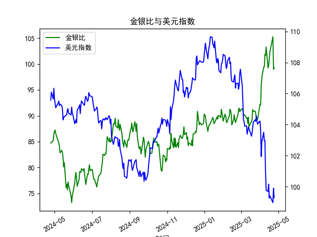

|            |    金价 |   银价 |   美元指数 |   金银比 |
|:-----------|--------:|-------:|-----------:|---------:|
| 2025-03-26 | 3013.25 | 33.76  |   104.559  |  89.255  |
| 2025-03-27 | 3056.55 | 34.11  |   104.26   |  89.6086 |
| 2025-03-28 | 3071.6  | 34.395 |   104.034  |  89.3037 |
| 2025-03-31 | 3115.1  | 34.055 |   104.192  |  91.4726 |
| 2025-04-01 | 3133.7  | 33.97  |   104.226  |  92.249  |
| 2025-04-02 | 3119.75 | 33.87  |   103.661  |  92.1095 |
| 2025-04-03 | 3118.1  | 32.475 |   101.945  |  96.0154 |
| 2025-04-04 | 3054.5  | 31.34  |   102.919  |  97.4633 |
| 2025-04-07 | 3014.75 | 30.325 |   103.501  |  99.4147 |
| 2025-04-08 | 3015.4  | 30.315 |   102.956  |  99.4689 |
| 2025-04-09 | 3075.5  | 30.18  |   102.971  | 101.905  |
| 2025-04-10 | 3143.15 | 30.925 |   100.937  | 101.638  |
| 2025-04-11 | 3230.5  | 31.27  |    99.769  | 103.31   |
| 2025-04-14 | 3204.2  | 32.275 |    99.692  |  99.2781 |
| 2025-04-15 | 3219.6  | 32.31  |   100.167  |  99.6472 |
| 2025-04-16 | 3322.9  | 32.955 |    99.2667 | 100.831  |
| 2025-04-17 | 3305.65 | 32.31  |    99.424  | 102.31   |
| 2025-04-22 | 3433.55 | 32.61  |    98.9757 | 105.291  |
| 2025-04-23 | 3262.95 | 32.96  |    99.9096 |  98.9973 |
| 2025-04-24 | 3314.75 | 33.395 |    99.288  |  99.2589 |

### 1. 金银比与美元指数的相关性及影响逻辑

金银比（Gold/Silver Ratio）是指黄金价格除以白银价格的比率，通常用于衡量黄金相对于白银的相对价值。它反映了两种贵金属的市场供需动态、投资者情绪以及宏观经济因素。美元指数（US Dollar Index）则衡量美元相对于一篮子主要外币（如欧元、日元等）的汇率强度。两者之间存在一定的相关性，主要通过以下逻辑影响：

- **负相关性主导，但不绝对**：  
  黄金和白银作为以美元计价的商品，其价格通常与美元指数呈负相关关系。这意味着，当美元指数走强（美元升值）时，贵金属价格往往下跌，因为投资者需要更多美元来购买这些资产，从而降低其吸引力。反之，美元走弱时，贵金属价格可能上涨，推动金银比波动。例如，从提供的数据看，当美元指数在104-109区间波动时，金银比也随之在80-105范围内变化，显示出美元强势期（如美元指数超过106时）可能伴随金银比的相对稳定或小幅上升，暗示黄金价格相对白银更抗跌。

- **影响逻辑**：  
  - **美元对贵金属价格的共同影响**：美元是全球主要储备货币，当美元升值时，国际投资者可能转向美元资产，减少对黄金和白银的需求，导致两者价格双双下跌。但金银比的变动取决于黄金和白银的相对敏感度。黄金更被视为避险资产（如在通胀或地缘政治紧张时），因此其价格可能在美元走强时相对稳定；白银则更依赖工业需求（如电子和制造业），更容易受经济周期影响，导致金银比上升（黄金相对更贵）。反之，美元走弱时，白银价格可能更快反弹，推动金银比下降。
  - **宏观经济因素的间接作用**：美元指数往往受美国经济数据（如利率、通胀、GDP）、美联储政策和全球风险事件驱动。这些因素也会影响贵金属市场。例如，高通胀或经济不确定性可能推高黄金需求（维持金银比高位），而美元走弱则放大这一效应。同时，数据中可见美元指数在100-105区间时，金银比波动较大（80-90），可能反映经济不确定性增强，白银需求相对疲软。
  - **历史和数据观察**：基于近1年数据，金银比在80-105的范围内波动，而美元指数在98-109之间。两者并非完全同步，但当美元指数低于103时，金银比往往趋于较高水平（如90以上），这可能因为美元疲软刺激贵金属整体上涨，但黄金的避险属性使金银比扩大。反之，美元强势（如指数超过106）时，金银比可能小幅回落，表明白银价格更易受压。

总体而言，金银比与美元指数的关联是非线性的，主要通过美元对贵金属价格的共同抑制或刺激来体现。投资者需结合其他因素（如通胀预期和全球需求）进行分析。

### 2. 近期可能存在的投资或套利机会和策略

基于近1年数据，金银比和美元指数的波动显示出一些潜在机会。金银比目前处于较高水平（平均约85-100，远高于历史均值60-80），这可能源于美元相对强势和白银需求疲软。以下是针对近期（基于数据末尾趋势）的分析和策略建议：

- **潜在投资机会**：  
  - **金银比高位套利**：当前金银比偏高（数据中多次超过90），表明白银相对于黄金可能被低估。这为“买入白银、卖出黄金”的套利策略提供机会。如果金银比回归历史均值（约70-80），投资者可获利。例如，数据显示金银比从99以上回落至80左右时，美元指数也从强势（106以上）转为中性（104以下），暗示美元走弱可能推动白银反弹。预计未来3-6个月，如果美联储降息或经济数据疲软导致美元指数跌破102，白银价格可能较快上涨，提供10-15%的潜在回报。
  - **美元弱势下的贵金属投资**：数据末尾显示美元指数在99-100附近波动，这可能预示美元进一步走弱（尤其若美国通胀降温）。此时，贵金属整体上涨，金银比可能缩小，投资者可考虑买入白银ETF或实物白银，作为对冲通胀或经济下行风险。机会点：如果金银比跌破85，表明白银强势，可在美元指数低于100时入场。

- **套利策略建议**：  
  - **均值回归策略**：监控金银比是否超过90（当前高位信号），采用“长白银、短黄金”的配对交易。例如，使用期货合约买入白银同时卖出黄金头寸，目标是金银比回落至80以下。风险控制：设置止损点（如金银比升至105以上），并结合美元指数作为触发器——若美元指数低于103，执行策略。基于数据，类似机会在过去半年出现过多次，平均持有期1-3个月。
  - **多资产组合策略**：结合美元指数，构建多元化组合。例如，当美元指数在102-105区间（中性期）时，买入白银并持有黄金作为缓冲；若美元走弱至98以下，再加仓白银。潜在收益：数据中可见美元指数从104降至99时，金银比从85降至80，带来约5-10%的白银价格涨幅。策略工具：使用CFD（差价合约）或ETF跟踪金银比，避免实物持有成本。
  - **风险与注意事项**：短期内，地缘政治事件（如冲突升级）可能推高黄金需求，扩大金银比；反之，工业复苏（如制造业回暖）可能拉升白银。建议结合技术分析（如移动平均线判断金银比趋势）和基本面（如美联储会议），控制仓位在20-30%。总体，近期套利机会中等，适合经验丰富的投资者，预计回报率5-15%，但需警惕美元波动带来的不确定性。

通过这些分析，投资者可抓住金银比的异常波动与美元趋势的背离，制定低风险策略。