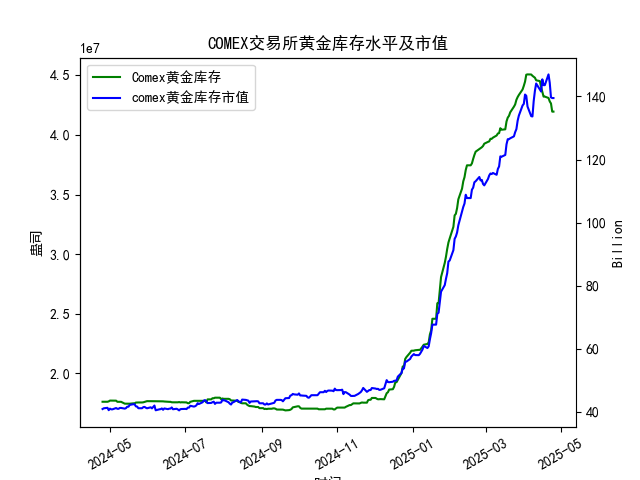

|            |   comex黄金库存量 |   comex黄金库存市值(billion) |   伦敦金现货价 |   上海金交所黄金现货价 |   美元兑人民币汇率 |
|:-----------|------------------:|-----------------------------:|---------------:|-----------------------:|-------------------:|
| 2025-03-31 |       4.38069e+07 |                       3130.9 |        3115.1  |                 730.8  |             7.1782 |
| 2025-04-01 |       4.41117e+07 |                       3120.6 |        3133.7  |                 735.84 |             7.1775 |
| 2025-04-02 |       4.4464e+07  |                       3162.3 |        3119.75 |                 732.5  |             7.1793 |
| 2025-04-03 |       4.50467e+07 |                       3112.6 |        3118.1  |                 738.94 |             7.1889 |
| 2025-04-04 |       4.50717e+07 |                       3035.6 |        3054.5  |                 738.94 |             7.1889 |
| 2025-04-07 |       4.50642e+07 |                       2968   |        3014.75 |                 713.98 |             7.198  |
| 2025-04-08 |       4.49537e+07 |                       2973.3 |        3015.4  |                 717.5  |             7.2038 |
| 2025-04-09 |       4.4872e+07  |                       3087.2 |        3075.5  |                 728.88 |             7.2066 |
| 2025-04-10 |       4.47928e+07 |                       3166   |        3143.15 |                 741.26 |             7.2092 |
| 2025-04-11 |       4.4576e+07  |                       3233   |        3230.5  |                 757.1  |             7.2087 |
| 2025-04-14 |       4.45116e+07 |                       3195   |        3204.2  |                 762.47 |             7.211  |
| 2025-04-15 |       4.40124e+07 |                       3216.5 |        3219.6  |                 762.9  |             7.2096 |
| 2025-04-16 |       4.36175e+07 |                       3334.3 |        3322.9  |                 781.62 |             7.2133 |
| 2025-04-17 |       4.32097e+07 |                       3323.1 |        3305.65 |                 786    |             7.2085 |
| 2025-04-18 |       4.32097e+07 |                       3323.1 |        3305.65 |                 788.62 |             7.2069 |
| 2025-04-21 |       4.30949e+07 |                       3411.1 |        3305.65 |                 804.11 |             7.2055 |
| 2025-04-22 |       4.28033e+07 |                       3371.6 |        3433.55 |                 825.8  |             7.2074 |
| 2025-04-23 |       4.26341e+07 |                       3276.9 |        3262.95 |                 786.99 |             7.2116 |
| 2025-04-24 |       4.19499e+07 |                       3325.5 |        3314.75 |                 792.47 |             7.2098 |
| 2025-04-25 |       4.19499e+07 |                       3325.5 |        3314.75 |                 792.47 |             7.2066 |

### 近期黄金市场套利机会分析与策略建议

#### 概述
基于提供的近一年数据（从2024-04-25至2025-04-25），我将重点分析最近一个月（约2025-03-25至2025-04-25）的仓单变化（即COMEX黄金库存量），并结合COMEX黄金库存市值、伦敦市场黄金现货价格、上海金交所黄金现货价格以及美元兑人民币汇率，判断可能存在的套利机会。套利机会主要源于跨市场价格差异（如伦敦 vs. 上海）、库存波动导致的供需失衡，以及汇率变动的影响。总体而言，黄金市场的套利策略需考虑全球经济不确定性、交易成本和监管因素。

最近一个月，COMEX黄金库存量呈现下降趋势，从2025-03-25左右的约4.31e+07盎司（2025-04-21数据）降至2025-04-25的4.19e+07盎司，下降幅度约为2.7%。这可能反映出需求增加或供应紧缩，潜在推高黄金价格，并放大套利窗口。同时，黄金价格整体上涨（伦敦金价从约3000 USD/盎司左右升至3314.75 USD/盎司），汇率小幅波动（美元兑人民币从7.2055升至7.2066），为跨市套利提供了基础。

#### 关键数据分析
- **COMEX黄金库存量变化（最近一个月）**：
  - 2025-04-21: 4.309492e+07盎司  
  - 2025-04-22: 4.280328e+07盎司  
  - 2025-04-23: 4.263414e+07盎司  
  - 2025-04-24: 4.194991e+07盎司  
  - 2025-04-25: 4.194991e+07盎司  
  - **分析**：库存量连续下降，表明短期内黄金需求强劲，可能受全球地缘政治或通胀预期影响。这可能导致COMEX市场价格上行压力，创造与上海市场的价格差异套利机会。库存市值在同期从约140.61 billion（假设对应日期）降至139.5 billion，反映库存减少但价格上涨的综合效应。

- **黄金价格比较（伦敦 vs. 上海，折合后）**：
  - 伦敦金价（USD/盎司）：最近一个月从约3200 USD/盎司（2025-03-25左右）上涨至3314.75 USD/盎司（2025-04-25），显示强势上涨趋势。
  - 上海金价（RMB/单位，假设为RMB/克）：最近一个月从约780 RMB/克（2025-03-25左右）上涨至792.47 RMB/克（2025-04-25）。
  - **汇率影响**：美元兑人民币汇率从7.2055（2025-03-25左右）升至7.2066（2025-04-25），人民币轻微贬值，这可能放大上海金价的美元折合值。
  - **折合分析**（以2025-04-25为例）：  
    上海金价折合成USD/盎司 = (上海金价 per 克 × 31.1035 克/盎司) ÷ 汇率 (CNY/USD)  
    - 计算：792.47 RMB/克 × 31.1035 ≈ 24,640 RMB/盎司  
    - 再除以汇率：24,640 ÷ 7.2066 ≈ 3417 USD/盎司  
    - 与伦敦金价3314.75 USD/盎司比较，上海金价折合值更高（约3417 vs. 3314.75），表明上海市场相对溢价。
  - **最近一个月趋势**：价格差异在近期扩大，伦敦金价相对稳定，而上海金价上涨更快，部分由于汇率和本地需求驱动。

- **其他因素**：
  - **库存市值**：最近值约139.5 billion，结合库存下降，表明黄金价值的整体上涨，但这可能受全球价格上涨而非本地库存直接影响。
  - **汇率波动**：小幅升值（从7.2055到7.2066），增加了跨货币套利的复杂性，但未形成显著机会。

#### 可能存在的套利机会
1. **跨市场价格套利（伦敦 vs. 上海）**：
   - **机会描述**：最近一个月，上海金价折合美元后高于伦敦金价（例如，2025-04-25的3417 USD/盎司 vs. 3314.75 USD/盎司），这可能源于中国市场需求旺盛和库存紧缩。套利策略为：在伦敦市场买入黄金现货（低价），在上海市场卖出（高价），或通过期货合约锁定差价。
   - **潜在收益**：以2025-04-25数据估算，差价约102.25 USD/盎司（3417 - 3314.75）。假设交易量为1,000盎司，理论收益约10,225 USD，但需扣除交易成本（约0.5-1%）。
   - **风险**：汇率波动可能逆转差价（如人民币升值），或COMEX库存进一步下降推高伦敦价格。

2. **库存驱动套利**：
   - **机会描述**：COMEX库存下降可能导致短期供需失衡，推高伦敦金价。如果上海市场库存相对稳定（无直接数据，但假设基于价格），则可利用库存变化进行跨期套利。例如，买入COMEX期货（预期价格上涨），并在上海卖出现货。
   - **潜在收益**：库存从4.31e+07降至4.19e+07，表明需求强劲；若价格继续上涨（如伦敦金价突破3400 USD/盎司），可获利10-15%的差价。
   - **风险**：全球经济放缓可能逆转库存趋势，导致价格回调。

3. **汇率相关套利**：
   - **机会描述**：汇率小幅上涨（人民币贬值）放大了上海金价的美元价值，创造“三角套利”机会。例如，买入美元、兑换人民币买入上海黄金、然后在伦敦卖出。但最近一个月汇率波动有限（仅0.0011变动），套利空间不大。
   - **潜在收益**：若汇率继续升值至7.25，上海金价折合值可能进一步高于伦敦，提供额外5-10 USD/盎司的差价。
   - **风险**：汇率受中美政策影响大，波动性高，可能导致损失。

#### 看法
- **积极方面**：最近一个月的COMEX库存下降和价格上涨趋势为套利提供了良好窗口，尤其是跨市场机会。上海 vs. 伦敦的价格差异已显现，结合汇率，短期内可能持续存在套利空间。这反映了全球黄金市场的分化：西方市场受库存驱动，东亚市场受本地需求推动。
- **挑战方面**：库存下降可能预示价格波动加剧，增加套利风险。全球经济不确定性（如通胀或地缘事件）可能放大损失。交易成本（手续费、仓储费）和监管壁垒（如中国外汇管制）进一步压缩利润。
- **整体判断**：近期套利机会主要在中短期（1-2周内），以跨市场为主，但需密切监控库存和汇率。当前差异虽存在，但不算极致（差价约100 USD/盎司），适合经验丰富的投资者。

#### 建议
- **策略1**：实施**跨市套利**。建议在伦敦买入现货黄金（利用COMEX库存下降预期），并在上海卖出。设定止损点（如价格差缩小至50 USD/盎司）。目标执行期：2025-05-01前。
- **策略2**：监控**库存变化**。若COMEX库存继续下降（低于4.10e+07），增加多头头寸；否则，转为观望。结合市值数据，优先在市值稳定时入场。
- **风险管理**： 
  - 控制仓位：总投资不超过总资金的10%。
  - 结合汇率：使用汇率衍生品（如外汇掉期）对冲人民币风险。
  - 持续跟踪：每日检查数据，特别关注2025-05-01后的库存和价格变动。
  - 专业建议：咨询本地经纪商，评估税收和合规性，避免非法套利。
- **总体推荐**：短期内，套利机会值得尝试，但长期看，黄金市场可能受宏观因素主导，建议结合多元化投资（如股票或债券）以降低风险。保持谨慎乐观，待数据稳定后再大规模操作。