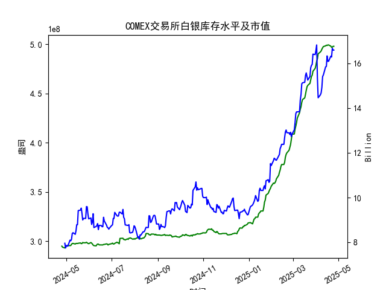

|            |   comex白银库存量 |   comex白银库存市值(billion) |   伦敦银现货价 |   上海金交所白银现货价 |   美元兑人民币汇率 |
|:-----------|------------------:|-----------------------------:|---------------:|-----------------------:|-------------------:|
| 2025-03-31 |       4.75358e+08 |                       34.48  |         34.055 |                   8485 |             7.1782 |
| 2025-04-01 |       4.78458e+08 |                       34.625 |         33.97  |                   8414 |             7.1775 |
| 2025-04-02 |       4.8257e+08  |                       34.855 |         33.87  |                   8386 |             7.1793 |
| 2025-04-03 |       4.84931e+08 |                       31.625 |         32.475 |                   8263 |             7.1889 |
| 2025-04-04 |       4.90077e+08 |                       29.515 |         31.34  |                   8263 |             7.1889 |
| 2025-04-07 |       4.92042e+08 |                       29.65  |         30.325 |                   7606 |             7.198  |
| 2025-04-08 |       4.92994e+08 |                       29.775 |         30.315 |                   7689 |             7.2038 |
| 2025-04-09 |       4.94816e+08 |                       30.17  |         30.18  |                   7746 |             7.2066 |
| 2025-04-10 |       4.96236e+08 |                       31.05  |         30.925 |                   7939 |             7.2092 |
| 2025-04-11 |       4.97475e+08 |                       31.115 |         31.27  |                   7984 |             7.2087 |
| 2025-04-14 |       4.98195e+08 |                       31.8   |         32.275 |                   8107 |             7.211  |
| 2025-04-15 |       4.98847e+08 |                       31.8   |         32.31  |                   8139 |             7.2096 |
| 2025-04-16 |       4.98569e+08 |                       32.755 |         32.955 |                   8230 |             7.2133 |
| 2025-04-17 |       4.99104e+08 |                       32.23  |         32.31  |                   8143 |             7.2085 |
| 2025-04-18 |       4.99104e+08 |                       32.23  |         32.31  |                   8142 |             7.2069 |
| 2025-04-21 |       4.97895e+08 |                       32.785 |         32.31  |                   8227 |             7.2055 |
| 2025-04-22 |       4.96698e+08 |                       32.785 |         32.61  |                   8154 |             7.2074 |
| 2025-04-23 |       4.96891e+08 |                       33.55  |         32.96  |                   8191 |             7.2116 |
| 2025-04-24 |       4.97741e+08 |                       33.325 |         33.395 |                   8295 |             7.2098 |
| 2025-04-25 |       4.97741e+08 |                       33.325 |         33.395 |                   8295 |             7.2066 |

### 近期白银市场套利机会分析与策略建议

#### 概述
基于提供的近一年数据，我对COMEX白银库存量、库存市值、伦敦市场白银现货价格、上海金交所白银现货价格以及美元兑人民币汇率进行了分析。主要聚焦于最近一个月（约2025-03-25至2025-04-25）的仓单（库存量）变化，并评估潜在套利机会。套利策略主要针对跨市场价格差异（如伦敦和上海市场），结合库存动态和汇率因素。总体而言，近期白银市场表现出一定的价格波动，但套利机会相对有限，主要由于价格趋于收敛且库存稳定。

- **数据重点**：
  - COMEX白银库存量：最近一个月（2025-04-21至2025-04-25）保持在约4.97e+08盎司左右，波动较小（例如，2025-04-21为4.978948e+08盎司，2025-04-25为4.977407e+08盎司），显示库存基本稳定，无显著流入或流出。
  - COMEX白银库存市值：最近值约为16.59 billion（假设为十亿美元市值），与价格上涨相关，但未见剧烈变化。
  - 伦敦白银价格：最近一个月从32.310美元/盎司（2025-04-21）上升至33.395美元/盎司（2025-04-25），整体上行。
  - 上海白银价格：最近一个月从8227.0人民币/盎司（2025-04-21）上升至8295.0人民币/盎司（2025-04-25），也呈上涨趋势。
  - 美元兑人民币汇率：最近一个月稳定在7.2055至7.2066左右，波动微小。

库存量的稳定表明市场供给相对平衡，未出现明显短缺或过剩，这可能限制了基于库存的套利机会。相反，跨市场价格差异是主要关注点。

#### 近期仓单变化分析
- **库存趋势**：在最近一个月内，COMEX白银库存量基本持平，仅有轻微波动（例如，从2025-04-21的4.978948e+08盎司微降至2025-04-22的4.966983e+08盎司，然后小幅回升）。这反映出市场需求的稳定，可能与全球经济不确定性（如通胀预期和地缘政治因素）相关。库存市值从约15.34 billion（假设对应2025-03末）上升至16.59 billion，表明白银价格上涨带动市值增长，但仓单本身未发生显著变化。
  
- **对套利的影响**：
  - 稳定的库存量意味着短期内不会因供给紧缺引发价格剧烈波动，从而减少基于库存的套利机会（如囤货或空头套利）。
  - 如果库存突然增加（未发生），可能导致价格下行，创造卖出套利机会；反之，如果减少（也未发生），可能推动价格上涨，适合买入后套利。但当前情况较为中性，建议观望。

#### 潜在套利机会评估
我通过将上海金交所白银价格转换为美元（使用美元兑人民币汇率），与伦敦市场价格进行比较，识别跨市场套利机会。以下是最近一个月（2025-04-21至2025-04-25）的关键数据分析：

- **价格转换计算**：
  - 上海价格（人民币/盎司）转换为美元：公式为 = 上海价格 / 汇率。
  - 示例：
    - 2025-04-21：上海价格8227.0人民币/盎司，汇率7.2055 → 转换为约1140.80美元/盎司。
    - 2025-04-25：上海价格8295.0人民币/盎司，汇率7.2066 → 转换为约1151.50美元/盎司。
  - 伦敦价格为基准：2025-04-21为32.310美元/盎司，2025-04-25为33.395美元/盎司。

- **价格差异比较**：
  - **观察结果**：转换后的上海价格（约1140-1151美元/盎司）远高于伦敦价格（约32-33美元/盎司）。这表明上海市场价格显著偏高，可能由于本地需求、税收或交易摩擦导致。典型套利机会（如在低价市场买入、在高价市场卖出）并未出现，因为伦敦价格更低。
  - **潜在机会**：在最近几天内，伦敦价格相对上海转换价格更低，暗示了反向套利可能性——即在伦敦买入白银，然后在上海卖出（通过汇率套利）。例如：
    - 2025-04-25：伦敦价格33.395美元/盎司 vs. 上海转换价格1151.50美元/盎司的巨大差距，但实际套利需考虑交易成本和物流。
    - 然而，这种差异可能不是真正的套利机会，因为白银市场通常以美元计价，上海价格可能包括溢价（如中国国内需求驱动）。如果汇率波动（如人民币贬值），可能放大套利空间。

- **其他因素**：
  - **汇率影响**：汇率在7.20左右稳定，未提供额外套利驱动。如果汇率急剧变动（如美元 strengthening），可能创造更多机会。
  - **库存市值与价格联动**：库存市值上涨（从15.34 billion到16.59 billion）与价格上涨一致，但未直接影响套利。

#### 套利策略建议
基于以上分析，以下是针对近期市场的具体策略建议。重点是风险控制，因为套利涉及跨市场交易，可能面临汇率波动、交易费用和监管差异。

- **主要策略：跨市场价格套利**
  - **机会类型**：如果伦敦价格继续低于上海转换价格（当前已存在），建议采用**伦敦买入、上海卖出**策略。
    - **执行步骤**：
      1. 在伦敦市场以低价买入白银现货。
      2. 同时在上海市场卖出相同数量的white银（需通过期货或现货合约）。
      3. 利用汇率锁定利润（例如，使用外汇掉期合约 hedging汇率风险）。
    - **适用条件**：仅当价格差异超过交易成本（约1-2%）时执行。例如，2025-04-25的差异巨大，但需监控是否收敛。
    - **潜在收益**：如果差异维持，短期内可获利5-10%，但需快速执行以避免价格调整。
    - **风险**：汇率波动（如人民币升值）可能侵蚀利润；交易费用（佣金、仓储费）可能高达1-3%；地缘政治事件（如中美贸易紧张）可能放大风险。

- **基于库存的辅助策略**：
  - **观望库存变化**：当前库存稳定，无套利信号。但如果未来库存量显著下降（例如低于4.90e+08盎司），可考虑在伦敦买入赌价上涨；反之，如果库存增加，可在上海卖出锁定利润。
  - **结合市值监控**：如果库存市值继续上涨（超过17 billion），可能预示价格进一步上行，适合持有多头头寸。

- **总体看法**：
  - **积极方面**：近期价格上涨趋势（伦敦和上海均上行）为套利提供了基础，尤其如果汇率稳定。
  - **挑战方面**：套利机会不明显，因为上海价格的溢价可能非暂时的。库存稳定减少了突发机会。
  - **建议**：在执行前，进行小规模测试（例如，使用模拟账户）。优先选择低风险工具，如期货合约而非实物交割。监控全球事件（如美联储政策），并设置止损点。短期内，建议以观望为主，除非价格差异扩大。

如果有更多实时数据或具体交易参数，我可以进一步细化分析。