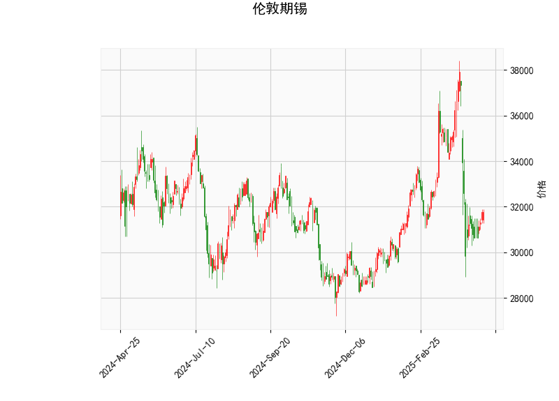

### 伦敦期锡技术分析结果解读

#### 1. 技术指标整体分析
基于提供的伦敦期锡技术分析数据，我们可以从多个维度对当前市场状况进行解读。当前价格为31763.0，处于相对中性的波动区间，但整体指标显示出一定的弱势信号。以下是对关键指标的详细分析：

- **RSI (相对强弱指数)**: 当前RSI值为45.24，这表明市场处于中性偏弱的区域。RSI通常在30以下被视为超卖（可能买入机会），而在70以上被视为超买（可能卖出机会）。45.24的水平暗示短期内卖方力量稍占上风，但尚未进入极端超卖状态，市场可能在盘整或轻微下行。

- **MACD (移动平均收敛散度)**: MACD线为-724.99，信号线为-673.33，柱状图（MACD Hist）为-51.66（负值）。MACD线低于信号线，显示出明显的看跌信号，这通常表示短期趋势向下。柱状图的负值进一步确认了卖方主导，但其绝对值较小（-51.66），暗示下行动能可能正在减弱。如果柱状图开始收窄或转为正值，可能预示反转机会。

- **布林带 (Bollinger Bands)**: 上轨为37041.33，中轨为33026.55，下轨为29011.76。当前价格31763.0位于中轨（33026.55）下方，但高于下轨（29011.76），表明价格处于布林带的收缩区间。这可能反映出市场波动性较低，处于盘整阶段。如果价格进一步接近下轨，可能形成支撑位；反之，如果突破上轨，则可能触发上行趋势。

- **K线形态**: 检测到的形态包括"CDLGAPSIDESIDEWHITE"和"CDLSHORTLINE"。 
  - "CDLGAPSIDESIDEWHITE" 通常表示价格出现跳空缺口后形成一个实体较长的白蜡烛（上涨蜡烛），这可能暗示短期多头信号或潜在反转，但需结合其他指标验证。
  - "CDLSHORTLINE" 指短线蜡烛（如小实体或十字星），往往反映市场不确定性或犹豫，可能预示盘整或小幅波动。
  
总体而言，技术指标显示伦敦期锡当前处于弱势盘整状态。RSI和MACD的看跌信号主导市场，但K线形态的潜在反转迹象（如跳空白蜡烛）可能带来变数。价格在布林带中下部徘徊，暗示短期内可能维持震荡，但若无外部驱动（如经济数据或全球需求变化），下行风险仍存。

#### 2. 近期可能存在的投资或套利机会和策略判断
基于上述分析，伦敦期锡市场短期内可能存在一定的交易机会，但需谨慎对待整体弱势趋势。以下是对潜在投资或套利机会的判断，以及相应的策略建议。注意，投资决策应结合基本面（如全球锡需求、供应动态和宏观经济因素）及风险管理。

##### 可能存在的投资机会
- **看跌机会**: MACD的负值和RSI的弱势水平表明短期下行风险较高。如果价格进一步跌向布林带下轨（29011.76），可能提供卖空或做空机会，尤其若伴随全球经济放缓（如制造业需求下降）或库存增加的外部因素。
  
- **反转机会**: K线形态中的"CDLGAPSIDESIDEWHITE" 可能预示潜在反弹。如果RSI从当前45.24水平回升至50以上，或MACD柱状图由负转正（如从-51.66收窄），这可能标志着超卖反弹，适合买入多头头寸。价格接近下轨时，若出现技术支撑（如历史低点），可视为低风险入场点。

- **套利机会**: 在商品期货市场，套利通常涉及跨市场或跨品种差异。例如：
  - **跨期套利**: 如果伦敦期锡期货与上海期货交易所的锡价存在价差（如由于地域需求或库存差异），可通过买入低价合约并卖出高价合约来锁定利润。目前价格在31763.0左右，若与现货市场（可能受供应链影响）出现异常价差，这将是一个机会。
  - **跨品种套利**: 锡与其它金属（如铜或铝）相关性较高。如果锡价相对其它金属（如LME铜）出现低估（基于历史相关性），可考虑锡与其他金属的价差交易，尤其在全球供应链紧张时期。
  - **波动率套利**: 布林带的收缩（价格在中下部波动）暗示波动性较低，这可能适合期权策略，如卖出看涨期权以赚取时间价值，但需警惕突发事件放大波动。

总体机会评估: 短期内，看跌机会更占优势，但反转信号（如K线形态）可能带来波动性交易。套利机会依赖市场间价差，当前环境（如全球通胀和供应链不确定性）可能放大这些机会。

##### 推荐策略
- **保守策略（适合风险厌恶者）**: 
  - 观察等待：监控RSI是否跌破30（超卖信号），或MACD柱状图是否收窄。若出现，考虑小仓位买入多头头寸，止损设在中轨（33026.55）下方。结合K线形态，避免在"CDLSHORTLINE" 出现时贸然入场。
  - 套期保值：企业或投资者可使用期货合约对冲锡价下行风险，例如买入看跌期权以保护现货头寸。

- **积极策略（适合经验丰富者）**:
  - 做空策略：若MACD保持看跌，价格跌破中轨（33026.55），可执行卖空操作，目标设为下轨（29011.76）。设置止盈/止损，例如在RSI回升至50时止盈。
  - 套利策略：利用跨期或跨品种价差，例如在伦敦和上海市场间建立反向头寸。假设伦敦锡价低于上海价，可买入伦敦合约并卖出上海合约，锁定价差收益。风险控制：限仓不超过总资金的20%，并在关键技术位（如布林带边缘）设置退出点。
  - 结合技术与基本面：若全球锡需求（如电子行业复苏）出现积极信号，优先考虑多头策略；反之，在经济数据疲软时加强看跌布局。

**风险提示**: 技术分析仅为参考，不保证准确性。市场受制于地缘政治、供需变化和突发事件影响，建议结合实时数据、资金管理（如不超过5%的仓位风险）和专业咨询进行操作。短期内，盘整格局可能持续，投资者需耐心等待确认信号。