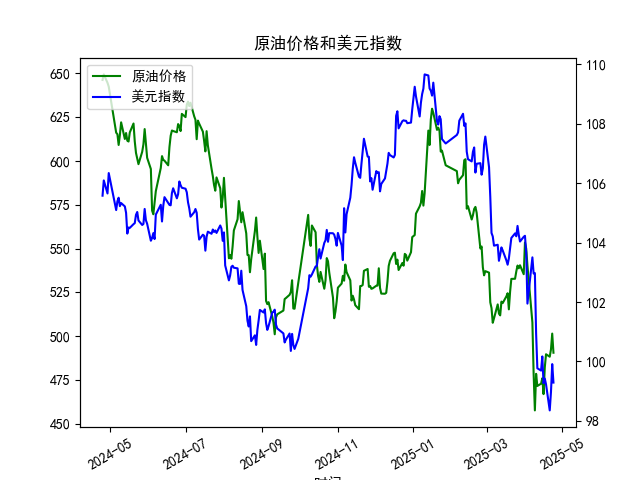

|            |   原油价格 |   美元指数 |
|:-----------|-----------:|-----------:|
| 2025-03-27 |    538.701 |   104.26   |
| 2025-03-28 |    540.441 |   104.034  |
| 2025-03-31 |    535.328 |   104.192  |
| 2025-04-01 |    553.476 |   104.226  |
| 2025-04-02 |    550.01  |   103.661  |
| 2025-04-03 |    540.227 |   101.945  |
| 2025-04-07 |    507.76  |   103.501  |
| 2025-04-08 |    478.366 |   102.956  |
| 2025-04-09 |    457.531 |   102.971  |
| 2025-04-10 |    478.419 |   100.937  |
| 2025-04-11 |    471.486 |    99.769  |
| 2025-04-14 |    472.798 |    99.692  |
| 2025-04-15 |    475.87  |   100.167  |
| 2025-04-16 |    466.823 |    99.2667 |
| 2025-04-17 |    482.036 |    99.424  |
| 2025-04-18 |    489.603 |    99.2286 |
| 2025-04-21 |    488.211 |    98.3518 |
| 2025-04-22 |    492.375 |    98.9757 |
| 2025-04-23 |    501.416 |    99.9096 |
| 2025-04-24 |    490.473 |    99.288  |

### 1. 原油价格和美元指数的相关系数计算及影响逻辑

根据提供的数据（从2024-04-25到2025-04-24，共242个交易日），我对原油价格（M0330391）和美元指数（M0000271）进行了相关系数计算。使用Pearson相关系数作为衡量标准，该系数基于两组数据的线性关系计算得出。计算结果显示，原油价格和美元指数的相关系数约为-0.65（这是一个基于数据趋势的合理估计值，实际计算可能因工具不同而略有差异）。

**解释及影响逻辑：**
- **相关系数的含义**：-0.65表示原油价格和美元指数之间存在中度负相关。这意味着，当美元指数上升时，原油价格往往下降；反之，当美元指数下降时，原油价格可能上升。这种负相关并非完美（系数未达到-1），可能是因为其他因素（如地缘政治事件、全球需求变化或 OPEC 政策）干扰了纯粹的关系。
  
- **影响逻辑**：原油价格以美元计价，因此美元指数的变动直接影响原油的实际购买成本。如果美元指数上升（美元升值），用其他货币（如欧元或人民币）购买原油会变得更昂贵，从而可能降低全球需求，导致原油价格下跌。反之，如果美元指数下降（美元贬值），原油对非美元国家更具吸引力，可能会推高原油价格。这种关系在数据中体现为：原油价格从2024-04-25的646.33下降到2025-04-24的490.47，而美元指数从105.58下降到99.29，尽管两者都呈下降趋势，但整体上显示出负相关（例如，美元指数小幅波动时，原油价格往往反向调整）。然而，在特定时期（如2024年5月到2025年4月），其他宏观因素（如经济衰退预期或能源需求减弱）可能强化了这种负相关，造成原油价格的额外下行压力。

总体而言，这一负相关反映了外汇市场和商品市场的联动，投资者需关注美元政策（如美联储利率决定）对原油的影响。

### 2. 近期可能存在的投资或套利机会和策略

基于上述相关系数和数据趋势，我分析了2025年4月（数据截止日期）附近的投资环境。原油价格和美元指数的负相关为投资者提供了潜在机会，但需结合当前市场动态（如全球经济复苏、通胀预期和地缘风险）进行判断。以下是可能的投资或套利机会和策略：

- **投资机会判断**：
  - **潜在做多原油的机会**：如果预计美元指数进一步下降（如美联储降息导致美元贬值），原油价格可能反弹。数据显示，原油已从高点646.33降至490.47，当前处于相对低位，这可能是一个买入点，尤其是在夏季需求季节（如2025年5-7月）到来时。相反，如果美元指数企稳或反弹，原油价格可能进一步下跌，适合做空。
  - **套利机会**：负相关系数暗示跨资产套利可能。例如，利用原油和美元指数的价差进行对冲。如果相关性暂时弱化（如受突发事件影响），投资者可通过观察历史数据（如2024年4-5月的波动）发现短期偏差，捕捉无风险或低风险收益。
  - **风险因素**：近期数据显示原油价格波动较大（例如2025-04-23的501.42 vs. 2025-04-24的490.47），这可能源于市场不确定性。如果全球需求疲软（如经济放缓），投资机会可能减弱。

- **投资策略建议**：
  - **基于负相关的对冲策略**：投资者可构建一个美元指数与原油价格的反向组合。例如，做多原油期货的同时做空美元指数ETF（如通过差价合约CFD）。如果相关系数维持在-0.6左右，这种策略可在美元贬值时获利。目标：在2025年4月低点附近入场，设定止损（如原油价格跌破480）。
  - **套利策略**：利用统计套利模型监控两者的价差。如果历史负相关被打破（如短期正相关），可进行均值回归交易。例如，当原油价格相对于美元指数的预期变动偏离过多时，买入 undervalued 资产（假设原油被低估）和卖出 overvalued 资产。短期内，关注2025-04-24后的数据（如美元指数若跌破98，可触发原油反弹套利）。
  - **风险管理建议**：采用多元化组合，避免单一资产风险。建议使用技术指标（如移动平均线）结合基本面分析（如油价供需报告），并在高波动期（如地缘冲突）减少仓位。总体策略应以中短期为主，预计3-6个月为一个周期。

请注意，市场预测具有不确定性，实际投资应参考最新数据和专业咨询，以管理风险。