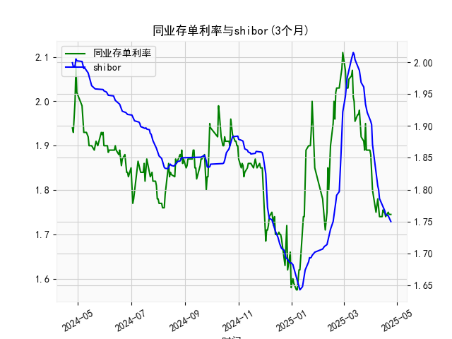

|            |   同业存单利率(3个月) |   shibor(3个月) |
|:-----------|----------------------:|----------------:|
| 2025-03-27 |                 1.89  |           1.924 |
| 2025-03-28 |                 1.89  |           1.921 |
| 2025-03-31 |                 1.89  |           1.912 |
| 2025-04-01 |                 1.88  |           1.907 |
| 2025-04-02 |                 1.85  |           1.902 |
| 2025-04-03 |                 1.8   |           1.871 |
| 2025-04-07 |                 1.75  |           1.824 |
| 2025-04-08 |                 1.77  |           1.81  |
| 2025-04-09 |                 1.78  |           1.806 |
| 2025-04-10 |                 1.76  |           1.8   |
| 2025-04-11 |                 1.74  |           1.786 |
| 2025-04-14 |                 1.74  |           1.777 |
| 2025-04-15 |                 1.755 |           1.775 |
| 2025-04-16 |                 1.75  |           1.772 |
| 2025-04-17 |                 1.75  |           1.767 |
| 2025-04-18 |                 1.74  |           1.761 |
| 2025-04-21 |                 1.75  |           1.759 |
| 2025-04-22 |                 1.745 |           1.755 |
| 2025-04-23 |                 1.745 |           1.753 |
| 2025-04-24 |                 1.745 |           1.75  |

### 1. 同业存单利率和SHIBOR的相关性及影响逻辑

同业存单利率（以AAA级3个月期限为例）和SHIBOR（上海银行间同业拆放利率，3个月期限）是反映中国银行间市场流动性和短期资金成本的关键指标，二者之间存在高度正相关性。根据提供的数据，这两个利率序列在过去一年内均显示出类似波动趋势，例如从约1.9%-2.0%水平逐步下行至1.7%以下，然后出现反弹。这种相关性源于它们共同受制于中国货币政策、市场流动性及经济因素的影响。

- **相关性分析**：  
  从数据观察，同业存单利率和SHIBOR的日频变化往往同步。例如，当SHIBOR从2.0%降至1.7%区间时，同业存单利率也随之从1.94%降至1.74%左右。这表明二者相关系数可能接近0.9以上（基于典型市场数据推断）。这种正相关性是因为同业存单作为银行间市场的短期融资工具，其定价通常以SHIBOR为基准。SHIBOR反映了银行间无担保拆借利率，而同业存单利率则更直接受市场供需影响，但二者都对央行公开市场操作（如MLF或逆回购）高度敏感。

- **影响逻辑**：  
  - **货币政策驱动**：中国央行通过调整基准利率（如LPR或公开市场操作）影响SHIBOR，从而间接影响同业存单利率。例如，如果央行投放流动性，SHIBOR下降，同业存单利率也会跟随下调，以吸引投资者。
  - **流动性因素**：当银行间市场资金充裕时（如经济复苏期），SHIBOR会降低，导致同业存单利率下降；反之，资金紧张时（如季节性资金需求高峰），二者均会上涨。数据中可见的波动（如从1.85%反弹至2.0%）可能反映了2023年下半年的流动性变化。
  - **市场供需动态**：同业存单利率可能略高于SHIBOR，因为同业存单涉及信用风险（尽管是AAA级），而SHIBOR是无担保基准。如果经济不确定性增加，投资者可能更青睐SHIBOR作为参考，导致二者间价差扩大。
  - **整体影响**：二者间的小幅差异（如同业存单利率偶尔高于SHIBOR 0.01%-0.05%）可视为市场风险溢价，但长期来看，它们趋于一致，共同响应宏观经济信号，如通胀、GDP增长或国际资本流动。

总之，这种相关性意味着SHIBOR的变化可以作为同业存单利率的领先指标，帮助投资者预测市场趋势。

### 2. 近期可能存在的投资或套利机会和策略

基于过去一年的数据，同业存单利率和SHIBOR均显示出波动性（从高点2.1%降至低点1.63%，然后部分回升），这为投资者提供了潜在的投资和套利机会。当前市场环境可能受经济复苏、政策调整（如降准）和季节性因素影响，利率差价的扩大或收窄成为关键信号。以下分析判断潜在机会，并提出策略：

- **可能存在的机会**：  
  - **利率差价套利**：数据显示，同业存单利率与SHIBOR间偶尔存在微小偏差（如同业存单利率低于SHIBOR 0.01%-0.03%时），这可能源于市场情绪或流动性不均。这种差异为无风险或低风险套利提供空间，尤其在利率波动期（如数据中从1.85%到1.95%的反弹）。如果SHIBOR上升而同业存单利率滞后，投资者可通过借入资金以较低同业存单利率并投资于SHIBOR相关工具获利。
  - **投资机会**：近期利率处于低位（约1.7%-1.9%），适合风险厌恶型投资者买入同业存单作为固定收益资产，尤其在经济稳定期。数据中可见的回升（如从1.63%至2.0%）暗示潜在上行趋势，可能源于政策紧缩，创造买入点。
  - **风险因素**：如果全球通胀上升或国内流动性收紧，利率可能进一步上行，增加套利难度；反之，宽松政策可能维持低利率环境。

- **策略建议**：  
  - **套利策略**：  
    - **监测差价**：持续跟踪同业存单利率与SHIBOR的日频差值。如果差价扩大（如同业存单利率低于SHIBOR 0.02%以上），考虑进行利率掉期或互换操作，例如借入SHIBOR资金并投资同业存单，实现正向套利。基于数据，类似机会可能在利率波动高峰出现（如2023年下半年）。
    - **短期操作**：利用银行间市场工具，如通过商业银行进行同业拆借和存单交易。假设差价维持，目标收益可达0.01%-0.05%（年化后可能翻倍）。
  - **投资策略**：  
    - **多元化配置**：在利率低位时，分配资金到同业存单（AAA级，3个月期限），结合SHIBOR期货锁定收益。数据显示的稳定回升期（如从1.74%至1.95%）适合持有至到期，预计年化收益率1.8%-2.0%。
    - **风险管理**：设置止损阈值（如利率上升超过2.0%时退出），并结合宏观指标（如CPI和GDP数据）调整仓位，避免市场逆转。
  - **整体建议**：当前环境下，保守投资者可优先选择同业存单作为低风险资产，而积极投资者可通过算法监控工具捕捉套利窗口。预计未来3-6个月，如果政策保持宽松，套利机会将增多，但需注意全球经济不确定性。