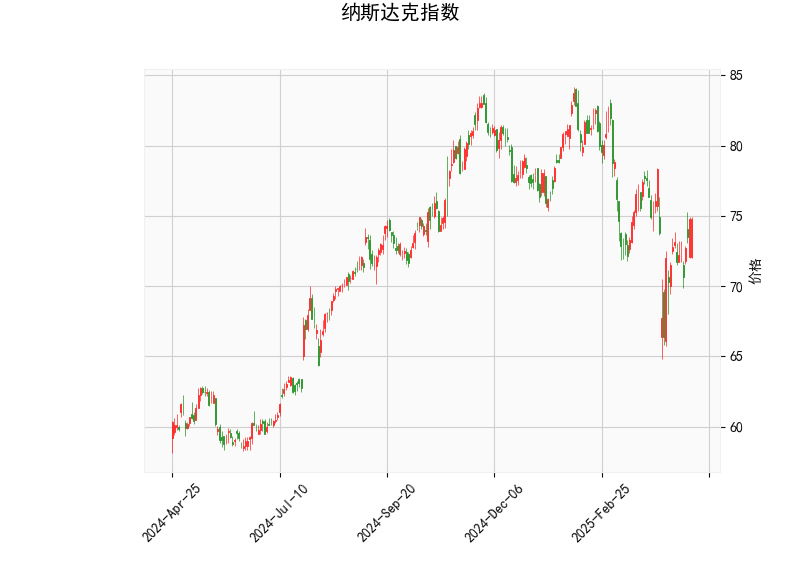

# 纳斯达克指数技术分析结果解读

## 1. 对技术分析结果的详细分析
基于提供的纳斯达克指数数据，我们可以从多个技术指标入手，评估当前市场的态势。以下是对各指标的逐一分析：

- **当前价格（74.74）**：  
  当前价格位于76.28的中轨附近（布林带中轨），高于下轨（68.14）但低于上轨（84.42）。这表明价格处于相对稳定的区间内，没有明显突破上轨（可能表示超买）或下轨（可能表示超卖）。短期内，价格的波动可能保持在中性水平，但如果出现向上突破，将测试上轨的阻力。

- **RSI（52.89）**：  
  RSI值处于中性区域（高于30但低于70），表明纳斯达克指数当前没有明显的超买或超卖信号。RSI接近50，暗示市场力量平衡，投资者情绪较为稳定。这可能预示短期内市场将继续横盘整理或缓慢上涨，而非急剧波动。

- **MACD指标**：  
  - MACD线（-0.57）高于信号线（-1.08），且MACD柱状图（0.51）为正值，这是一个潜在的看涨信号。MACD线从信号线向上交叉，表明短期动量可能正在转向正面。尽管整体MACD值为负（显示熊市势头尚未完全逆转），但柱状图的正值暗示买方力量正在增强，可能预示反弹或修正。

- **布林带指标**：  
  - 上轨（84.42）、中轨（76.28）和下轨（68.14）显示当前价格在中轨附近波动，表明市场处于低波动状态。布林带的宽度相对正常（未显著扩张），这通常反映市场不确定性不高。如果价格向上逼近上轨，可能出现买盘增多；反之，向下接近下轨则可能触发卖盘。

- **K线形态**：  
  该指标显示了多个强势信号，包括CDLBELTHOLD（多头控制，价格维持上涨）、CDLCLOSINGMARUBOZU（强势收盘实体蜡烛，表示强劲趋势）、CDLLONGLINE（长实体线，显示大波动）和CDLMARUBOZU（无影实体蜡烛，强调强势）。这些形态整体偏向看涨，暗示近期K线图可能形成上涨格局，投资者应关注连续性以确认趋势。

综合而言，技术指标呈现出中性偏看涨的态势。RSI和布林带显示市场稳定，MACD和K线形态则提供了一些积极信号，但尚未出现极端条件（如RSI超买）。这可能表示纳斯达克指数正处于一个积累阶段，等待进一步催化剂（如经济数据或市场事件）来推动方向。

## 2. 近期可能存在的投资或套利机会和策略
基于上述分析，我们可以判断纳斯达克指数的潜在机会。当前市场显示出轻微看涨迹象，但风险仍存（如可能的回调）。以下是针对近期机会的分析和建议策略：

### 可能的机会
- **看涨机会**：  
  MACD的正柱状图和强势K线形态（如CDLMARUBOZU）暗示短期内可能出现反弹或小幅上涨。如果外部因素（如积极的经济数据）支持，价格可能向上测试布林带上轨（84.42），提供买入机会。RSI的中性水平意味着市场尚未过热，留有上行空间。

- **套利机会**：  
  由于布林带显示低波动，投资者可考虑波动率套利策略，例如通过期权或期货合约（如买入看涨期权、卖出看跌期权）来捕捉潜在的价格波动。K线强势形态可能导致短期价差扩大，提供差价套利（如在横盘中买入低点、卖出高点）。然而，MACD的负值提醒需警惕逆转风险。

- **风险因素**：  
  如果RSI升至70以上或MACD线回落，市场可能进入回调阶段，导致机会转为风险。全球事件（如地缘政治或利率变化）也可能放大波动。

### 推荐策略
- **买入策略**：  
  如果K线形态持续显示强势（如新CDLMARUBOZU出现），建议在当前价位（74.74）附近买入ETF或指数基金，目标设在上轨（84.42）。设置止损在下轨（68.14）以下，以控制风险。结合RSI监控，避免在超买区入场。

- **套利策略**：  
  利用布林带的窄幅波动进行中性套利，例如构建期权价差组合（如牛市价差策略），在价格小幅上涨时获利。短期内，可监控MACD交叉点作为进出信号，确保风险对冲（如使用对冲基金或衍生品平衡头寸）。

- **整体建议**：  
  采用保守方法，优先观察市场确认信号（如MACD线进一步上扬）。多元化投资（如结合股票和期权）可降低单一风险。长期投资者应关注基本面（如科技股表现），而短期交易者可借助技术指标快速进出。始终结合风险管理，建议在实际操作前咨询专业顾问。