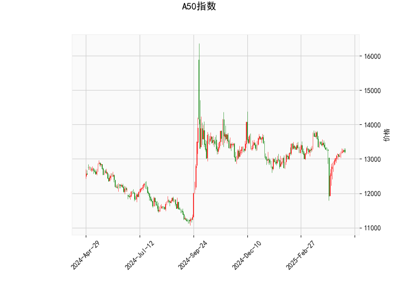

### A50指数技术分析结果解读

#### 1. 对技术分析结果的详细分析
以下是对A50指数当前技术指标的逐项分析，基于提供的指标数据（当前价为13218.0）。这些指标共同反映了市场的短期趋势、动量和波动性。

- **当前价格（Current Price）**: 13218.0  
  当前价格位于布林带的中轨（Middle Band）附近（13223.2），表明指数处于相对平衡的状态。价格没有明显偏离中轨，这通常暗示市场缺乏强烈的趋势方向，可能处于盘整期。如果价格向上突破上轨（13805.21），可能预示上行趋势；反之，向下突破下轨（12641.19）则可能转为下行。

- **RSI（Relative Strength Index）: 52.92**  
  RSI值处于中性区间（30-70），具体为52.92，表明A50指数目前没有明显的超买或超卖信号。这反映了市场参与者的力量相对均衡，短期内可能继续维持横盘。如果RSI升至70以上，将提示潜在超买风险；如果跌至30以下，则可能出现超卖反弹机会。目前的RSI水平支持市场继续观望。

- **MACD（Moving Average Convergence Divergence）指标**  
  - MACD线: -0.33  
  - MACD信号线: -43.38  
  - MACD柱状图（Hist）: 43.05  
  MACD指标显示了短期趋势的细微变化。MACD线（-0.33）略微低于零轴，但MACD柱状图（Hist）为正值（43.05），这暗示短期内可能存在看涨信号，因为Hist是MACD线与信号线的差值，且正值表示MACD线正在向信号线靠拢或上行。然而，整体MACD值偏负，表明熊市势头尚未完全逆转。投资者需关注Hist的持续性：如果Hist保持正值并扩大，可能会确认上行趋势。

- **布林带（Bollinger Bands）**  
  - 上轨（Upper Band）: 13805.21  
  - 中轨（Middle Band）: 13223.2  
  - 下轨（Lower Band）: 12641.19  
  当前价格紧邻中轨，显示市场波动性较低（布林带收窄）。这通常是市场处于整理阶段的特征，等待突破方向。如果价格向上触及上轨，可能触发买盘；反之，向下触及下轨则可能引发卖压。布林带的窄幅暗示短期内缺乏剧烈波动，但一旦突破，将增加趋势的确定性。

- **K线形态**  
  - CDLMATCHINGLOW: 这是一种看涨形态，表示最近的K线显示出两个连续的低点大致相同，暗示市场可能已触及短期底部。这是一种潜在的反转信号，表明卖方力量减弱，买方可能开始积聚。  
  - CDLSPINNINGTOP: 这是一种中性或不确定形态，K线实体较小（上下影线较长），反映市场多空力量均衡，价格波动有限。目前的结合形态（CDLMATCHINGLOW + CDLSPINNINGTOP）显示短期内可能有底部构建，但缺乏明确方向，投资者需等待确认。

总体而言，A50指数的技术指标显示市场处于中性偏看涨的整理阶段。RSI和布林带的中性位置，以及K线形态的底部信号（如CDLMATCHINGLOW），暗示潜在的上行机会，但MACD的负值和CDLSPINNINGTOP的不确定性提醒风险。短期趋势可能取决于外部因素，如全球经济数据或政策变化。

#### 2. 近期可能存在的投资或套利机会及策略分析
基于上述分析，A50指数短期内可能存在有限的投资机会，特别是围绕潜在反转和盘整。以下是针对近期（1-3个月）的判断和策略建议，重点关注风险控制和机会捕捉。策略以保守为主，适合经验丰富的投资者。

##### 可能的投资机会
- **看涨机会**:  
  K线形态中的CDLMATCHINGLOW和MACD Hist的正值暗示指数可能从当前水平反弹。如果价格突破布林带上轨（13805.21），这将是一个买入信号，潜在目标可看向13500-14000区间。RSI的中性水平支持这种可能性，但需结合全球市场（如中国经济数据或美联储政策）确认。  
  **套利潜力**: A50指数期货或期权市场可能存在价差机会。例如，如果现货指数与期货价格出现偏差（如期货折价），投资者可通过现货-期货套利获利。当前的中性指标环境适合低风险套利，而非高杠杆投机。

- **风险与下行机会**:  
  如果市场不确定性加剧（如CDLSPINNINGTOP所示），价格可能下探布林带下轨（12641.19），提供逢低买入或空头机会。但RSI未进入超卖区，因此下行风险较低。短期内，任何急跌都可能被视为修正性机会，而非长期趋势逆转。

##### 推荐投资策略
- **多头策略（Buy and Hold）**:  
  - **买入点**: 在价格稳定在中轨以上（13200以上）时小仓位买入，设置止损在下轨附近（12800以下）。目标价格为上轨（13800以上）。  
  - **理由**: MACD Hist的正值和K线底部信号提供支撑。结合RSI的中性，短期上行概率较高。  
  - **风险管理**: 限仓位（不超过总仓位的20%），并监控全球事件（如中美贸易动态）。  

- **套利策略（Arbitrage）**:  
  - **跨市场套利**: 利用A50指数期货与现货的价差。例如，如果期货价格低于现货（常见于市场不确定期），可买入期货并卖出现货锁定收益。当前布林带收窄的环境有利于低波动套利。  
  - **期权策略**: 购买看涨期权（Call Option）作为保护性头寸，行使价设在13500左右。成本较低，适合在CDLSPINNINGTOP不确定期 hedging。  
  - **理由**: 指标的中性特征减少了剧烈波动的风险，套利操作可实现无风险或低风险收益。  

- **观望与中性策略**:  
  - 如果市场继续盘整，建议采用区间交易：买入低点（12600-13000）并卖出高点（13500-13800）。使用MACD作为进出信号，例如当Hist转为正值时买入。  
  - **理由**: K线形态的不确定性提醒避免激进操作。等待RSI突破60以上或布林带扩大时再行动。  

总体策略建议: 近期机会以短期反弹为主，但需谨慎。优先选择低风险策略，如套利或小仓位多头。外部因素（如经济数据）将主导趋势变化，投资者应结合基本面分析（如中国股市表现）进行决策。风险提示: 市场波动性可能增加，建议设置严格止损以控制损失。