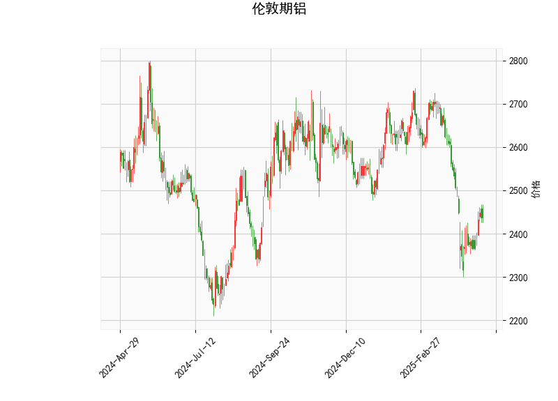

### 伦敦期铝技术分析结果分析

#### 1. 对技术分析结果的详细解读
基于提供的伦敦期铝技术指标数据，我们可以从多个维度对当前市场状况进行评估。以下是对关键指标的逐一分析：

- **当前价格（Current Price）**: 价格为2437.5，表明铝价目前处于相对较低水平，与历史波动相比，可能接近支撑位。这可能反映出市场情绪谨慎或外部因素（如全球经济不确定性）对需求的影响。

- **RSI（Relative Strength Index）**: RSI值为46.05，处于中性区域（一般RSI在30-70之间为中性）。低于50的RSI暗示短期内卖方力量稍占上风，但尚未进入超卖区（RSI<30），因此市场可能正处于盘整阶段，潜在反弹机会存在。

- **MACD（Moving Average Convergence Divergence）**: MACD线为-37.64，信号线为-53.63，柱状图（MACD Hist）为15.99（正值）。MACD线高于信号线（尽管两者均为负），这显示短期移动平均线正逐渐接近长期移动平均线，形成潜在的看涨信号。柱状图的正值进一步表明多头力量可能正在积聚，但整体MACD仍为负，意味着趋势尚未完全反转，投资者需警惕可能的假突破。

- **Bollinger Bands（布林带）**: 上轨为2812.99，中轨为2561.58，下轨为2310.18。目前价格（2437.5）位于中轨下方且接近下轨，这通常表示价格处于波动区间的下端，暗示市场可能超卖或即将出现均值回归。如果价格反弹至中轨以上，可能确认向上趋势；反之，若跌破下轨，则可能加剧下行风险。

- **K线形态（K线形态）**: 检测到"CDLMATCHINGLOW"形态，这是一个经典的看涨反转信号，通常出现在价格见底后，表明市场可能从低点反弹。该形态暗示卖方力量耗尽，多头可能开始主导，短期内价格向上修正的可能性较高。

总体而言，这些指标显示伦敦期铝当前处于弱势盘整阶段，但RSI中性、MACD柱状图正值以及K线看涨形态的结合，暗示潜在的反弹机会。市场可能正从超卖区恢复，但需注意全球经济因素（如能源价格或需求疲软）可能干扰趋势。

#### 2. 近期可能存在的投资或套利机会和策略判断
基于上述分析，伦敦期铝市场短期内可能存在一定的投资机会，特别是反弹交易，但风险不可忽视。以下是对潜在机会和策略的评估：

- **可能存在的投资机会**:
  - **反弹机会**: 当前价格接近Bollinger Bands下轨，且K线形态显示看涨信号，RSI和MACD也显示潜在多头积聚。这可能为短期多头交易提供机会，例如在价格企稳后买入。若全球铝需求（如电动汽车或建筑行业）回暖，价格可能向上测试中轨（约2561.58）。
  - **风险因素**: 市场若受制于宏观经济下行（如通胀压力或贸易摩擦），价格可能进一步下探至下轨以下。因此，机会主要适用于短期投机，而非长期持有。
  - **套利潜力**: 铝作为工业金属，与铜或其他大宗商品相关联。当前铝价相对低位，可能存在跨市场套利机会，例如与LME铜价或铝现货市场的价差套利。如果铝价与原油价格（作为生产成本）出现异常背离，也可考虑相关套利。

- **推荐投资或套利策略**:
  - **多头策略（Buy and Hold）**: 在价格稳定于下轨以上时，考虑买入期铝合约，目标位设在中轨（2561.58）附近。结合RSI回升至50以上作为加仓信号。风险管理：设置止损在下轨（2310.18）下方5-10点，以防范突发下行。
  - **均值回归套利**: 利用Bollinger Bands的特性，当价格接近下轨时，建立多头头寸，预期回归中轨。策略可结合MACD柱状图正值作为入场确认。若与相关资产（如铝ETF或期货期权）进行配对套利，可降低单一市场风险。
  - **突破交易策略**: 若价格突破中轨（2561.58），可加仓多头；反之，若跌破下轨，切换为空头。使用RSI作为辅助指标，例如当RSI超过50时确认多头趋势。
  - **风险控制建议**: 采用小仓位操作，监控全球经济数据（如PMI指数或铝库存水平）。对于套利者，建议评估LME与COMEX铝价差，寻找无风险套利窗口。总体策略应以短期为主，避免在不确定性高的市场环境中过度暴露。

总之，近期伦敦期铝的投资机会主要源于技术面反弹信号，但需结合基本面（如需求复苏）验证。投资者应谨慎行事，优先考虑风险管理，以避免市场波动带来的损失。