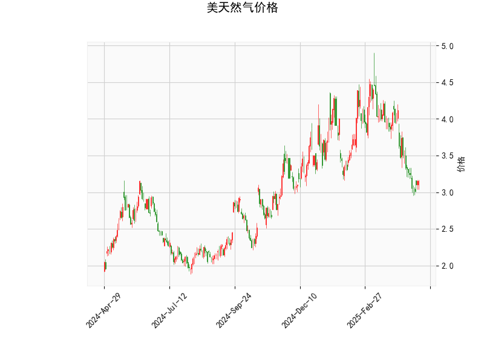

# 美天然气价格的技术分析结果分析

## 1. 对技术指标的详细分析
基于提供的美天然气价格数据，我们可以从多个技术指标入手，对当前市场状况进行评估。当前价格为3.158美元，这是一个关键的参考点。以下是对各指标的逐一分析：

- **RSI（相对强弱指数）**：当前RSI值为36.98，这表明市场处于超卖状态（RSI低于30通常被视为超卖信号）。RSI低于50暗示卖方力量占优，但也可能预示着短期反弹机会，因为价格可能已过度下跌。投资者应关注RSI是否开始回升，如果它向上突破40-50区间，可能标志着趋势逆转。

- **MACD（移动平均收敛散度）**：MACD线为-0.224，信号线为-0.206，MACD直方图为-0.018。这些值均显示出看跌信号，因为MACD线低于信号线，且直方图为负值。这表示短期趋势可能向下，卖方主导市场。然而，直方图的负值较小（接近零），暗示潜在的动量减弱，如果MACD线向上交叉信号线，可能出现买入信号。

- **布林带指标**：上轨为4.623，中轨为3.814，下轨为3.005。当前价格3.158接近下轨，这进一步强化了超卖信号。布林带显示价格波动在相对狭窄的范围内，暗示市场可能缺乏方向性。如果价格反弹并触及中轨（3.814），这可能成为一个关键支撑位；反之，如果价格跌破下轨，可能加剧下行压力。

- **K线形态**：提供的K线形态为空列表，这意味着当前未检测到明显的K线模式（如锤头线或吞没形态）。这可能表示市场处于盘整阶段，缺乏强烈的趋势信号。投资者应结合其他指标和K线图来观察潜在的反转形态。

总体而言，这些指标显示美天然气价格目前处于弱势态势，超卖特征较为明显，但MACD的看跌信号提醒了潜在的下行风险。市场可能在短期内出现反弹，但需警惕外部因素如天气、地缘政治或供需变化的影响。

## 2. 近期可能存在的投资或套利机会和策略
基于上述分析，我们可以判断出一些潜在的投资机会和策略。美天然气市场受季节性需求（如冬季取暖）和全球事件影响较大，因此策略应以风险控制为先。以下是针对当前状况的分析和建议：

### 潜在投资机会
- **反弹买入机会**：由于RSI超卖和价格接近布林带下轨，短期内可能存在价格反弹的空间。例如，如果RSI回升至40以上或价格向上测试中轨（3.814），这可能是一个低风险买入点。预计反弹目标可能在3.5-4.0美元区间，基于布林带的上轨作为阻力位。
- **做空或卖出机会**：MACD的看跌信号表明，如果价格无法突破中轨并继续下行（如跌破3.0美元），投资者可考虑做空策略。尤其在能源市场波动加剧时，这可能带来短期收益。
- **套利机会**：天然气期货和现货市场间存在价差套利潜力。例如，如果当前现货价格（3.158美元）与期货合约价格出现明显背离（如期货价格过高），投资者可通过买入现货并卖出期货来锁定利润。同时，跨市场套利（如与欧洲天然气价格比较）可能存在，但需关注全球供应动态（如LNG出口）。

### 推荐投资策略
- **短期策略**：采用“买入超卖反弹”策略。建议在RSI回升至40-50区间时小额买入多头头寸，并设置止损在布林带下轨下方（如2.9美元）。如果MACD直方图转为正值，可加仓以捕捉反弹。
- **风险管理策略**：使用布林带作为支撑和阻力位，例如将中轨（3.814）作为初步目标位，止盈在4.0美元附近。同时，结合期权策略（如购买看涨期权）来对冲风险，避免直接暴露于市场波动。
- **中长期策略**：如果市场进入盘整期，考虑多元化套利，如天然气与相关商品（如原油）的相关性套利（天然气价格往往随原油波动）。例如，如果原油价格上涨，天然气可能跟进，提供跨资产机会。
- **注意事项**：任何策略都应结合基本面分析，如美国天然气库存数据或天气预报。当前市场不确定性较高，建议控制仓位（不超过总资金的10-20%）并监控全球事件。潜在回报：如果反弹成功，短期收益可能在5-10%；但如果趋势延续下行，损失风险同样存在。

总之，当前美天然气价格显示出超卖特征，可能带来反弹机会，但MACD的看跌信号增加了不确定性。投资者应谨慎行事，结合技术与基本面进行决策，以最大化机会并最小化风险。