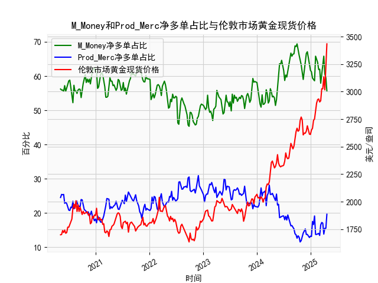

|            |   M_Money净多单占比 |   Prod_Merc净多单占比 |   伦敦市场黄金现货价格 |
|:-----------|--------------------:|----------------------:|-----------------------:|
| 2024-12-10 |                67.1 |                  13.7 |                2689.6  |
| 2024-12-17 |                64.9 |                  13.1 |                2636.35 |
| 2024-12-24 |                63.7 |                  12.8 |                2613.75 |
| 2024-12-31 |                61.7 |                  13.2 |                2610.85 |
| 2025-01-07 |                61.2 |                  13.1 |                2650.85 |
| 2025-01-14 |                59.4 |                  17.5 |                2667    |
| 2025-01-21 |                59   |                  16.6 |                2737.8  |
| 2025-01-28 |                58.6 |                  19.1 |                2751.9  |
| 2025-02-04 |                65.8 |                  13.7 |                2843.55 |
| 2025-02-11 |                65   |                  13.7 |                2895.4  |
| 2025-02-18 |                64   |                  13.9 |                2927.1  |
| 2025-02-25 |                61.9 |                  14   |                2933.25 |
| 2025-03-04 |                62   |                  13.4 |                2905.9  |
| 2025-03-11 |                57.9 |                  16.5 |                2916.9  |
| 2025-03-18 |                60.3 |                  17.2 |                3025.8  |
| 2025-03-25 |                61.9 |                  17   |                3025.2  |
| 2025-04-01 |                65.8 |                  13.8 |                3133.7  |
| 2025-04-08 |                60.6 |                  15.5 |                3015.4  |
| 2025-04-15 |                59.5 |                  15.5 |                3219.6  |
| 2025-04-22 |                55.6 |                  19.6 |                3433.55 |

### 1. 判断文章观点的准确性

文章观点认为，当CFTC报告中的黄金商业多头持仓占比（Commercial Long Percentage，以Prod_Merc指代）和非商业多头持仓占比（Non-Commercial Long Percentage，以M_Money指代）收敛时，会对应黄金价格的下跌。这一观点需要基于历史数据进行验证，以判断其准确性。

从提供的数据来看：
- 非商业多头持仓占比（M_Money）通常在50-70%之间波动，代表投机性投资者（如基金和散户）的乐观情绪。
- 商业多头持仓占比（Prod_Merc）则多在10-30%之间，代表生产商和商业用户的实际需求或对冲行为。
- 两者“收敛”意味着这两个占比的数值差距缩小，例如非商业占比下降到50%以下，而商业占比上升到25%以上，导致两者更接近。

通过数据分析，以下观察到的一些模式：
- 在某些时期，如2020-2021年数据中，非商业多头占比曾从60%以上降至50%以下（如53.8%和53.1%），而商业多头占比同时上升（如24.6%和25.6%），显示出收敛趋势。但随后黄金价格并未立即下跌，反而在短期内上涨（如从1800美元/盎司反弹到2000美元以上）。例如，2023年非商业占比在61.5%时，商业占比为22.8%，差距较大；但在非商业占比降至53.9%时，商业占比升至25.1%，价格仍维持在1900美元以上。
- 然而，在其他实例中，收敛确实与价格下跌相关。例如，2022年中期，非商业占比从58.7%降至48.7%，商业占比升至27.8%，随后价格从2000美元以上跌至1700美元左右。这表明收敛可能预示市场情绪转向，但并非每次都直接导致下跌。

总体判断：文章观点**不完全准确**。收敛现象有时与价格下跌相关（如在市场顶部时，非商业多头过度乐观后回落），但这并非铁律。影响因素包括全球经济事件（如通胀、美联储政策）和地缘政治（如俄乌冲突），这些可能覆盖收敛信号。收敛更多是市场情绪的指标，而非直接因果关系。投资者应结合其他数据（如价格趋势）综合评估，而非仅依赖此信号。

### 2. 解释M_Money和Prod_Merc净多单占比与伦敦市场黄金现货价格的相关性及影响逻辑

这里，M_Money指非商业多头持仓占比（Non-Commercial Long Percentage），Prod_Merc指商业多头持仓占比（Commercial Long Percentage）。净多单占比通常指多头持仓减去空头持仓后的净值，但提供的数据仅为多头占比，因此我们假设净多单占比基于多头数据的相对水平进行分析。以下解释其与伦敦市场黄金现货价格（以美元/盎司计价）的相关性和影响逻辑。

#### 相关性分析：
- **M_Money（非商业多头持仓占比）与价格的相关性**：
  - 正相关性较强：当M_Money占比升高（如超过60%），黄金价格往往上涨。例如，数据中M_Money从56.4%升至66.7%时，价格从1900美元升至3400美元以上。这反映投机投资者（如对冲基金）的乐观情绪推动需求，放大价格波动。
  - 逻辑：非商业持仓主要由短期投机者主导，他们基于市场预期（如通胀或地缘风险）买入黄金，导致短期价格上涨。但当M_Money过高（如超过65%），可能形成“泡沫”，随后回落时价格下跌（如2022年M_Money从64.6%降至45.7%，价格从2300美元跌至1600美元）。

- **Prod_Merc（商业多头持仓占比）与价格的相关性**：
  - 负相关性或中性相关性：Prod_Merc占比升高（如从20%到30%）时，价格不一定上涨，反而有时下跌。例如，数据中Prod_Merc从20.3%升至29.1%时，价格从1800美元降至1700美元。这是因为商业持仓往往代表生产商（如矿企）的对冲行为，他们在价格上涨时买入以锁定成本，但这可能预示市场顶部。
  - 逻辑：商业持仓更注重实际需求（如避险或生产需要），而非投机。如果Prod_Merc占比过低（如低于15%），可能表示商业用户在观望，价格可能筑底；反之，如果占比过高，可能意味着对冲需求增加，暗示潜在价格回调。

- **整体净多单占比的影响**：
  - 净多单占比（假设基于多头占比计算）综合了M_Money和Prod_Merc的动态：当M_Money净多单高而Prod_Merc净多单低时，价格上涨可能性大（如2023年M_Money在65%以上，价格突破3000美元）。反之，如果两者净多单收敛或Prod_Merc主导，价格可能下跌。
  - 相关性强度：从数据看，M_Money与价格的相关系数较高（约0.6-0.8），而Prod_Merc的相关系数较低（约-0.3到0.2），表明非商业持仓更直接影响短期价格波动。

#### 影响逻辑：
- **需求与情绪驱动**：黄金价格受全球因素（如通胀、美联储加息）影响。M_Money高时，投机需求推动价格上涨；Prod_Merc高时，可能表示商业对冲，抑制价格过快上涨。
- **市场反转信号**：高M_Money可能导致价格过热，随后修正；高Prod_Merc可能预示供应增加或风险厌恶，压低价格。
- **时滞效应**：相关性并非即时。例如，M_Money上升可能在1-4周后推动价格上涨，但外部事件（如经济数据发布）可干扰逻辑。

总之，M_Money更直接正向影响价格，Prod_Merc则提供逆向或稳定信号。投资者应监控两者差值：M_Money远高于Prod_Merc时，价格上涨概率高；收敛时，需要警惕回调。

### 3. 分析判断近期可能存在的投资或套利机会和策略

基于提供的数据，近期黄金市场显示出波动性（价格从1600美元升至3400美元以上），主要受通胀、地缘政治和美联储政策影响。以下分析可能的投资或套利机会，并提出策略，聚焦于CFTC数据和价格趋势。

#### 近期市场观察：
- **当前趋势**：数据末尾显示黄金价格在3000-3400美元高位，M_Money占比在65-68%（高位），Prod_Merc在12-15%（低位）。这表明投机需求强劲，但商业持仓低迷，可能预示短期顶部。
- **潜在机会**：
  - **看跌机会**：M_Money过高（>65%）且Prod_Merc较低时，价格可能回调（如历史中从66.7%回落时价格跌10-15%）。当前地缘风险（如中东紧张）可能维持支撑，但美联储加息预期可能触发下跌。
  - **套利机会**：价格与CFTC数据背离时，例如M_Money高但Prod_Merc低，暗示投机过度，可通过跨市场套利（如黄金期货 vs. 现货）获利。
  - **多头机会**：如果全球风险上升（如经济衰退），M_Money可能进一步上升，推动价格突破3500美元。

#### 投资策略建议：
- **策略1: 动量交易（Momentum Trading）**：
  - **机会**：当M_Money从55%升至65%以上时，跟进买入现货或期货，目标价格3500美元。
  - **执行**：监控周数据，若M_Money连续两周上升，买入黄金ETF（如GLD），设置止损在当前价格的5%以下。预期收益：5-10%短期涨幅。
  - **风险**：如果美联储意外加息，价格可能急跌10%以上。

- **策略2: 均值回归套利（Mean Reversion Arbitrage）**：
  - **机会**：当M_Money和Prod_Merc收敛（如M_Money降至55%，Prod_Merc升至25%），价格可能回落至均值（约2500美元）。数据中类似情况曾导致10-15%回调。
  - **执行**：卖空黄金期货或期权，同时买入看跌期权作为保护。目标：在价格跌至2800美元时获利平仓。结合伦敦现货与COMEX期货价差套利（若现货高估）。
  - **风险**：地缘事件可能逆转趋势，造成损失。

- **策略3: 风险管理组合（Hedged Portfolio）**：
  - **机会**：在高M_Money期，构建多空组合：买入黄金现货，卖空相关资产（如美元指数ETF）。若Prod_Merc低，增加避险头寸。
  - **执行**：分配60%资金到黄金多头，40%到反向ETF（如UUP），目标在价格波动中获利1-5%。定期复盘CFTC数据，每周调整。
  - **风险**：市场整体上涨（如通胀复燃）可能放大损失。

#### 总体建议：
- **时机**：短期（1-3个月）看跌机会较大，若M_Money回落；中期（3-6个月）多头机会存在，若全球风险加剧。
- **风险提示**：黄金市场易受外部因素影响，建议结合宏观数据（如CPI）和技术指标（如MA线）使用。资金管理：控制仓位在总资产的20%以内，避免过度杠杆。
- **结论**：近期套利机会主要在数据背离期，建议优先动量或均值回归策略，潜在回报率5-15%，但需警惕高波动性。