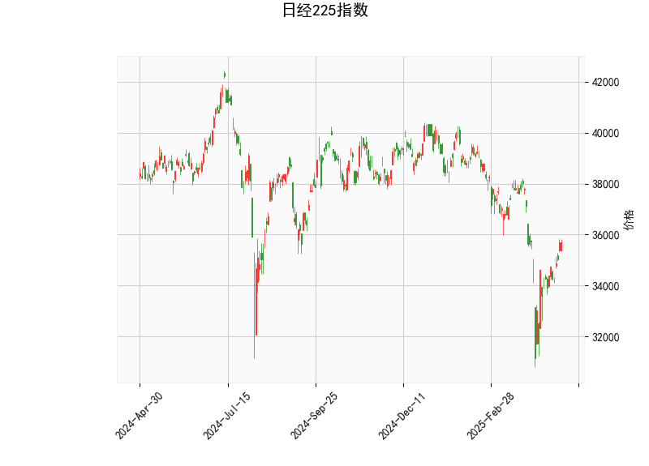

### 日经225指数的技术分析结果分析

#### 1. 技术指标整体分析
基于提供的日经225指数数据，我们对当前的技术指标进行详细解读。当前价格为35705.74点，该指数显示出混合信号，结合RSI、MACD、Bollinger Bands和K线形态，可以看出市场处于相对中性的状态，但存在潜在的短期看涨机会。

- **RSI (相对强弱指数)**: 当前RSI值为53.00。这表明日经225指数处于中性区域（RSI在30-70之间为中性）。RSI略高于50，暗示市场有轻微的强势，但未达到超买水平（RSI>70）。这可能表示近期买盘力量在缓慢增加，但整体动量并不强劲。如果RSI继续上升，可能预示短期上行趋势。

- **MACD (移动平均收敛散度)**: MACD线为-344.43，信号线为-673.95，柱状图（MACD Hist）为329.52。MACD线高于信号线（柱状图为正值），这通常被视为一个看涨信号，表明短期内多头力量可能正在增强。尽管MACD整体处于负值区域（暗示熊市趋势仍在持续），但柱状图的正值显示了潜在的反转迹象。如果MACD线继续向上接近零线，可能会确认买入机会；反之，如果柱状图转为负值，则可能加剧下行风险。

- **Bollinger Bands (布林带)**: 上轨为40658.94，中轨为36655.26，下轨为32651.59。当前价格35705.74位于中轨和下轨之间，接近中轨。这反映出市场波动性适中，没有极端超买或超卖情况。价格在中轨附近通常表示趋势不明朗，但如果价格向上突破中轨并接近上轨（40658.94），可能触发上行趋势；反之，如果跌破下轨，则可能进入超卖区域，增加反弹风险。

- **K线形态**: 检测到的形态为“CDLGAPSIDESIDEWHITE”（Gap Side-by-Side White Lines）。这是一个典型的看涨K线模式，通常表示价格在向上跳空后形成并排的白实体蜡烛，暗示多头控制并可能继续上涨。该形态结合当前MACD信号，强化了短期看涨的可能，但需注意外部因素如全球经济事件可能干扰其延续性。

总体而言，技术指标显示日经225指数当前处于一个平衡状态。RSI和Bollinger Bands的中性表现与MACD和K线形态的看涨信号形成对比，表明市场可能在酝酿短期反弹，但整体趋势仍需进一步确认。投资者应密切关注全球市场动态（如美国股市或日元汇率），因为日经225对外部因素高度敏感。

#### 2. 近期可能存在的投资或套利机会和策略
基于上述分析，日经225指数短期内可能存在看涨机会，但风险不可忽视。以下是对潜在投资和套利机会的判断，以及相应的策略建议。需强调，这些建议基于技术分析，仅供参考，实际操作应结合基本面分析和风险管理。

- **可能存在的投资机会**:
  - **短期看涨机会**: MACD柱状图的正值和K线形态的看涨信号表明，指数可能在短期内向上测试中轨或上轨。如果全球市场稳定（如美联储政策或亚洲经济数据向好），日经225有潜力从当前水平反弹至36000-38000点区间。这为多头投资者提供进场机会。
  - **套利机会**: 日经225作为期货和期权活跃的指数，存在跨市场套利潜力。例如，当前价格低于中轨，可能导致期货与现货价差扩大，适合进行期货-现货套利。同时，期权市场中，看涨期权隐含波动率较低（基于Bollinger Bands的波动性），可能为低风险套利策略提供空间。
  - **潜在风险**: 如果RSI快速上升至70以上或MACD柱状图转为负值，市场可能逆转，导致下行压力。日经225易受地缘政治事件（如日美贸易摩擦）影响，因此机会可能短暂。

- **投资策略建议**:
  - **买入策略**: 考虑在当前价格附近建仓多头头寸，尤其是如果MACD线向上交叉信号线（例如，当柱状图进一步扩大）。目标位可设在中轨上方（约37000点），止损位设在下轨附近（约33000点），以控制风险。适合短期交易者使用杠杆产品，如ETF或期货。
  - **套利策略**: 
    - **期货-现货套利**: 如果日经225期货价格与现货价格出现异常价差（当前价格偏低时），可买入现货并卖出期货锁定收益。预计价差收敛可在1-3天内实现，适合经验丰富的投资者。
    - **期权策略**: 构建牛市价差期权（Bull Call Spread），例如买入当前价位附近的看涨期权，同时卖出更高行权价的看涨期权。这可利用K线形态的看涨信号，成本较低（初始投资约5-10%）。如果指数上行，潜在收益为10-20%；如果下行，损失有限。
  - **风险管理建议**: 所有策略应结合仓位控制（不超过总资金的20%），并设置动态止损（如Bollinger Bands下轨）。监控经济指标（如日本CPI或美元/日元汇率），若出现负面新闻，及时退出。长期投资者可等待RSI稳定在50以上再行动，以避免假突破。

总之，日经225指数的近期机会主要聚焦于短期反弹，但需谨慎对待市场波动。建议结合实时数据和技术工具（如图表软件）进行验证，并咨询专业顾问以适应个人风险偏好。