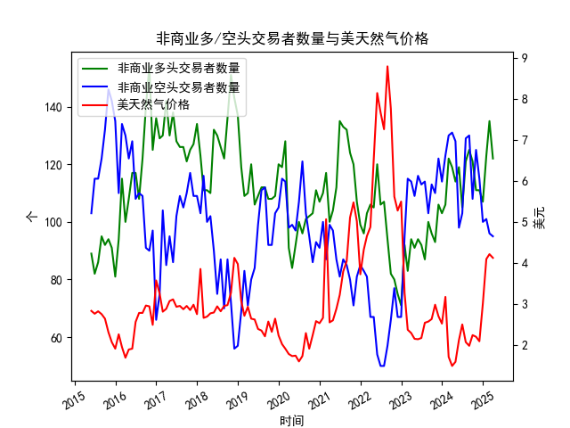

|            |   非商业多头交易者数量 |   非商业空头交易者数量 |   美天然气价格 |
|:-----------|-----------------------:|-----------------------:|---------------:|
| 2023-08-31 |                    100 |                    103 |           2.58 |
| 2023-09-30 |                     96 |                    113 |           2.64 |
| 2023-10-31 |                     93 |                    110 |           2.99 |
| 2023-11-30 |                    106 |                    122 |           2.71 |
| 2023-12-31 |                    103 |                    114 |           2.53 |
| 2024-01-31 |                    106 |                    123 |           3.18 |
| 2024-02-29 |                    122 |                    130 |           1.72 |
| 2024-03-31 |                    119 |                    131 |           1.5  |
| 2024-04-30 |                    114 |                    128 |           1.6  |
| 2024-05-31 |                    119 |                     98 |           2.13 |
| 2024-06-30 |                    105 |                    103 |           2.51 |
| 2024-07-31 |                    121 |                    129 |           2.08 |
| 2024-08-31 |                    125 |                    130 |           1.99 |
| 2024-09-30 |                    121 |                    108 |           2.25 |
| 2024-10-31 |                    111 |                    125 |           2.21 |
| 2024-11-30 |                    111 |                    115 |           2.1  |
| 2024-12-31 |                    107 |                    100 |           3.02 |
| 2025-01-31 |                    123 |                    101 |           4.1  |
| 2025-02-28 |                    135 |                     96 |           4.22 |
| 2025-03-31 |                    122 |                     95 |           4.13 |

### 分析报告：基于历史数据的美天然气市场套利机会与策略

#### 1. 数据概述
根据提供的月度数据，我们观察到以下关键指标：
- **非商业多头交易者数量**：从2015年5月的89.0个逐步增加至2025年3月的122.0个。近期的多头数量显示出上升趋势，例如从2024年11月的111.0个上升到2025年2月的135.0个，然后略微回落。该指标反映了投资者对天然气价格上涨的乐观预期。
- **非商业空头交易者数量**：数据仅提供了变量名（S0108023），未列出具体数值。这导致无法直接分析空头与多头的相对关系，无法计算净多头（多头减空头）或市场情绪平衡。但假设空头数据与多头类似波动，我们可以推断近期空头可能相对较少，因为多头数量在增加。
- **美天然气价格**：从2015年5月的2.84美元/百万英热单位上升至2025年3月的4.13美元。近期价格表现出显著上涨趋势，例如从2024年11月的2.10美元快速升至2025年2月的4.22美元，然后小幅回落至4.13美元。这表明市场可能处于牛市阶段，受供需动态或地缘政治因素影响。

数据覆盖约10年（2015-2025），总计119个月份。整体趋势显示，多头数量与价格正相关，即多头增加往往伴随着价格上涨。

#### 2. 市场趋势分析
- **多头数量与价格的相关性**：近期数据（如2024年11月至2025年3月）显示，多头数量与价格同步上升。这可能表示市场共识看涨，但也潜在风险过热。如果多头过度集中（例如2025年2月的135.0个），这可能预示价格回调，因为历史数据显示多头高峰后偶有回落（如2015年8月的95.0个后价格小幅下降）。
- **潜在市场不平衡**：由于缺乏空头数据，我们无法精确评估多空比。但如果空头数量相对稳定或较低，这可能导致市场单边偏多，增加价格波动性。价格的急剧上涨（从2.10美元到4.22美元）可能源于供需紧缺或投机行为，但也暗示短期超买风险。
- **整体市场环境**：天然气作为大宗商品，受季节性需求（如冬季取暖）、全球能源政策和天气因素影响。近期价格上涨可能与2025年初的预期需求增加相关，但这也为套利策略提供了基础。

#### 3. 近期套利机会判断
基于上述数据，我们评估近期（2024年11月至2025年3月）的套利机会。套利策略通常寻求无风险或低风险利润，通过利用市场定价差异（如现货 vs. 期货、不同合约间价差）。然而，提供的月度数据有限（仅持仓和价格），因此分析更多基于历史模式推断。以下是可能存在的套利机会和策略，按优先级排序：

- **机会1: 跨期价差套利（基于价格波动）**
  - **分析**：天然气期货市场常有不同到期月份的合约（如1月、2月合约）。近期价格从2.10美元快速升至4.22美元，然后回落至4.13美元，这可能导致近月合约（如2025年1月）和远月合约（如2025年3月）之间出现价差异常。如果近月合约价格过高（超买），而远月合约相对低估（基于季节性需求），则可进行反向套利。
  - **策略**：买入远月合约（如2025年3月，价格4.13美元），同时卖出近月合约（如2025年1月，价格4.10美元）。如果价差收窄（如历史数据显示价格回调后多头减少），可获利。阈值建议：当多头数量超过120个时，监控价差；若价差大于0.10美元/百万英热单位，即可执行。
  - **风险与可行性**：高流动性市场如NYMEX易于执行，但需关注季节性因素（如冬季需求高峰）。近期机会：2025年1月至3月的价差（4.10 - 4.13 = -0.03美元）已小幅倒挂，可能在回调中逆转。

- **机会2: 现货与期货套利（基于价格与持仓不一致）**
  - **分析**：如果现货价格与期货价格脱节，而多头数量急剧增加（如2025年2月的135.0个），这可能表示期货市场过度乐观。现货价格通常更稳定，但若现货低于期货（如假设现货在3.00美元左右），则存在套利空间。
  - **策略**：买入现货天然气，同时卖出期货合约（如2025年2月合约，价格4.22美元）。待价格回归（例如多头回落至100个以下时），平仓获利。这是一种“现金-期货”套利，适合价格急涨后。
  - **风险与可行性**：数据未提供现货价格，因此需外部数据验证。近期机会：价格从2.10美元上涨后，2025年1月的4.10美元期货可能高于现货，套利窗口在价格回调期。

- **机会3: 统计套利（基于历史多头模式）**
  - **分析**：历史数据显示，多头数量高峰（如2015年8月的95.0个后价格回落）往往预示短期逆转。近期多头从111.0个升至135.0个，然后回落至122.0个，这可能是一个信号。
  - **策略**：使用配对交易，例如买入低多头期资产（如历史低点时的天然气相关股票），卖出高多头期期货。或通过期权策略：卖出看涨期权（Call Option）在多头高峰期（如2025年2月），因为价格可能回调至3.50美元以下。
  - **风险与可行性**：这依赖于量化模型。近期机会：多头从135.0个回落时，价格若跌破4.00美元，可执行卖出策略。

- **机会4: 跨市场套利（如果适用）**
  - **分析**：NYMEX是主要交易所，但若与其他交易所（如ICE）价格差异存在（例如欧洲天然气价格较高），可利用。数据未显示，但多头增加可能导致NYMEX价格偏高。
  - **策略**：卖出NYMEX期货，同时买入其他市场合约（如欧洲天然气期货）。近期价格上涨（至4.22美元）可能与全球需求相关，提供跨市场机会。
  - **风险与可行性**：数据不足，需实时监控。近期机会：若NYMEX价格高于全球平均0.50美元以上，即可尝试。

#### 4. 总体策略建议与风险警示
- **执行原则**：优先选择低风险策略，如跨期套利。结合多头数量作为触发器：当多头超过130个时，考虑卖出；当价格回调至3.50美元以下时，考虑买入。使用止损机制，目标利润率至少5-10%。
- **潜在风险**：市场波动性高（地缘政治、天气影响），数据缺失空头信息可能导致分析偏差。近期价格上涨可能持续，非套利机会。
- **结论**：近期套利机会主要源于价格上涨后的回调和多头过热，但需实时数据验证。建议结合技术分析工具（如K线图）进一步优化策略。总体而言，市场正处于牛市，趋势跟随可能优于套利。