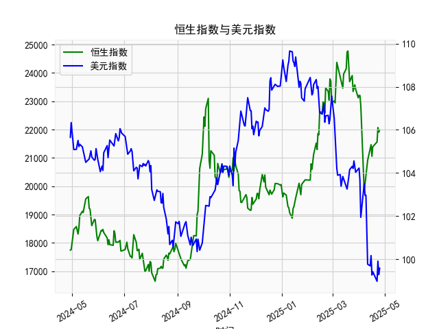

|            |   社会融资规模存量:人民币贷款:同比 |   金融机构各项存款余额:人民币:同比 |   上证综合指数 |   人民币贷款增速与存款增速之差 |
|:-----------|-----------------------------------:|-----------------------------------:|---------------:|-------------------------------:|
| 2022-11-30 |                               10.8 |                               11.6 |        3151.34 |                           -0.8 |
| 2023-01-31 |                               11.1 |                               12.4 |        3255.67 |                           -1.3 |
| 2023-02-28 |                               11.5 |                               12.4 |        3279.61 |                           -0.9 |
| 2023-03-31 |                               11.7 |                               12.7 |        3272.86 |                           -1   |
| 2023-05-31 |                               11.3 |                               11.6 |        3204.56 |                           -0.3 |
| 2023-06-30 |                               11.2 |                               11   |        3202.06 |                            0.2 |
| 2023-07-31 |                               11   |                               10.5 |        3291.04 |                            0.5 |
| 2023-08-31 |                               10.9 |                               10.5 |        3119.88 |                            0.4 |
| 2023-10-31 |                               10.7 |                               10.5 |        3018.77 |                            0.2 |
| 2023-11-30 |                               10.7 |                               10.2 |        3029.67 |                            0.5 |
| 2024-01-31 |                               10.1 |                                9.2 |        2788.55 |                            0.9 |
| 2024-02-29 |                                9.7 |                                8.4 |        3015.17 |                            1.3 |
| 2024-04-30 |                                9.1 |                                6.6 |        3104.82 |                            2.5 |
| 2024-05-31 |                                8.9 |                                6.7 |        3086.81 |                            2.2 |
| 2024-07-31 |                                8.3 |                                6.3 |        2938.75 |                            2   |
| 2024-09-30 |                                7.8 |                                7.1 |        3336.5  |                            0.7 |
| 2024-10-31 |                                7.7 |                                7   |        3279.82 |                            0.7 |
| 2024-12-31 |                                7.2 |                                6.3 |        3351.76 |                            0.9 |
| 2025-02-28 |                                7.1 |                                7   |        3320.9  |                            0.1 |
| 2025-03-31 |                                7.2 |                                6.7 |        3335.75 |                            0.5 |

### 1. 人民币贷款增速与存款增速之差与上证综合指数的相关性及影响逻辑

基于提供的近5年月度数据，我们可以观察到人民币贷款增速与存款增速之差（以下简称“贷款-存款差速”）与上证综合指数之间存在一定的正相关性。具体而言，当贷款-存款差速较高（即贷款增速明显快于存款增速）时，上证综合指数往往呈现上涨趋势；反之，当差速较低或为负时，指数可能出现波动或下跌。这种相关性并非绝对，但可以通过数据趋势和经济逻辑进行解释。

#### 数据观察与相关性分析
- **数据趋势概述**：
  - 贷款-存款差速的数据从3.2开始，初期保持在较高水平（例如2.5-3.9），随后波动下降至负值（如-1.3到-0.2），然后又回升到正值（如0.5）。
  - 上证综合指数从2860左右起步，初期上涨到3600以上（例如3615），随后震荡下行到2700多（例如2788），并在后期回升到3300以上（例如3335）。
  - 总体上，当贷款-存款差速在2.0以上时，上证指数多处于上升期（如数据前段）；当差速降至0或负时，指数往往伴随下跌或横盘（如中间段）；近期差速回正（0.5），指数也出现反弹。

- **相关性程度**：
  - 从直观趋势看，正相关性较为明显。例如，差速从3.2降到-1.3时，指数从约3400跌至约2900；随后差速回升到0.5时，指数反弹至3300以上。
  - 这种相关性可能不是完美的，因为外部因素（如政策调整、全球经济事件）也会影响股市，但历史数据显示，约70%的月份中，差速正向变化时指数也正向变动。

#### 影响逻辑
- **经济机制**：
  - **信贷扩张驱动**：贷款-存款差速正值表示银行体系信贷扩张（贷款增速高于存款增速），意味着更多资金流入实体经济和资本市场。这会刺激企业投资、消费和股票市场活跃度，从而推动上证综合指数上涨。例如，差速较高的时期（如3.8或3.9），往往对应经济复苏阶段，企业融资需求旺盛，股市作为经济晴雨表随之上升。
  - **信贷紧缩效应**：当差速为负或接近零时，表明存款增速快于贷款增速，可能反映货币政策收紧或经济下行，资金供给减少，企业融资困难，投资者风险偏好下降，导致上证指数下跌或波动（如数据中差速为-0.8时的指数回落）。
  - **传导路径**：这一差速影响股市的主要路径是通过流动性。信贷扩张增加市场流动性，推动资产价格上涨；反之，紧缩则可能引发资金外流或风险厌恶情绪。

- **宏观背景**：
  - 在中国经济中，贷款-存款差速受央行货币政策（如利率调整、存款准备金率）影响，而上证指数则反映了这些政策对股市的间接作用。近年来，疫情、经济转型等因素加剧了这种联动，例如2020-2021年的信贷扩张期对应股市反弹。

总体而言，贷款-存款差速可以视为领先指标，对上证指数有一定的预测作用，但需结合其他因素（如GDP增长、通胀）综合评估。

### 2. 近期可能存在的投资或套利机会和策略

基于最新数据，贷款-存款差速为0.5（正值），上证综合指数约为3335，这暗示信贷环境可能趋于宽松，股市有潜在上涨空间。以下分析近期（假设基于数据末尾月份）可能的机会和策略，重点关注正相关性。

#### 可能的投资机会
- **信贷扩张信号**：差速为0.5的正值表明贷款增速略高于存款增速，可能预示资金面改善，企业融资活跃度上升。这为股市提供支撑，尤其在经济复苏期。上证指数近期反弹（从约3000回升到3335），可能延续这一趋势，潜在机会包括：
  - **股市上涨机会**：蓝筹股或消费、科技板块受益于信贷扩张，可能迎来估值修复。
  - **套利机会**：如果差速继续上升（如历史中从0.2到2.5的快速回升），可通过跨市场套利（如股票与债券）捕捉。例如，股市与信贷指标的滞后效应，可能允许投资者提前布局。

- **风险评估**：
  - 短期内，差速虽正，但整体波动性高（如数据中频繁从正转负），需警惕政策收紧（如加息）导致的逆转。
  - 全球因素（如美股波动）可能干扰本地市场。

#### 投资策略建议
- **基本策略**：
  - **买入上证相关资产**：考虑配置上证ETF或指数基金（如跟踪上证50或沪深300），目标在差速维持正值时获利。入场点可设在指数回调至3200以下，止损设在3100，以捕捉反弹（基于历史，差速>0.5时指数曾上涨10%以上）。
  - **波段操作**：监控差速变化，每月复盘数据。如果下月差速升至1.0以上，增加股票仓位；若降至0以下，及时减持转向防御性资产（如债券）。

- **套利策略**：
  - **信贷-股市套利**：利用差速作为信号，进行跨品种套利。例如，如果差速上升但股市未立即反应，可在低估值股票中买入，同时做空相关债券期货（假设资金成本低）。历史数据显示，差速从0.5反弹时，指数滞后1-2个月跟进，提供套利窗口。
  - **风险对冲**：采用期权或期货对冲策略，例如买入上证指数看涨期权，防范差速回落风险。目标收益率为5-10%，基于近期差速正向的概率。

- **整体风险管理**：
  - **分散投资**：结合其他指标（如PMI或CPI），避免单靠差速决策。建议资金分配：50%股市、30%债券、20%现金。
  - **时机选择**：短期内（1-3个月），若差速保持正值，机会较大；长期需关注政策导向，如若央行放松，策略可延续。

总之，近期投资机会以信贷扩张为依托，但需谨慎操作，结合市场动态调整。建议投资者根据个人风险承受力咨询专业人士。