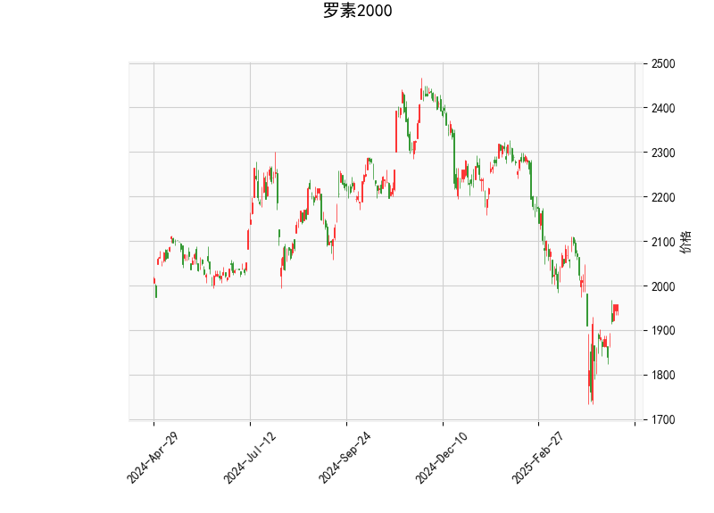

# 罗素2000指数技术分析结果分析

## 1. 关键指标解读
基于提供的技术分析数据，我们对罗素2000指数（Russell 2000）的当前状态进行全面评估。该指数当前价格为1957.62，处于相对稳定的波动区间。以下是对各指标的详细分析：

- **RSI（相对强弱指数）**：当前值为51.02。这表明指数处于中性区域（RSI通常在30以下为超卖，70以上为超买）。RSI值接近50，暗示近期买方和卖方力量基本平衡，没有明显的超买或超卖信号。这可能表示市场缺乏短期极端动向，适合观察进一步确认。

- **MACD（移动平均收敛散度）**：MACD线为-27.73，信号线为-46.85，柱状图（MACD Hist）为19.12。MACD线高于信号线（Hist值为正），这暗示了一个潜在的看涨信号，表明短期内可能有向上交叉的迹象。然而，MACD整体为负值，显示指数仍处于下行趋势中。这反映了市场可能在从之前的下跌中恢复，但尚未完全逆转。投资者需警惕，如果MACD线未能持续向上，可能维持弱势。

- **Bollinger Bands（布林带）**：上轨为2334.27，中轨为2051.06，下轨为1767.86。当前价格1957.62位于中轨和下轨之间，具体偏向下轨。这表明指数处于波动区间的下半部，可能接近支撑位（下轨）。Bollinger Bands的收窄或价格接近下轨通常预示潜在反弹机会，但如果价格跌破下轨，则可能确认进一步下行趋势。

- **K线形态**：当前K线形态为空（[]），意味着没有明显的经典形态（如锤子线、吞没模式或头肩顶）。这表示短期内缺乏强烈的形态信号，分析需依赖其他指标进行辅助判断。

总体而言，罗素2000指数当前呈现中性偏弱的态势。RSI的中性水平和MACD的潜在看涨信号暗示市场可能在筑底，但Bollinger Bands的位置显示价格仍面临下行压力。整体趋势需结合更广泛的市场环境（如经济数据或美联储政策）来验证。

## 2. 近期可能存在的投资或套利机会和策略
基于上述分析，罗素2000指数作为小盘股代表，可能存在短期交易机会，但需谨慎对待市场波动。以下是对潜在机会和策略的判断：

### 可能的机会
- **买入机会**：当前MACD Hist值为正，暗示短期看涨信号。如果价格接近或触及Bollinger Bands下轨（1767.86），这可能是一个低风险买入点，期待反弹至中轨（2051.06）或上轨（2334.27）。RSI的中性水平进一步支持这种可能性，表明市场未出现过度卖出。
  
- **卖出或做空机会**：如果价格跌破下轨（1767.86），这可能确认下行趋势，触发卖出信号。MACD整体负值也支持这种风险，适合短期做空策略，尤其在RSI未显示超卖时。

- **套利机会**：罗素2000指数常用于指数套利策略，例如：
  - **指数期货与现货套利**：如果罗素2000指数ETF（如IWM）与期货合约之间存在价差（例如，由于市场情绪或流动性差异），投资者可通过多头现货、空头期货（或反之）来锁定无风险收益。目前价格在中下轨，价差可能较小，但若市场波动加剧，套利窗口可能出现。
  - **跨市场套利**：比较罗素2000与大盘指数（如S&P 500）的表现差异。小盘股往往在经济复苏期表现更强，如果经济数据向好，罗素2000可能相对大盘 undervalued，提供套利空间。

### 推荐策略
- **短期交易策略**：
  - **买入策略**：在MACD线向上交叉信号线时入场，设置止损在下轨以下（例如1768左右）。目标位可设在中轨（2051）附近。结合RSI，如果其升至60以上，可加仓以捕捉反弹。
  - **卖出策略**：若价格跌破下轨，考虑做空或减持头寸。止盈位可设在中轨以下，以控制风险。
  
- **套利策略**：
  - **价差套利**：监控罗素2000 ETF与期货的实时价差。如果差价扩大（例如由于期权市场波动），使用算法或手动套利工具进行对冲。建议在低波动期操作，以降低滑点风险。
  - **多元化策略**：结合其他资产（如债券或大盘股），构建中性组合。例如，同时持有罗素2000多头和大盘空头头寸，以对冲小盘股的波动性。

- **风险管理建议**：市场不确定性较高，建议控制仓位（不超过总仓位的20-30%），并使用技术指标（如MACD交叉）作为进出场信号。长期投资者可等待更明确的经济信号（如通胀数据或利率决定）再行动。总体而言，当前环境适合短线交易者，而非激进套利者。