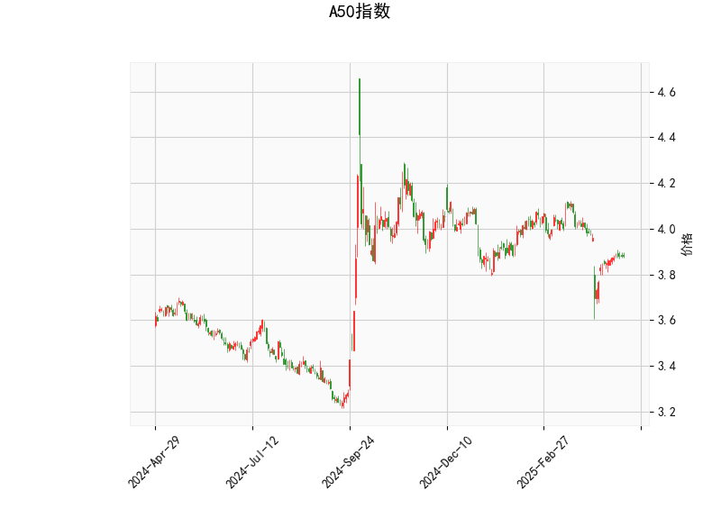

### 1. A50指数的技术分析结果分析

以下是对A50指数当前技术分析结果的详细解读，基于提供的指标数据。我们将逐一分析关键指标及其含义，以评估市场趋势和潜在信号。

- **当前价格（Current Price）**：  
  当前价格为3.882，这位于布林带的中带（3.972）和下带（3.780）之间。具体而言，它接近布林带的下边缘，表明价格可能处于相对低位或支撑区域。这种位置通常暗示短期内可能出现反弹或测试中带的潜力，但也需警惕进一步下行风险。

- **RSI（Relative Strength Index）**：  
  RSI值为45.525，这处于中性水平（低于50），显示市场当前缺乏强势动量。RSI低于30通常表示超卖状态，而高于70表示超买；当前值接近超卖边缘，暗示A50指数可能已从近期卖压中恢复一些力量，但整体仍偏弱势。这可能反映投资者情绪谨慎，短期内若RSI回升至50以上，将是看涨信号。

- **MACD（Moving Average Convergence Divergence）**：  
  MACD线值为-0.025，信号线值为-0.034，柱状图（MACD Hist）为正值0.009。这表明MACD线已从信号线下方向上交叉（尽管两者均在零线下方），这是一个轻微的看涨信号。柱状图的正值显示短期动量可能开始转向向上，但整体MACD仍处于负值区域，意味着熊市势头尚未完全逆转。投资者应关注MACD线是否继续上行至零线以上，以确认潜在反转。

- **布林带（Bollinger Bands）**：  
  上带为4.163，中带为3.972，下带为3.780。目前价格（3.882）位于下带附近，这往往是市场波动率较低时的支撑位。如果价格反弹，可能向上测试中带（3.972）；反之，若跌破下带，则可能进入更弱势区域。布林带的收窄或扩张可以进一步指示波动性：当前带宽较窄，暗示市场可能即将出现突破（向上或向下）。

- **K线形态**：  
  检测到的形态包括“CDLMATCHINGLOW”和“CDLSPINNINGTOP”。  
  - **CDLMATCHINGLOW**：这表示最近的K线形成了两个相似的低点，常见于市场底部，可能预示着价格支撑增强和潜在反转。这种形态通常是看涨信号，表明卖家力量减弱。  
  - **CDLSPINNINGTOP**：这显示K线实体较小，影线较长，反映市场多空力量均衡，存在不确定性。它往往表示短期内可能出现方向选择，投资者需等待后续K线确认。  
  总体上，这些形态结合其他指标，暗示A50指数可能处于筑底阶段，但尚未形成明确趋势。

综合分析：A50指数的技术指标显示当前市场偏向弱势，但存在潜在反弹机会。RSI和MACD的信号较为中性，K线形态和布林带位置则提供了一些看涨线索。整体而言，短期趋势不明朗，需结合成交量和外部因素（如经济数据）进一步验证。

### 2. 近期可能存在的投资或套利机会和策略判断

基于上述技术分析，我们评估A50指数的近期投资和套利机会。A50指数（通常指富时中国A50指数）涉及A股市场，其波动性较高，机会可能源于技术反转或市场套利。以下是针对当前情况的判断和策略建议，重点关注风险控制。

#### 可能存在的投资机会：
- **反弹机会**：当前价格接近布林带下带，结合CDLMATCHINGLOW形态和MACD的轻微看涨信号，短期内可能出现向上反弹（目标测试中带3.972或上带4.163）。如果RSI回升至50以上，这将增强看涨信心。  
- **潜在风险**：若市场情绪转弱（如全球经济不确定性加剧），价格可能进一步下探下带以下，导致短期损失。因此，机会主要适合短期交易者，而非长期投资者。  
- **套利机会**：A50指数基于期货或ETF，可能存在期现套利（如A50期货与现货价格偏差）或跨市场套利（如中港市场差异）。例如，如果A50期货价格高于现货（正基差），可考虑卖出期货买入现货反向套利；反之亦然。目前指标显示市场不确定性较高，套利机会可能在波动率扩大时出现。

#### 投资或套利策略建议：
- **多头策略（适合乐观者）**：  
  - **买入机会**：在RSI升至50以上或MACD柱状图持续扩大时，考虑买入A50指数ETF或相关基金。目标位设在中带（3.972）附近，止损位设在下带以下（3.780以下）。这可捕捉潜在反弹，预计持有期为1-2周。  
  - **期权策略**：购买看涨期权（如A50期权合约），以低成本参与上涨。如果K线形态确认反转，此策略风险较低。  

- **空头策略（适合谨慎者）**：  
  - **卖出机会**：若价格跌破下带（3.780）并RSI跌至30以下，考虑卖空指数或买入看跌期权。目标位可设在3.700附近，止损设在中带以上。这利用当前弱势进行短期获利。  

- **套利策略**：  
  - **期现套利**：监控A50期货与现货价差。如果价差异常（如期货溢价超过0.5%），可执行反向套利（例如，卖出期货、买入现货）。当前中性指标暗示套利窗口可能在短期波动中出现，建议使用自动化工具跟踪价差。  
  - **跨市场套利**：如果A50指数与相关指数（如恒生指数）出现异常相关性偏差，可在沪深交易所和香港交易所间进行套利。但需注意交易成本和监管差异。  

- **风险管理与总体建议**：  
  - **风险控制**：所有策略均应设置严格止损（例如，损失不超过1-2%的仓位），并结合成交量确认信号。CDLSPINNINGTOP形态提醒市场不确定性高，避免重仓操作。  
  - **总体判断**：近期机会以短期反弹或套利为主，而非长期趋势。建议投资者在全球经济数据（如CPI或GDP）公布前保持观望，若指标恶化，则优先规避风险。最终，策略需根据个人风险偏好和实时市场数据调整。