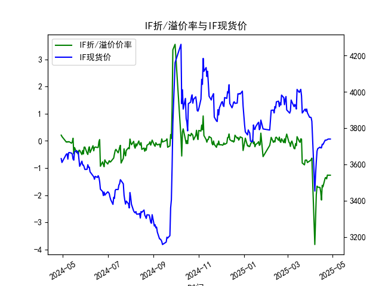
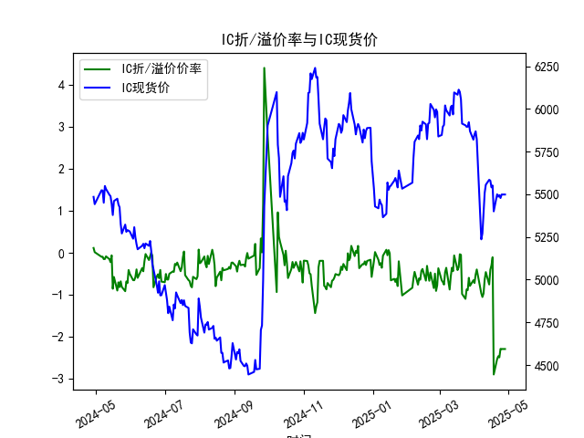
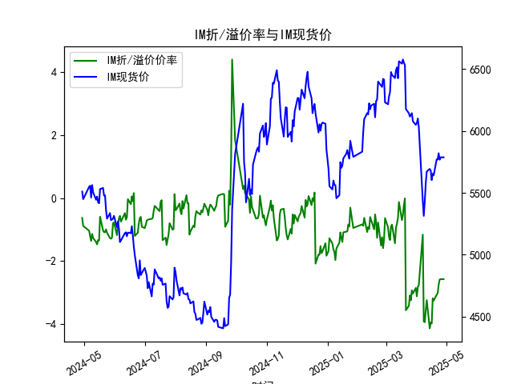

|            |   IF折/溢价率 |   IF现货价 |   IH折/溢价率 |   IH现货价 |   IC折/溢价率 |   IC现货价 |   IH折/溢价率 |   IH现货价 |
|:-----------|--------------:|-----------:|--------------:|-----------:|--------------:|-----------:|--------------:|-----------:|
| 2025-03-31 |     -0.738445 |     3858.6 |     -0.651649 |     5819.6 |     -0.651649 |     5819.6 |      -2.85304 |     6049   |
| 2025-04-01 |     -0.722386 |     3859.6 |     -0.716974 |     5850.6 |     -0.716974 |     5850.6 |      -3.11981 |     6064.2 |
| 2025-04-02 |     -0.689576 |     3857.6 |     -0.5168   |     5868.6 |     -0.5168   |     5868.6 |      -2.82374 |     6100   |
| 2025-04-03 |     -0.634556 |     3837   |     -0.395252 |     5822.4 |     -0.395252 |     5822.4 |      -2.76398 |     6031.8 |
| 2025-04-07 |     -3.81231  |     3452.6 |     -0.961471 |     5236.2 |     -0.961471 |     5236.2 |      -1.16153 |     5432.6 |
| 2025-04-08 |     -2.92977  |     3543.8 |     -1.04965  |     5271   |     -1.04965  |     5271   |      -3.91353 |     5313.6 |
| 2025-04-09 |     -1.97446  |     3614   |     -0.96643  |     5387.2 |     -0.96643  |     5387.2 |      -3.9405  |     5429.6 |
| 2025-04-10 |     -1.663    |     3673   |     -0.632471 |     5509   |     -0.632471 |     5509   |      -3.56785 |     5578.2 |
| 2025-04-11 |     -1.70421  |     3686.6 |     -0.457211 |     5555.8 |     -0.457211 |     5555.8 |      -3.2409  |     5672.2 |
| 2025-04-14 |     -1.71162  |     3694.8 |     -0.752381 |     5584.8 |     -0.752381 |     5584.8 |      -4.13446 |     5693   |
| 2025-04-15 |     -1.88329  |     3690.4 |     -0.402211 |     5580   |     -0.402211 |     5580   |      -3.95041 |     5680.4 |
| 2025-04-16 |     -2.17398  |     3690.8 |     -0.296286 |     5540.4 |     -0.296286 |     5540.4 |      -3.98173 |     5603   |
| 2025-04-17 |     -1.63358  |     3710.6 |     -0.104562 |     5551.2 |     -0.104562 |     5551.2 |      -3.18113 |     5653.8 |
| 2025-04-18 |     -1.68913  |     3708.8 |     -2.89029  |     5400   |     -2.89029  |     5400   |      -3.25269 |     5642   |
| 2025-04-21 |     -1.36545  |     3733.2 |     -2.52696  |     5499.8 |     -2.52696  |     5499.8 |      -3.06818 |     5770   |
| 2025-04-22 |     -1.34653  |     3733   |     -2.45739  |     5486   |     -2.45739  |     5486   |      -3.02072 |     5769.6 |
| 2025-04-23 |     -1.39646  |     3734   |     -2.48358  |     5495   |     -2.48358  |     5495   |      -2.75012 |     5820   |
| 2025-04-24 |     -1.25668  |     3736.8 |     -2.28117  |     5478   |     -2.28117  |     5478   |      -2.58556 |     5767.4 |
| 2025-04-25 |     -1.26205  |     3739.2 |     -2.28499  |     5498.6 |     -2.28499  |     5498.6 |      -2.57433 |     5786.6 |
| 2025-04-28 |     -1.26205  |     3739.2 |     -2.28499  |     5498.6 |     -2.28499  |     5498.6 |      -2.57433 |     5786.6 |

### 1. 股指期货折/溢价率与现货价的相关性及影响逻辑

股指期货的折/溢价率（Basis Percent）是指期货价格相对于现货价格的百分比差异，通常计算为（期货价格 - 现货价格）/现货价格 × 100%。这一指标反映了期货市场与现货市场的价格偏差，其与现货价的相关性主要体现在市场预期、供需动态和成本因素上。以下是详细解释：

- **相关性分析**：
  - **正相关性**：当市场预期未来现货价格上涨时，期货价格往往高于现货价格，导致正溢价率（例如，数据中ANAL在2024-04-29的溢价率为0.212135%）。反之，如果现货价格上涨但期货价格未能跟上，溢价率可能缩小或转为折价。
  - **负相关性**：折价率（负值）通常与现货价格的相对稳定或下跌预期相关。例如，数据显示近期（如2025-04-28，ANAL的折价率为-1.262049%），期货价格低于现货，这可能表示市场对未来风险的担忧，导致期货被低估。现货价格的波动（如ANAL从3631.6上升到3739.2）会间接影响折/溢价率，因为期货价格需调整以反映现货基差。
  - **整体趋势**：从提供的数据看，四大股指（ANAL、IH、IC、IM）在过去一年中，折/溢价率从正值（如2024-04-29的正溢价）逐步转向负值（如2025-04-28的负折价），这与现货价格的缓慢上涨（如IH从5442.0到5498.6）形成对比，表明期货市场可能对现货的乐观预期进行了修正。

- **影响逻辑**：
  - **市场预期与风险偏好**：折/溢价率受投资者对未来经济走势的预期影响。如果预期经济向好，现货价格上涨，期货可能出现溢价；反之，如果预期经济下行或存在不确定性（如地缘政治风险），期货价格会打折。现货价格作为基准，会放大或缩小这一差异。
  - **持有成本与资金因素**：期货交易涉及保证金和融资成本，而现货持有需支付股息或存储费用。这些成本会推动期货价格偏离现货。例如，正溢价可能源于期货的融资优势，而折价则可能由于现货持有者的机会成本。
  - **供需动态**：高流动性或机构投资者行为（如套利交易）会影响折/溢价率。现货价格的上涨（如IC从5450.6到5498.6）如果未伴随期货价格同步调整，会加剧折价。
  - **其他外部因素**：宏观经济数据、政策变化（如利率调整）和市场情绪也会间接影响二者关系。例如，数据中IM的折价率始终较高（从-0.631797%到-2.574325%），可能反映中小盘股（中证1000）的风险溢价更高。

总之，折/溢价率不是现货价格的直接函数，而是二者互动的结果。长期看，如果折/溢价率持续扩大，可能预示市场失衡，需要通过套利活动恢复平衡。

### 2. 近期可能存在的投资或套利机会和策略

基于提供的数据（覆盖2024-04-29至2025-04-28），近期（即数据末期，如2025-04）股指期货普遍出现负折价率（例如，ANAL为-1.26%，IH为-2.28%），这暗示期货价格被低估，可能存在套利或投资机会。以下是分析和建议：

- **机会判断**：
  - **当前市场特征**：数据显示四大股指的折/溢价率从正值转为负值，且负值在近期加深（如IM从-1.038760%到-2.574325%），这可能源于市场对经济放缓的担忧或资金外流。现货价格总体上涨（如ANAL从3610.2到3739.2），但期货未能跟进，形成折价空间。根据历史经验，折价率过大（如超过-1%）往往是反转信号，潜在机会包括反套利和趋势交易。
  - **潜在风险**：折价可能持续，如果现货价格回调或市场情绪恶化，机会会减弱。数据中IH和IC的相似性可能表示相关性强，需关注整体市场。

- **投资或套利策略**：
  - **反套利策略（买入期货、卖出现货）**：
    - **机会**：鉴于近期负折价率（如2025-04-28，IH的-2.28%），投资者可考虑买入期货合约（如IH期货）并卖出相应现货（如上证50成分股）。这能锁定价差收益，例如，如果折价率收窄，现货价格稳定，投资者可获利。
    - **执行建议**：在折价率大于-2%时入场，设定止损（如若折价率扩大到-3%，退出）。结合数据，IM的折价最深（-2.57%），适合风险偏好高的投资者，但需注意中小盘股的波动性。
    - **优势**：低成本（期货只需保证金），但需监控交割期以避免风险。
    
  - **正套利策略（若溢价反弹）**：
    - **机会**：如果市场预期好转（如经济数据改善），折价率可能转为正值（如数据中2024-04-29的正溢价）。此时，可卖出期货并买入现货锁定收益。
    - **执行建议**：观察短期数据波动，若折价率从-1.26%反弹至正值，快速执行。但当前数据不支持此机会，需等待。

  - **趋势投资策略**：
    - **机会**：现货价格上涨趋势（如ANAL从3656.2到3739.2），结合折价，可采用多头策略：买入期货等待现货跟进，或通过期权对冲。
    - **执行建议**：使用数据中现货价的均线（如5日或20日均线）作为信号，当现货价突破均线上方且折价率收窄时入场。适用于中长期投资者。

  - **风险管理与总体建议**：
    - **注意事项**：交易成本、保证金要求和市场流动性可能侵蚀收益。建议结合宏观指标（如CPI、GDP）监控，避免单一依赖历史数据。
    - **优先选择**：IH和IC因折价率稳定且现货流动性高，更适合初级套利。总体上，近期折价机会大于溢价，投资者应以小额测试为主，目标年化收益控制在5-10%。若无专业经验，建议咨询顾问或使用模拟交易。

