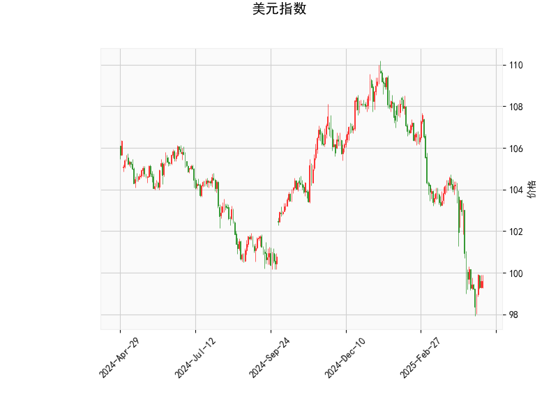

### 美元指数的技术分析

基于提供的美元指数技术指标，我们可以对当前市场状况进行全面评估。美元指数的当前价格为99.5836，处于相对较低水平，这表明其短期内可能面临超卖状况。以下是对关键指标的详细解读：

- **RSI（相对强弱指数）**：值为37.65，低于30的阈值，这通常被视为超卖信号。RSI的低位暗示美元指数可能即将出现反弹或修正，投资者需警惕潜在的短期向上波动。
  
- **MACD指标**：MACD线为-1.287，低于信号线（-1.337），整体显示出看跌趋势。然而，MACD直方图（Hist）为0.049（正值），这表明短期内可能存在向上交叉的迹象，潜在的看涨信号虽弱但值得关注。如果MACD线向上穿越信号线，美元指数可能迎来短期反弹。

- **布林带指标**：上轨为109.32，中轨为103.75，下轨为98.19。当前价格（99.5836）接近下轨，这进一步强化了超卖的特征。在布林带框架下，价格触及下轨往往是买入信号，预示着可能的技术性反弹。然而，如果价格持续在下轨附近徘徊，可能会加剧下行风险。

- **K线形态**：当前K线形态为空（[]），表示没有明显的特定模式（如锤头线或吞没形态）。这可能意味着市场缺乏强烈的短期方向性，投资者应结合其他指标和外部事件（如美联储政策）来判断后续走势。

总体而言，美元指数当前处于超卖状态，RSI和布林带下轨的信号暗示短期内可能出现技术性反弹。但MACD的负值提醒我们，整体趋势仍偏向中性偏弱。如果外部因素（如美国经济数据或地缘政治事件）支持，美元指数可能从99.50附近反弹至中轨（约103.75）水平；反之，若无强力支撑，价格可能进一步测试下轨。

### A股和港股的投资或套利机会及策略

美元指数的超卖状况与潜在反弹会对全球新兴市场产生连锁影响，特别是对A股和港股这些与中国经济紧密相关的市场。美元指数走强通常会增加新兴市场的资金外流压力，导致股市承压；反之，美元弱势或反弹有限时，可能为这些市场带来资金流入机会。基于当前分析，以下是近期A股和港股可能的投资或套利机会及策略建议：

#### 1. **投资机会分析**
   - **短期风险与回调机会**：如果美元指数从超卖水平反弹（如RSI回升），这可能导致A股和港股短期内承压，尤其是出口导向型股票（如消费电子、汽车和原材料股）。例如，A股中的上证指数或深证指数可能出现回调，港股中的恒生指数也可能跟随下行。这为逆势投资者提供了买入机会。建议关注估值较低的蓝筹股，如A股的银行股（e.g., 工商银行）和科技股（e.g., 腾讯控股在港股的H股），这些股票在市场回调后往往有较强反弹潜力。
   
   - **潜在利好因素**：若美元反弹力度有限（例如MACD向上交叉失败），A股和港股可能受益于全球风险偏好回升。中国经济的复苏信号（如消费数据和政策刺激）可能抵消美元影响，提供中期投资机会。A股当前正处于相对低位，部分板块（如新能源和医疗健康）可能迎来估值修复。港股作为国际资金的桥梁，更易吸引外资，尤其是在美元弱势时。

   - **具体机会**：
     - **A股**：关注低估值板块，如金融和消费股。如果上证指数跌破3200点（当前假设水平），可视为加仓时机。长期来看，政策支持（如稳增长措施）可能推动A股上行。
     - **港股**：中概股（如阿里巴巴和京东）可能在美元反弹后出现折价，提供低风险入场点。恒生科技指数若跟随美元指数回调至低位，可能成为中期买入目标。

#### 2. **套利机会和策略**
   - **AH股套利**：A股和港股之间存在价差套利机会，尤其是AH股（如腾讯控股的A股和H股）。当前，如果美元指数反弹导致港股承压，H股相对于A股的估值可能进一步走低，形成套利空间。策略包括：
     - **正向套利**：如果H股价格低于A股（AH溢价率下降），投资者可买入H股并卖出A股期货或期权，实现价差收益。例如，腾讯H股若相对A股折价5%以上，可通过港股通买入H股，同时对冲A股风险。
     - **风险管理**：监控美元指数的反弹力度，若RSI升至40以上，AH股价差可能扩大。建议使用期权或ETF进行套利，以控制波动性。
   
   - **跨市场套利**：利用A股和港股的流动性差异，进行短期轮动。例如，在美元超卖期买入港股ETF（如恒生中国企业ETF），待美元反弹后转向A股防御性板块。预计套利周期为1-3个月，需结合技术指标（如MACD交叉）作为进出信号。

#### 总体策略建议
- **风险偏好者**：在美元指数可能反弹的背景下，采用“买入回调”策略，优先选择A股和港股中的防御性股票（如公用事业和必需消费）。设置止损位，例如若上证指数跌破3100点，则减仓。
- **保守投资者**：关注套利机会，避免直接投资。使用技术指标（如RSI低于30时加仓）结合基本面（如中国GDP数据）进行决策。
- **注意事项**：全球事件（如美联储加息或中美贸易动态）可能放大美元指数的影响，因此建议结合宏观数据监控市场。总体而言，短期内A股和港股的投资机会大于风险，但需谨慎应对美元潜在反弹。