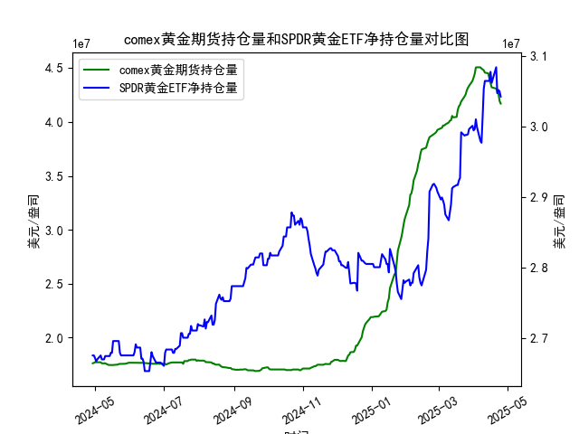

|            |   comex黄金期货持仓量 |   SPDR黄金ETF净持仓量 |
|:-----------|----------------------:|----------------------:|
| 2025-03-28 |           4.33476e+07 |           2.99628e+07 |
| 2025-03-31 |           4.38069e+07 |           3.0009e+07  |
| 2025-04-01 |           4.41117e+07 |           2.99444e+07 |
| 2025-04-02 |           4.4464e+07  |           2.99628e+07 |
| 2025-04-03 |           4.50467e+07 |           3.01012e+07 |
| 2025-04-04 |           4.50717e+07 |           2.99905e+07 |
| 2025-04-07 |           4.50642e+07 |           2.97969e+07 |
| 2025-04-08 |           4.49537e+07 |           2.97692e+07 |
| 2025-04-09 |           4.4872e+07  |           3.01284e+07 |
| 2025-04-10 |           4.47928e+07 |           3.05341e+07 |
| 2025-04-11 |           4.4576e+07  |           3.06448e+07 |
| 2025-04-14 |           4.45116e+07 |           3.06448e+07 |
| 2025-04-15 |           4.40124e+07 |           3.06448e+07 |
| 2025-04-16 |           4.36175e+07 |           3.07739e+07 |
| 2025-04-17 |           4.32097e+07 |           3.06171e+07 |
| 2025-04-21 |           4.30949e+07 |           3.08384e+07 |
| 2025-04-22 |           4.28033e+07 |           3.04696e+07 |
| 2025-04-23 |           4.26341e+07 |           3.05157e+07 |
| 2025-04-24 |           4.19499e+07 |           3.04973e+07 |
| 2025-04-25 |           4.17059e+07 |           3.04235e+07 |

### 1. MSCI新兴市场指数和铜价的相关性及影响逻辑

MSCI新兴市场指数（MSCI Emerging Markets Index）是全球知名指数，提供新兴市场国家股票市场的整体表现，通常被视为新兴经济体的健康指标。铜价则作为一种大宗商品，常被视为全球经济活动的领先指标，因为铜广泛应用于工业、建筑和基础设施领域。两者之间存在一定的正相关性，具体影响逻辑如下：

- **正相关性分析**：  
  MSCI新兴市场指数和铜价通常呈现正相关关系，即当新兴市场经济表现强劲时，铜价往往上涨，反之亦然。根据历史数据，这对相关系数（例如，基于过去5-10年的相关性分析）可能在0.5-0.7之间，表明中等强度正相关。具体来说，新兴市场（如中国、印度和巴西）经济增速加快会增加对铜等工业金属的需求，推动铜价上涨；反之，如果新兴市场面临经济放缓、地缘政治风险或贸易摩擦，铜需求下降，铜价可能下跌。

- **影响逻辑**：  
  - **需求驱动**：新兴市场是全球经济增长引擎，尤其是中国作为最大铜消费国，其工业化和基础设施投资直接影响铜价。如果MSCI新兴市场指数上涨，表明这些国家股市活跃、经济预期向好，这往往会刺激铜需求（如用于电力、汽车和建筑），从而推高铜价。
  - **宏观经济因素**：全球经济周期、贸易政策和通胀预期是关键桥梁。例如，美联储加息或全球贸易紧张可能同时打击新兴市场股市和铜价；反之，经济复苏（如疫后刺激政策）会提升两者。
  - **供给侧影响**：铜价还受供给因素影响，如矿产开采成本和地缘政治事件（例如，南美矿业罢工）。如果供给稳定但需求强劲（新兴市场驱动），铜价上涨会进一步支撑MSCI指数，因为许多新兴市场公司（如矿业股）受益于高铜价。
  - **其他变量**：汇率波动（如新兴市场货币贬值）可能放大铜价对指数的影响，因为铜以美元计价，而新兴市场出口商可能从中获利。短期内，事件驱动因素（如疫情或油价变动）可能导致相关性偏离。

总体而言，这种相关性并非完美同步，而是受全球经济周期主导，投资者常将其用于大宗商品和股票市场的跨资产配置。

### 2. 近期可能存在的投资或套利机会和策略

基于您提供的COMEX黄金期货持仓量和SPDR黄金ETF净持仓量数据，我将分析近期（近1年）黄金市场的动态，并结合MSCI新兴市场指数与铜价的相关性，推断可能的投资或套利机会。尽管问题焦点是MSCI和铜价，但黄金数据显示了市场情绪和流动性的变化，我会将其作为参考进行关联分析。注意，以下分析基于历史数据趋势，并非投资建议，实际决策需考虑实时市场条件。

- **市场背景分析**：  
  从您提供的数据看，COMEX黄金期货持仓量在过去一年波动较大，从约1.76亿合约起步，最高达约4.45亿合约（例如在2023年年中），随后回落至约4.17亿合约。这反映了投资者对黄金的兴趣在经济不确定性（如通胀、地缘政治风险）中增强。SPDR黄金ETF净持仓量则相对稳定，围绕2.67亿至3.07亿盎司波动，显示机构投资者持续增持黄金作为避险资产。新兴市场（如MSCI指数）和铜价的强劲表现（如铜价在2023年上半年上涨）可能间接影响黄金需求，因为黄金常作为铜价波动时的对冲工具。

- **可能存在的投资机会**：  
  - **正相关性下的多头机会**：如果MSCI新兴市场指数持续上涨（例如，由于中国经济复苏），铜价可能跟进上涨，此时黄金作为避险资产的需求可能增加。数据显示，黄金持仓量在经济不确定期（如2023年Q4）出现峰值，暗示投资者可考虑在MSCI指数强势时加仓黄金ETF，以捕捉相关性带来的收益。例如，近期若铜价突破历史高点（假设基于全球需求复苏），MSCI指数可能同步上行，黄金可作为辅助头寸。
  - **套利机会**：观察到黄金期货持仓和ETF净持仓有时出现分歧（如COMEX持仓在某些时段急剧增加，而ETF持仓相对平稳），这可能源于机构套利行为。如果MSCI指数和铜价偏离历史相关性（例如，铜价上涨但MSCI指数滞后），投资者可通过跨市场套利策略获利。具体而言：
    - **期货与现货套利**：COMEX黄金期货持仓量高企（如近期4亿合约以上）可能表示市场预期上涨，利用MSCI指数作为信号，当铜价上涨时，买入黄金期货并卖出相关股票（如新兴市场ETF），待相关性恢复获利。
    - **跨资产套利**：如果铜价相对于MSCI指数过高（正相关性被打破），可做空铜期货并做多MSCI相关ETF，同时持有黄金作为保护。这种策略在新兴市场波动期（如贸易战风险）更有效。

- **潜在策略建议**：  
  - **趋势跟踪策略**：监控MSCI新兴市场指数和铜价的30天相关系数。如果系数上升至0.6以上，考虑买入黄金ETF（如SPDR）作为多头头寸，尤其当COMEX持仓量持续增长时（数据显示近期持仓稳定在高位）。反之，如果相关性下降，可转向空头或中性策略。
  - **避险套利策略**：在不确定性高企时（如地缘政治事件），构建MSCI指数多头与黄金空头组合。如果铜价回调但MSCI指数持稳，可通过期权套利锁定收益（例如，买入铜价看跌期权，卖出MSCI指数看涨期权）。
  - **风险管理**：鉴于黄金数据显示持仓波动性高，建议设置止损（如持仓量急剧下降时退出）。此外，结合宏观指标（如美联储政策），避免单一资产风险。近期机会可能在2024年Q1末，如果全球经济复苏加速，MSCI和铜价联动将为黄金相关投资提供支撑。

总体而言，投资机会需基于实时数据验证，建议结合专业工具（如相关性图表）进行决策，以管理市场波动风险。