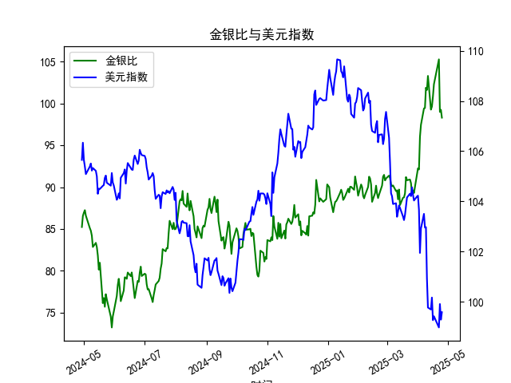

|            |    金价 |   银价 |   美元指数 |   金银比 |
|:-----------|--------:|-------:|-----------:|---------:|
| 2025-03-27 | 3056.55 | 34.11  |   104.26   |  89.6086 |
| 2025-03-28 | 3071.6  | 34.395 |   104.034  |  89.3037 |
| 2025-03-31 | 3115.1  | 34.055 |   104.192  |  91.4726 |
| 2025-04-01 | 3133.7  | 33.97  |   104.226  |  92.249  |
| 2025-04-02 | 3119.75 | 33.87  |   103.661  |  92.1095 |
| 2025-04-03 | 3118.1  | 32.475 |   101.945  |  96.0154 |
| 2025-04-04 | 3054.5  | 31.34  |   102.919  |  97.4633 |
| 2025-04-07 | 3014.75 | 30.325 |   103.501  |  99.4147 |
| 2025-04-08 | 3015.4  | 30.315 |   102.956  |  99.4689 |
| 2025-04-09 | 3075.5  | 30.18  |   102.971  | 101.905  |
| 2025-04-10 | 3143.15 | 30.925 |   100.937  | 101.638  |
| 2025-04-11 | 3230.5  | 31.27  |    99.769  | 103.31   |
| 2025-04-14 | 3204.2  | 32.275 |    99.692  |  99.2781 |
| 2025-04-15 | 3219.6  | 32.31  |   100.167  |  99.6472 |
| 2025-04-16 | 3322.9  | 32.955 |    99.2667 | 100.831  |
| 2025-04-17 | 3305.65 | 32.31  |    99.424  | 102.31   |
| 2025-04-22 | 3433.55 | 32.61  |    98.9757 | 105.291  |
| 2025-04-23 | 3262.95 | 32.96  |    99.9096 |  98.9973 |
| 2025-04-24 | 3314.75 | 33.395 |    99.288  |  99.2589 |
| 2025-04-25 | 3277.3  | 33.335 |    99.5836 |  98.3141 |

# 1. 金银比与美元指数的相关性及影响逻辑

金银比（Gold/Silver Ratio）是指黄金价格除以白银价格的比率，通常用于评估黄金和白银的相对价值。美元指数（US Dollar Index）则衡量美元对一篮子主要货币（如欧元、日元等）的汇率强度。两者之间存在一定的相关性，主要源于黄金和白银作为以美元计价的贵金属，其价格受美元波动的影响。以下是相关性和影响逻辑的详细解释：

### 相关性分析
- **正相关或负相关的可能性**：金银比和美元指数可能呈现弱正相关或负相关。具体而言，当美元指数上升（美元走强）时，黄金和白银的价格往往下跌，因为以美元计价的商品变得相对昂贵，从而可能导致金银比上升（黄金相对于白银更“贵”）。反之，美元指数下降（美元走弱）时，贵金属价格可能上涨，如果白银上涨幅度更大，金银比可能下降。从提供的数据看，金银比在过去一年波动于76-105之间，而美元指数在98-109之间，显示出一定的反向趋势，例如美元指数较低时金银比较高，但这需结合具体市场条件。
  
- **数据观察**：在给定的数据中，当美元指数从约104降至99左右时，金银比往往在80-100之间波动。这暗示美元走弱可能推动贵金属价格上涨，从而影响金银比的波动。但相关性并非绝对，需考虑其他因素如经济数据、地缘政治事件等干扰。

### 影响逻辑
- **美元对贵金属价格的影响**：黄金和白银主要以美元定价，因此美元的强弱直接影响其需求和价格。美元走强时，投资者可能转向美元资产，减少对贵金属的买入，导致黄金和白银价格下跌；美元走弱时，贵金属作为避险工具的需求增加，价格可能上涨。这会间接放大金银比的波动，因为黄金更偏向避险属性，而白银兼具工业用途（例如电子和制造业），其价格更易受经济周期影响。
  
- **金银比的特定逻辑**：金银比反映黄金和白银的相对估值。当经济不确定性增加时，投资者更青睐黄金（导致金银比上升），而美元走强可能加剧这一效应；反之，如果经济复苏，白银需求上升，金银比可能下降。同时，美元指数的变动会通过全球贸易和投资情绪间接影响贵金属市场。例如，美元走弱可能刺激新兴市场需求，从而拉低金银比。
  
- **整体影响机制**：美元指数是宏观经济指标，而金银比更微观，反映贵金属内部动态。两者互动的逻辑是：美元变动→影响贵金属价格→改变金银比。但这种关系并非线性，还受通胀、利率、供应链等因素干扰。在近期数据中，美元指数的波动（从105以上降至99以下）可能已推动金银比维持较高水平，表明美元弱势环境下贵金属定价的潜在不稳定。

# 2. 近期可能存在的投资或套利机会和策略

基于提供的数据，金银比和美元指数的波动显示出潜在的投资和套利机会。金银比当前较高（末尾数据约98-105），而美元指数较低（约99），这可能预示着市场调整或均值回归。以下是分析和建议的策略，重点关注风险管理，因为贵金属市场受全球事件影响较大。

### 可能的机会
- **均值回归机会**：金银比的历史长期均值约为50-80（基于历史数据），当前数据高于这一水平，表明白银相对便宜。这可能提供买入白银、卖出黄金的机会。如果美元指数继续走弱，贵金属价格上涨可能进一步拉低金银比。
  
- **套利机会**：金银比的异常波动（如从80以下快速升至100以上）可用于跨资产套利。例如，当金银比过高时，买入白银并卖出黄金的“配对交易”可能获利。同时，美元走弱的环境可能放大这一机会，但需警惕回调风险。
  
- **市场环境分析**：近期美元指数下降（从105以上至99以下）可能预示经济放缓或美联储降息预期，这有利于贵金属上涨。如果金银比回落至80-90区间，投资者可捕捉短期反弹。

### 投资策略建议
- **策略1: 均值回归套利**：
  - **操作**：如果金银比维持在100以上，考虑买入白银期货或ETF（如SLV），同时卖出黄金期货或ETF（如GLD）。目标是当金银比回归至85以下时获利平仓。
  - **时机**：监控美元指数，若其进一步跌破98，执行该策略。基于数据，美元弱势期（如末尾99以下）是进入点。
  - **风险管理**：设置止损位，例如若金银比升至110以上，立即退出。资金分配不超过总仓位的20%，以防市场逆转。

- **策略2: 结合美元指数的动态套利**：
  - **操作**：当美元指数走弱（低于100）时，增加贵金属头寸，但优先白银以利用潜在金银比下降。反之，若美元指数反弹至105以上，减少头寸避免损失。
  - **时机**：从数据看，美元指数在100以下时，金银比波动较大，可在这一区间进行短期交易（如持有1-5天）。
  - **风险管理**：使用期权 hedging，例如买入白银看涨期权，保护美元反弹风险。结合经济新闻（如非农数据）调整仓位。

- **策略3: 长期投资组合**：
  - **操作**：构建多元化组合，包括黄金和白银资产的比例调整（如60%黄金、40%白银），并在金银比高时加仓白银。预期美元持续走弱的环境下，贵金属整体上涨。
  - **时机**：当前数据显示金银比高位，适合中期布局（3-6个月）。
  - **风险管理**：定期复盘数据，避免单一资产暴露。考虑通胀数据和地缘风险，如果全球紧张局势加剧，黄金可能主导上涨。

### 注意事项
- **风险因素**：贵金属市场易受突发事件（如地缘冲突或利率变化）影响。美元指数的反弹可能导致金银比上升，增加损失。
- **整体建议**：投资者应结合实时数据和专业分析，避免仅凭历史数据决策。建议使用工具如MT4或Bloomberg监控波动，并咨询财务顾问以适应个人风险偏好。