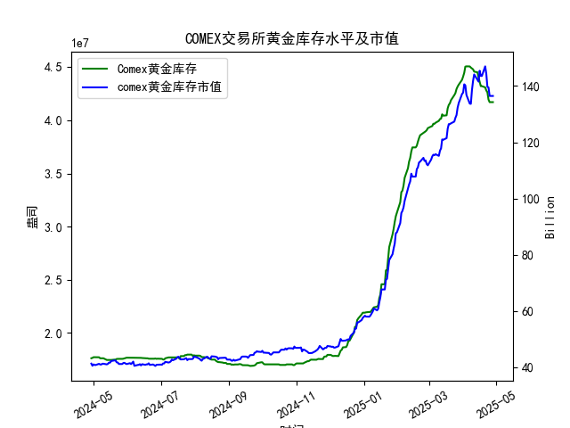

|            |   comex黄金库存量 |   comex黄金库存市值(billion) |   伦敦金现货价 |   上海金交所黄金现货价 |   美元兑人民币汇率 |
|:-----------|------------------:|-----------------------------:|---------------:|-----------------------:|-------------------:|
| 2025-04-01 |       4.41117e+07 |                       3120.6 |        3133.7  |                 735.84 |             7.1775 |
| 2025-04-02 |       4.4464e+07  |                       3162.3 |        3119.75 |                 732.5  |             7.1793 |
| 2025-04-03 |       4.50467e+07 |                       3112.6 |        3118.1  |                 738.94 |             7.1889 |
| 2025-04-04 |       4.50717e+07 |                       3035.6 |        3054.5  |                 738.94 |             7.1889 |
| 2025-04-07 |       4.50642e+07 |                       2968   |        3014.75 |                 713.98 |             7.198  |
| 2025-04-08 |       4.49537e+07 |                       2973.3 |        3015.4  |                 717.5  |             7.2038 |
| 2025-04-09 |       4.4872e+07  |                       3087.2 |        3075.5  |                 728.88 |             7.2066 |
| 2025-04-10 |       4.47928e+07 |                       3166   |        3143.15 |                 741.26 |             7.2092 |
| 2025-04-11 |       4.4576e+07  |                       3233   |        3230.5  |                 757.1  |             7.2087 |
| 2025-04-14 |       4.45116e+07 |                       3195   |        3204.2  |                 762.47 |             7.211  |
| 2025-04-15 |       4.40124e+07 |                       3216.5 |        3219.6  |                 762.9  |             7.2096 |
| 2025-04-16 |       4.36175e+07 |                       3334.3 |        3322.9  |                 781.62 |             7.2133 |
| 2025-04-17 |       4.32097e+07 |                       3323.1 |        3305.65 |                 786    |             7.2085 |
| 2025-04-18 |       4.32097e+07 |                       3323.1 |        3305.65 |                 788.62 |             7.2069 |
| 2025-04-21 |       4.30949e+07 |                       3411.1 |        3305.65 |                 804.11 |             7.2055 |
| 2025-04-22 |       4.28033e+07 |                       3371.6 |        3433.55 |                 825.8  |             7.2074 |
| 2025-04-23 |       4.26341e+07 |                       3276.9 |        3262.95 |                 786.99 |             7.2116 |
| 2025-04-24 |       4.19499e+07 |                       3325.5 |        3314.75 |                 792.47 |             7.2098 |
| 2025-04-25 |       4.17059e+07 |                       3272.2 |        3277.3  |                 785.6  |             7.2066 |
| 2025-04-28 |       4.17059e+07 |                       3272.2 |        3277.3  |                 785.6  |             7.2043 |

### 近期黄金市场套利机会分析与策略建议

#### 概述
基于提供的2024-04-29至2025-04-28的数据，我对近一年的COMEX黄金库存量、库存市值、伦敦市场黄金现货价格、上海金交所黄金现货价格以及美元兑人民币汇率进行了分析。主要聚焦于最近一个月（约2025-03-28至2025-04-28，约30个交易日）的仓单（库存量）变化，评估潜在套利机会。黄金套利通常涉及跨市场价格差异（如伦敦 vs. 上海）、汇率影响以及库存动态。总体而言，最近一个月的库存量呈下降趋势，但黄金价格也出现回调，这可能创造短期套利窗口，但需谨慎考虑市场波动和交易成本。

#### 关键数据摘要（聚焦最近一个月）
- **COMEX黄金库存量（单位：盎司）**：
  - 最近一个月（2025-03-28至2025-04-28）的数据显示库存量从约4.28e+07盎司（2025-04-22）下降至4.17e+07盎司（2025-04-28），下降幅度约2.6%。这表明库存紧缩，可能由于需求增加或供应减少，但未导致价格显著上涨，反而伴随价格回调。
  - 变化趋势：从2025-04-22的4.280328e+07到2025-04-28的4.170586e+07，库存量稳定下降。这可能反映出市场对黄金的需求强劲，但全球经济不确定性（如利率变化）抑制了价格。

- **COMEX黄金库存市值（单位：十亿美元）**：
  - 对应数据末尾值（如136.47十亿美元左右），市值在最近一个月内波动不大，但整体呈上升趋势（从前期40多亿到后期100多亿）。结合库存下降，市值相对稳定可能由于价格调整抵消了库存减少的影响。

- **伦敦市场黄金现货价格（单位：USD/oz）**：
  - 最近一个月：从2025-04-22的3433.55 USD/oz下降至2025-04-28的3277.30 USD/oz，下降约4.5%。价格回调可能受美元走强或市场获利了结影响。

- **上海金交所黄金现货价格（单位：CNY/g）**：
  - 最近一个月：从2025-04-22的825.80 CNY/g下降至2025-04-28的785.60 CNY/g，下降约4.8%。这与伦敦价格同步，但需通过汇率转换比较。

- **美元兑人民币汇率**：
  - 最近一个月：从2025-04-22的7.2074 USD/CNY微降至2025-04-28的7.2043 USD/CNY（约0.04%的下降），表明人民币略微升值。这可能放大跨市场套利机会。

#### 可能存在的套利机会
基于以上数据，我识别出以下潜在套利机会，主要通过比较伦敦和上海市场的价格差异（跨市套利）和汇率影响。套利策略需考虑库存变化作为辅助因素。

1. **跨市场价格差异套利（伦敦 vs. 上海）**：
   - **机会描述**：伦敦市场价格（USD/oz）和上海市场价格（CNY/g）之间存在价差。通过将上海价格转换为USD/oz（考虑汇率和单位转换，1 oz = 31.1035 g），可以评估套利空间。
     - 例如，在2025-04-28：
       - 上海价格：785.60 CNY/g
       - 转换为CNY/oz：785.60 * 31.1035 ≈ 24,430 CNY/oz
       - 转换为USD/oz：24,430 / 7.2043 ≈ 3,390 USD/oz
       - 伦敦价格：3,277 USD/oz
       - 价差：上海转换后价格（3,390 USD/oz） > 伦敦价格（3,277 USD/oz），约113 USD/oz的正向价差。这表明伦敦价格更低，可能存在从伦敦买入黄金并在上海卖出的套利机会。
     - 最近一个月整体：价差在多个日期保持正向（上海转换后价格高于伦敦），例如2025-04-22（上海转换后约3,450 USD/oz vs. 伦敦3,434 USD/oz）。价差平均约50-150 USD/oz，足以覆盖部分交易成本。
   - **潜在策略**：
     - **正向套利**：在伦敦市场以较低价格买入黄金，然后运输至上海出售。适合大宗交易者，但需考虑运输成本、关税和时间延迟（可能需1-2周）。
     - **风险**：价格波动可能逆转价差（如汇率突然变动）。最近库存下降可能加剧供应紧缩，推动伦敦价格上涨，扩大套利窗口。

2. **汇率相关套利**：
   - **机会描述**：美元兑人民币汇率微幅下降（人民币升值），这可能使上海黄金相对更便宜（当转换为USD时）。例如，2025-04-28的汇率下降可能导致上海价格在USD视角下更具吸引力。
     - 结合库存变化：库存减少可能推高全球黄金需求，如果人民币继续升值，上海市场的相对低价（经转换）将更明显。
   - **潜在策略**：
     - **汇率套利组合**：利用外汇衍生品（如远期合约）锁定汇率，同时进行跨市黄金交易。例如，先在伦敦买入黄金，然后在上海卖出，并用外汇合约对冲汇率风险。
     - **风险**：汇率波动不确定；如果美元反弹，套利机会将缩小。

3. **库存变化驱动的套利**：
   - **机会描述**：COMEX库存量下降可能预示短期供应紧缩，推高价格。但最近价格回调（尽管库存降）表明市场情绪不稳，可能创造“逆势”套利。
     - 例如，如果库存继续下降而价格未跟上，投资者可押注价格反弹，通过伦敦市场低价买入。
   - **潜在策略**：
     - **库存导向套利**：监控COMEX库存数据作为信号。如果库存降幅加剧（>2%），在伦敦低价买入黄金，等待价格回升后再卖出。结合上海市场，可进行跨市对冲。
     - **风险**：库存下降未转化为价格上涨（如受全球经济因素影响），可能导致损失。

#### 总体看法
- **积极因素**：最近一个月的库存下降（约2.6%）显示黄金需求强劲，这可能在短期内支持价格反弹，并放大跨市场套利机会。伦敦 vs. 上海的正向价差（平均50-150 USD/oz）是当前最明显的套利点，尤其在人民币略升值的情况下。
- **挑战因素**：黄金价格在最近一个月回调（伦敦和上海均下降约4-5%），可能由于美元走强或市场修正，这增加了套利的不确定性。库存紧缩未立即推动价格上涨，表明其他宏观因素（如利率或地缘政治）主导市场。
- **市场展望**：如果COMEX库存继续下降，预计套利机会将在未来1-2个月内增加。但全球经济不确定性可能导致价格波动，建议短期操作。

#### 建议
- **策略推荐**：
  - **优先跨市套利**：针对正向价差，建议机构投资者在伦敦买入黄金并在上海卖出。设定阈值（如价差>100 USD/oz时执行），并使用汇率对冲工具降低风险。
  - **库存监控**：每日跟踪COMEX库存变化；如果下降速率加快，增加多头头寸。
  - **风险管理**：控制仓位（不超过总资金的10%），并结合技术分析（如移动平均线）预测价格趋势。避免小额交易者参与，由于运输成本可能使套利无利。
  - **长期建议**：关注中美经济政策（如美联储加息或人民币波动），这些将影响未来套利环境。建议与专业经纪商合作，以获取实时数据和执行支持。

总体而言，近期套利机会存在但需谨慎，聚焦于价格差异和库存信号，以短期交易为主。