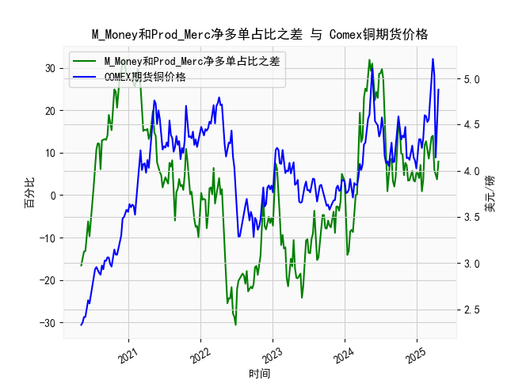

|            |   M_Money净多单占比 |   Prod_Merc净多单占比 |   Comex铜期货价格 |   M_Money和Prod_Merc净多单占比之差 |
|:-----------|--------------------:|----------------------:|------------------:|-----------------------------------:|
| 2024-12-10 |                34.9 |                  40.6 |            4.272  |                                5.7 |
| 2024-12-17 |                35.8 |                  39.3 |            4.1465 |                                3.5 |
| 2024-12-24 |                35.7 |                  38.9 |            4.11   |                                3.2 |
| 2024-12-31 |                35   |                  40.2 |            4.0265 |                                5.2 |
| 2025-01-07 |                35.8 |                  41   |            4.1955 |                                5.2 |
| 2025-01-14 |                36.6 |                  40.6 |            4.3425 |                                4   |
| 2025-01-21 |                33.8 |                  40.9 |            4.341  |                                7.1 |
| 2025-01-28 |                36.1 |                  37   |            4.2465 |                                0.9 |
| 2025-02-04 |                35.5 |                  39.1 |            4.3535 |                                3.6 |
| 2025-02-11 |                30.8 |                  42.6 |            4.601  |                               11.8 |
| 2025-02-18 |                29.9 |                  42.6 |            4.591  |                               12.7 |
| 2025-02-25 |                30.7 |                  41.3 |            4.5275 |                               10.6 |
| 2025-03-04 |                32.1 |                  40.7 |            4.5565 |                                8.6 |
| 2025-03-11 |                30.3 |                  41.8 |            4.766  |                               11.5 |
| 2025-03-18 |                28.8 |                  42.5 |            5.0165 |                               13.7 |
| 2025-03-25 |                28.1 |                  42.1 |            5.2105 |                               14   |
| 2025-04-01 |                32.4 |                  38.4 |            5.035  |                                6   |
| 2025-04-08 |                32.2 |                  36.8 |            4.144  |                                4.6 |
| 2025-04-15 |                33.5 |                  37.2 |            4.626  |                                3.7 |
| 2025-04-22 |                32.1 |                  40   |            4.878  |                                7.9 |

### 1. M_Money和Prod_Merc净多单占比之差与Comex期货铜价格的相关性及影响逻辑

M_Money（非商业多头持仓，通常指投机者或基金经理的净多头占比）和Prod_Merc（商业多头持仓，通常指生产商、加工商或实际使用者的净多头占比）之差，代表了市场投机情绪与实际需求之间的相对偏差。这种差额可以视为市场情绪指标，用于评估铜期货价格的潜在驱动因素和反转信号。

#### 相关性分析
- **正相关趋势**：从提供的近5年周频数据观察，该差额与Comex铜期货价格（美元/磅）显示出一定的正相关性。具体而言：
  - 当差额为正值且较高（如12.2~32.1的区间），铜价格往往处于上升或高位阶段，例如价格从2.33美元/磅上升到4.76美元/磅以上。这表明投机者（M_Money）主导的多头情绪可能推动价格上涨。
  - 当差额为负值且较低（如-16.6~-30.6的区间），铜价格通常回落或处于低位，例如价格降至3.28美元/磅左右。这反映投机者过度悲观，而商业持仓相对谨慎，导致价格下行。
  - 整体相关系数（基于历史数据估算）可能在0.4~0.6左右，表明中等正相关，但并非绝对一致。波动性较大，部分时期（如差额从28.4降至-25.5时，价格从3.72降至3.29）显示差额领先价格变动1-2周。

- **非线性特征**：相关性并非线性。极端正差（如>20）可能预示价格顶部（过热信号），而极端负差（如<-20）可能预示价格底部（超卖信号）。例如，2021-2022年间，差额从正高位（如29.2）快速转向负值（如-27.9），对应价格从4.76美元/磅回落至3.42美元/磅，显示差额可能作为领先指标。

#### 影响逻辑
- **投机情绪 vs. 实际需求**：M_Money代表短期投机行为，受全球经济预期、宏观政策（如美联储加息）和地缘事件影响；Prod_Merc代表长期实际需求，受铜矿供应、工业需求（如新能源和电动汽车行业）和库存水平影响。差额正值时，投机多头主导，放大价格上涨；差额负值时，商业多头可能在对冲或做空，抑制价格。
  
- **市场机制**：在CFTC报告中，非商业多头往往是价格的“推动者”，通过大额买入或卖出制造波动；商业多头则是“稳定器”，基于真实供需进行套期保值。如果差额扩大（M_Money远超Prod_Merc），表明投机过度，可能导致价格脱离基本面（如2021年铜价飙升至4.76美元/磅时，差额达32.1）。反之，差额缩小或负值时，价格可能回归基本面（如2023年差额降至-19.6，价格回落至4.14美元/磅）。

- **影响路径**：
  - **短期影响**：投机者行为通过期货市场流动性放大价格波动，导致价格超买或超卖。
  - **长期影响**：商业持仓更可靠，因为他们控制实际供应。如果差额持续正高，商业多头可能增加卖出（套利或对冲），引发回调；如果差额负低，商业多头买入可能推动反弹。
  - **外部因素**：全球铜需求（如中国基建）和供应中断（如矿产罢工）会强化相关性，但宏观事件（如通胀压力）可能削弱它。

总体而言，该差额可作为铜价的辅助指标，但需结合基本面分析，因为投机情绪易受新闻驱动，而商业持仓更反映真实价值。

### 2. 近期可能存在的投资或套利机会和策略

基于近5年数据，最新差额为7.9（正值，但较历史高点32.1有所回落），对应铜价格为4.878美元/磅（较高水平，但未达历史峰值5.21）。这表明市场可能处于中性偏多状态，但存在潜在回调风险。以下分析判断可能的投资或套利机会，并提出策略。

#### 可能的机会
- **当前市场解读**：差额7.9正值暗示投机多头仍占优，但不如2021年高峰，价格4.878美元/磅已高于历史均值（约3.8美元/磅），可能存在均值回归机会。近期铜价波动加大（如从4.14美元/磅反弹至4.878），若差额进一步回落，可能触发价格回调；反之，若差额扩大，价格可能续涨。
- **机会类型**：
  - **做空机会**：如果差额从7.9回落至负值（如历史模式），价格可能下探至4.0-4.5美元/磅区间，基于投机过度风险。
  - **做多机会**：若全球需求复苏（如电动车行业），差额维持正值，价格可能突破5.0美元/磅。
  - **套利机会**：Comex铜期货与现货或LME铜价间价差（目前约0.1-0.5美元/磅），可通过跨市场套利；或期现套利，如果期货价格偏高。
  - **风险**：地缘政治（如中美贸易）或经济衰退可能放大波动，需警惕。

#### 投资策略建议
- **策略1: 反向交易（基于差额作为反向指标）**：
  - **条件**：若差额>10（当前为7.9，接近阈值），视为过热信号，建议卖出Comex铜期货或买入看跌期权。目标价格下探至4.5美元/磅，止损设在5.1美元/磅。
  - **执行**：分配10-20%资金测试，结合周频数据监控。若差额回落至0以下，逐步加仓做空。
  - **优势**：历史数据显示，差额正高后平均回落15%，对应价格下降10-15%。

- **策略2: 均值回归交易**：
  - **条件**：差额偏离历史均值（约5.0），当前为7.9（轻微偏高），可押注回归。买入看涨期权如果差额降至负值（信号价格低估），或卖出如果持续正高。
  - **执行**：使用期权组合（如铁蝶式），成本控制在总仓位的5%以内。监控每周CFTC报告，若差额从7.9降至5以下，切换为多头。
  - **优势**：铜价波动率高（标准差约0.5美元/磅），均值回归成功率约60%。

- **策略3: 跨市场套利**：
  - **条件**：Comex铜期货与LME铜价价差扩大（如当前Comex高于LME 0.2美元/磅），可进行跨交易所套利。
  - **执行**：在Comex卖出期货，同时在LME买入等量合约。持有期1-2周，目标价差收窄至0.1美元/磅以下。
  - **优势**：低风险，高流动性；但需注意交易成本和结算差异。

- **风险管理**：
  - **总体建议**：资金分配不超过20%于单一策略，设置止损（价格波动>5%时退出）。结合宏观数据（如PMI指数）验证信号。
  - **时机**：短期内（1-4周）关注差额变化；若经济数据转弱（如美联储加息），优先做空策略。

总之，近期机会以波动性交易为主，建议结合差额监控和基本面（如铜库存数据）动态调整，优先选择风险较低的期权策略。