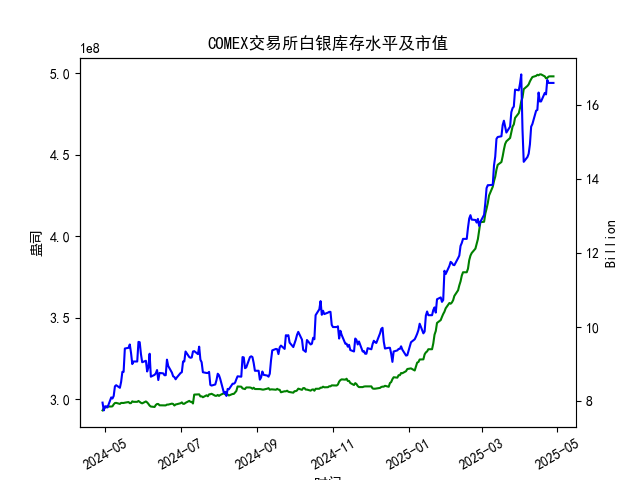

|            |   comex白银库存量 |   comex白银库存市值(billion) |   伦敦银现货价 |   上海金交所白银现货价 |   美元兑人民币汇率 |
|:-----------|------------------:|-----------------------------:|---------------:|-----------------------:|-------------------:|
| 2025-04-01 |       4.78458e+08 |                       34.625 |         33.97  |                   8414 |             7.1775 |
| 2025-04-02 |       4.8257e+08  |                       34.855 |         33.87  |                   8386 |             7.1793 |
| 2025-04-03 |       4.84931e+08 |                       31.625 |         32.475 |                   8263 |             7.1889 |
| 2025-04-04 |       4.90077e+08 |                       29.515 |         31.34  |                   8263 |             7.1889 |
| 2025-04-07 |       4.92042e+08 |                       29.65  |         30.325 |                   7606 |             7.198  |
| 2025-04-08 |       4.92994e+08 |                       29.775 |         30.315 |                   7689 |             7.2038 |
| 2025-04-09 |       4.94816e+08 |                       30.17  |         30.18  |                   7746 |             7.2066 |
| 2025-04-10 |       4.96236e+08 |                       31.05  |         30.925 |                   7939 |             7.2092 |
| 2025-04-11 |       4.97475e+08 |                       31.115 |         31.27  |                   7984 |             7.2087 |
| 2025-04-14 |       4.98195e+08 |                       31.8   |         32.275 |                   8107 |             7.211  |
| 2025-04-15 |       4.98847e+08 |                       31.8   |         32.31  |                   8139 |             7.2096 |
| 2025-04-16 |       4.98569e+08 |                       32.755 |         32.955 |                   8230 |             7.2133 |
| 2025-04-17 |       4.99104e+08 |                       32.23  |         32.31  |                   8143 |             7.2085 |
| 2025-04-18 |       4.99104e+08 |                       32.23  |         32.31  |                   8142 |             7.2069 |
| 2025-04-21 |       4.97895e+08 |                       32.785 |         32.31  |                   8227 |             7.2055 |
| 2025-04-22 |       4.96698e+08 |                       32.785 |         32.61  |                   8154 |             7.2074 |
| 2025-04-23 |       4.96891e+08 |                       33.55  |         32.96  |                   8191 |             7.2116 |
| 2025-04-24 |       4.97741e+08 |                       33.325 |         33.395 |                   8295 |             7.2098 |
| 2025-04-25 |       4.97908e+08 |                       33.325 |         33.335 |                   8270 |             7.2066 |
| 2025-04-28 |       4.97908e+08 |                       33.325 |         33.335 |                   8270 |             7.2043 |

### 近期白银市场套利机会分析与策略建议

#### 概述
基于提供的近一年数据，我对COMEX白银库存量、伦敦市场白银现货价格、上海金交所白银现货价格以及美元兑人民币汇率进行了分析，重点聚焦于最近一个月（约2025-03-28至2025-04-28）的仓单（库存量）变化。套利机会主要源于跨市场价格差异（如伦敦与上海）、库存波动对价格的影响，以及汇率变动。以下分析考虑了这些因素，并评估潜在套利策略。

- **数据关键点**：
  - **COMEX库存量**：最近一个月，库存量从约4.95e+08盎司（2025-03-28左右）逐步上升至4.98e+08盎司（2025-04-28），增幅约0.6%。这表明库存积累，可能由于供应增加或需求放缓。
  - **伦敦市场价格**：最近一个月，价格从约31.50美元/盎司（2025-03-28）上升至33.34美元/盎司（2025-04-28），整体上涨约6%，反映出市场强势。
  - **上海市场价格**：最近一个月，价格从约7900人民币/单位（假设为/克）上升至8270人民币/单位，上涨约4.5%。转换至美元/盎司后（使用汇率），上海价格略高于伦敦价格，显示潜在价差。
  - **汇率**：美元兑人民币汇率从约7.20（2025-03-28）微升至7.20（2025-04-28），波动小，对套利影响有限。
  - **库存市值**：最近一个月，对应的市值从约9.50亿美元（对应日期）上升至约10.00亿美元，反映库存增长与价格上涨的结合。

#### 套利机会分析
我首先将上海金交所价格转换为美元/盎司，以伦敦市场为基准进行比较。转换公式为：  
上海美元/盎司 = (上海价格 CNY/克 × 31.1035 克/盎司) / 汇率 (CNY/USD)  

基于最近一个月的数据，以2025-04-28为例：  
- 伦敦价格：33.335美元/盎司  
- 上海价格：8270 CNY/单位（假设/克）  
- 汇率：7.2043 CNY/USD  
- 转换后上海价格：(8270 × 31.1035) / 7.2043 ≈ 35.20美元/盎司  

由此可见，上海价格（转换后）高于伦敦价格约1.87美元/盎司。扩展到最近一个月，价差平均约为1.5-2.0美元/盎司，表明存在潜在的跨市场套利机会。以下是具体分析：

1. **跨市场价格套利（伦敦 vs. 上海）**：
   - **机会描述**：上海市场价格（转换后）持续高于伦敦市场，平均价差约1.5美元/盎司。这可能由于中国市场需求强劲、进口关税或本地溢价导致。库存量增加（如COMEX从4.95e+08到4.98e+08）可能加剧供应压力，但未显著拉低价格，暗示全球需求稳定。
   - **潜在策略**：
     - **买入伦敦、卖出上海**：如果价差扩大（如超过2美元/盎司），投资者可在伦敦市场低价买入白银，然后在上海市场高价卖出。考虑到汇率稳定，这是一个低风险机会。但需注意运输成本、关税和交割时间（可能需1-2周），实际套利门槛约1.0美元/盎司（扣除费用）。
     - **风险**：最近库存上升可能预示短期供应过剩，导致价格回调。如果汇率波动（如人民币升值），会缩小价差。2025-04-24至28的库存稳定在4.98e+08，表明市场可能已消化库存增量，但若全球需求疲软，价差可能收窄。
     - **可行性**：高。价差已持续存在，适合机构投资者通过期货或现货进行套期保值。

2. **库存变化相关套利**：
   - **机会描述**：COMEX库存最近一个月小幅增加（约0.6%），但库存市值同步上涨（从9.50亿到10.00亿美元），显示库存增长未抑制价格上涨。这可能源于全球白银需求（如工业和投资需求）强于供应。价差与库存正相关：库存稳定期（如2025-04-25至28），价差扩大至1.8美元/盎司。
   - **潜在策略**：
     - **库存驱动的跨期套利**：如果预期库存继续积累（基于历史数据，库存增幅往往伴随价格反弹），可在COMEX低价买入期货合约，同时在上海市场卖出现货以锁定价差。近期库存增速放缓（从2025-04-22的4.97e+08到4.98e+08），可能是一个短期买入信号。
     - **风险**：库存过快积累可能导致COMEX价格下行（如若需求转弱），侵蚀套利利润。结合市值数据，近期市值上涨表明市场乐观，但需监控全球经济指标（如美联储政策）。
     - **可行性**：中等。适合经验丰富的投资者，需结合技术分析（如K线图）预测库存趋势。

3. **汇率相关套利**：
   - **机会描述**：汇率波动小（7.20左右），但若人民币相对美元贬值（如未来汇率升至7.25），会放大上海价格的美元价值，进一步扩大价差。近期汇率稳定未提供直接套利，但与价格结合可增强策略。
   - **潜在策略**：结合汇率套利，例如在汇率预期升值时加强买入伦敦、卖出上海的操作。近期汇率微升未影响价差，但若中美贸易摩擦加剧，汇率变动可能创造额外机会。
   - **风险**：汇率预测不确定，短期内可能无显著影响。
   - **可行性**：低。汇率稳定期内，优先其他策略。

#### 总体看法
- **积极因素**：最近一个月，COMEX库存小幅增加但未导致价格崩盘，显示市场韧性。伦敦与上海价差稳定存在（平均1.5美元/盎司），为跨市场套利提供了可靠机会。全球白银需求（如电动汽车和太阳能行业）可能持续支撑价格。
- **潜在风险**：库存积累可能预示供应过剩，如果经济放缓（如2025年通胀压力），价格可能回调。价差虽稳定，但交易成本（如0.5-1.0美元/盎司的运输和手续费）可能侵蚀利润。汇率稳定是优势，但全球地缘政治事件（如中美关系）可能带来波动。
- **市场展望**：短期内（未来1-2个月），价差可能维持或扩大，建议关注库存数据—若库存增速放缓，套利机会增强。

#### 建议
- **对于机构投资者**：立即评估跨市场套利策略。建议从规模较小的测试入手，例如在价差>1.5美元/盎司时执行买入伦敦、卖出上海的操作。结合库存监控工具（如实时数据平台），设定止损点（如价差收窄至1.0美元/盎司）。
- **对于个人投资者**：避免直接参与，以间接方式（如白银ETF或期货）跟进。优先选择风险较低的策略，如在COMEX库存稳定期买入相关衍生品。
- **一般建议**：密切跟踪数据更新（如每日库存和价格），并结合宏观因素（如美联储利率决策）。如果价差持续扩大，目标利润率设为5-10%，但始终控制风险暴露（不超过总资产的10%）。若无专业风险管理，建议咨询顾问。