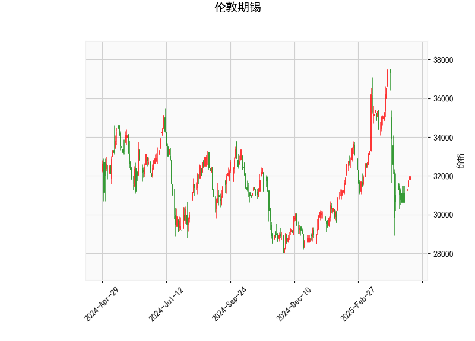

### 伦敦期锡技术分析结果详解

#### 1. 对技术分析结果的分析
以下是对提供的伦敦期锡技术指标的详细解读，这些指标 collectively 反映了市场的当前态势和潜在动量。当前价格为 31975.0，整体指标显示市场处于相对中性偏弱的阶段，但存在一些看涨信号。

- **RSI (Relative Strength Index)**: 当前值为 46.79。这表明市场处于中性偏弱区域。RSI 通常在 30 以下被视为超卖（可能引发反弹），而在 70 以上被视为超买（可能引发回调）。46.79 的水平暗示近期卖方力量稍占上风，但尚未进入极端超卖状态，潜在的反弹机会值得关注。

- **MACD (Moving Average Convergence Divergence)**: MACD 线为 -632.63，信号线为 -662.49，柱状图 (MACD Hist) 为 +29.85。MACD 线高于信号线（尽管两者均为负值），这形成了一个微弱的看涨交叉信号，表明短期动量可能正在从下行转向上行。柱状图的正值进一步支持这一观点，暗示潜在的买入机会。然而，整体负值水平表示熊市趋势尚未完全逆转，需警惕回调风险。

- **Bollinger Bands (布林带)**: 上轨为 37031.50，中轨为 33047.58，下轨为 29063.67。目前价格 31975.0 位于中轨附近（略低于中轨），这反映出价格处于一个相对稳定的中性区间。Bollinger Bands 的宽度显示市场波动性适中：如果价格向上突破上轨，可能预示强势上涨；反之，如果跌破下轨，则可能进入超卖区域并触发反弹。当前位置表明市场缺乏强烈方向性，但接近中轨的稳定可能为短期交易提供支撑。

- **K线形态**: 形态为 "CDLGAPSIDESIDEWHITE"（间隙并排白色实体线）。这是一种典型的看涨K线模式，通常表示价格在间隙后出现连续的上涨实体，暗示买方力量增强。结合当前价格，这种形态可能预示短期内价格企稳或反弹，但需与其他指标验证，以避免假突破。

总体而言，技术指标呈现混合信号：RSI 和 MACD 的负值显示弱势基础，但 MACD 的正柱状图和 K线形态的看涨特征暗示潜在的上行机会。市场可能正处于筑底阶段，等待进一步确认。

#### 2. 近期可能存在的投资或套利机会和策略
基于上述分析，伦敦期锡市场短期内可能存在有限的投资机会，特别是围绕潜在反弹或趋势逆转。以下是针对近期可能性的判断和建议策略，重点考虑技术面信号，同时强调风险管理。注意，商品期货市场受全球经济、供需动态和地缘政治影响较大，因此这些建议仅基于技术分析。

- **可能的投资机会**:
  - **短期看涨机会**: MACD 的正柱状图和 K线形态的看涨信号表明，价格可能从当前水平反弹向上测试上轨 (37031.50)。如果 RSI 从 46.79 水平回升至 50 以上，这将加强多头信心。预计机会窗口为 1-2 周内，适合短期交易者。
  - **均值回归机会**: 价格接近 Bollinger Bands 中轨，暗示潜在的均值回归。如果市场波动加剧，价格可能向上下轨移动，提供买卖点。超卖区域 (接近下轨 29063.67) 可能成为低吸点。
  - **套利潜力**: 在期货市场，跨品种套利（如与 LME 其他金属或全球锡市场比较）可能存在，但数据有限。假设基于技术分析，当前弱势可能与更强金属（如铜）形成价差套利机会，例如如果锡价反弹而其他金属滞后。

- **推荐策略**:
  - **买入多头策略**: 如果 MACD 柱状图继续扩大（转为更强正值），考虑在 31975.0 附近买入多头头寸，目标设在上轨 37031.50。止损位可设在下轨 29063.67 以下，以控制风险。结合 RSI，如果其升至 50-60 区间，可作为加仓信号。
  - **卖出空头策略**: 若 RSI 跌破 40 或价格跌破中轨，考虑短期空头操作，目标为下轨附近。K线形态的看涨特征可能限制空头空间，因此需谨慎。
  - **套利策略**: 对于经验丰富的投资者，可探索跨市场套利，例如在伦敦期锡买入多头，同时在相关市场（如上海期货交易所锡）卖出空头，以捕捉价差收敛。但需监控全球锡库存和需求数据（如电子行业需求），作为触发条件。
  - **风险管理建议**: 始终设置止损（例如基于 Bollinger Bands 的 2-5% 波动范围），并结合基本面分析（如锡矿供应或经济数据）。总体仓位控制在 20-30% 以内，避免单一技术信号主导决策。市场波动性较高，建议在关键水平（如中轨）等待确认信号再行动。

总之，近期投资机会以短期反弹为主，但需警惕整体弱势信号。建议结合实时市场数据和基本面因素进行验证，以最大化潜在回报并最小化风险。