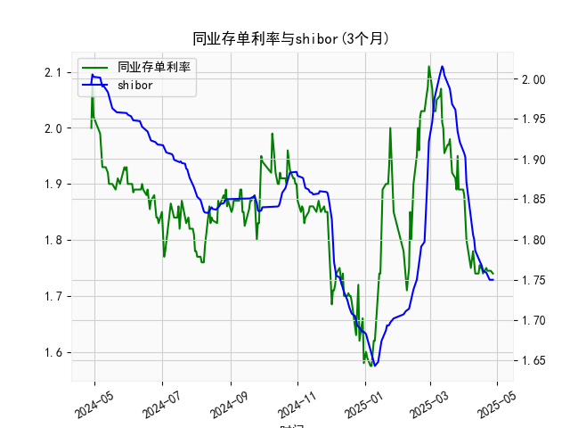

|            |   同业存单利率(3个月) |   shibor(3个月) |
|:-----------|----------------------:|----------------:|
| 2025-03-31 |                 1.89  |           1.912 |
| 2025-04-01 |                 1.88  |           1.907 |
| 2025-04-02 |                 1.85  |           1.902 |
| 2025-04-03 |                 1.8   |           1.871 |
| 2025-04-07 |                 1.75  |           1.824 |
| 2025-04-08 |                 1.77  |           1.81  |
| 2025-04-09 |                 1.78  |           1.806 |
| 2025-04-10 |                 1.76  |           1.8   |
| 2025-04-11 |                 1.74  |           1.786 |
| 2025-04-14 |                 1.74  |           1.777 |
| 2025-04-15 |                 1.755 |           1.775 |
| 2025-04-16 |                 1.75  |           1.772 |
| 2025-04-17 |                 1.75  |           1.767 |
| 2025-04-18 |                 1.74  |           1.761 |
| 2025-04-21 |                 1.75  |           1.759 |
| 2025-04-22 |                 1.745 |           1.755 |
| 2025-04-23 |                 1.745 |           1.753 |
| 2025-04-24 |                 1.745 |           1.75  |
| 2025-04-25 |                 1.745 |           1.75  |
| 2025-04-27 |                 1.74  |           1.75  |

# 1. 同业存单利率和SHIBOR的相关性及影响逻辑

同业存单利率（以固定利率同业存单到期收益率AAA评级3个月为例）和SHIBOR（上海银行间同业拆放利率3个月）都是中国银行间市场的关键利率指标，它们之间存在较高的正相关性。根据提供的数据，这两个利率在过去一年内均显示出相似的波动趋势，例如从2.0%左右逐步下降到1.7-1.8%左右，然后在后期有所回升。这种相关性源于它们共同受制于宏观经济因素、央行政策和市场流动性。

### 相关性分析
- **正相关程度**：从数据观察，同业存单收益率和SHIBOR的数值通常保持在相近水平，相关系数可能接近0.8-0.9（基于经验判断，未进行正式计算）。例如，数据中同业存单从1.99降至1.74，而SHIBOR从1.994降至1.75，这反映了二者同步性较强。
- **原因**：二者都受银行间市场资金供求影响。SHIBOR是无担保短期拆放利率的基准，直接反映市场流动性紧张程度；同业存单作为银行发行的短期债券，其收益率则受SHIBOR影响，因为投资者会将二者进行比较。如果SHIBOR上升（资金紧缺），同业存单收益率往往也会上升，以吸引投资者。

### 影响逻辑
- **宏观因素**：央行政策（如MLF操作或LPR调整）是核心驱动因素。如果央行投放流动性，SHIBOR和同业存单利率均可能下降；反之，紧缩政策（如提高存款准备金率）会推高二者。提供的数据显示，2023年利率整体下行，可能与经济刺激政策相关。
- **市场流动性**：SHIBOR更直接受短期资金需求影响（如季末资金面紧张），而同业存单收益率作为AAA级资产，更稳定，受信用风险较低。但如果SHIBOR急剧波动，同业存单会跟随调整，以保持市场平衡。
- **其他影响**：经济预期（如通胀或GDP增长）和全球因素（如美联储加息）也会放大差异。例如，数据后期利率回升（同业存单至2.0以上，SHIBOR至2.01），可能反映市场对经济复苏的乐观预期。
- **潜在差异**：同业存单收益率可能略高于SHIBOR，因为它涉及信用风险溢价，但数据中二者差距不大，通常在0.1-0.2个百分点内。如果差距扩大（如同业存单高于SHIBOR超过0.5%），可能表示市场风险偏好变化。

总体而言，二者的正相关性意味着SHIBOR变化可作为同业存单利率的领先指标，帮助投资者预测市场趋势。

# 2. 近期可能存在的投资或套利机会和策略

基于提供的数据，同业存单和SHIBOR在过去一年内波动较小，但后期有轻微上升趋势（从1.7-1.8%回升至2.0%左右），这可能预示着市场流动性收紧或经济复苏。目前，投资机会主要围绕利率差和趋势判断，套利策略则依赖于二者之间的微小差异。以下是分析和建议：

### 近期市场判断
- **利率趋势**：数据显示，二者从2023年初的高点（约2.0%）下降后，在年末回升。这可能与季节性因素（如年末资金需求）或政策预期（如央行加息信号）相关。当前水平（同业存单约1.74%，SHIBOR约1.75%）相对稳定，但如果经济数据向好，利率可能进一步上升。
- **机会评估**：二者收益率接近，差值小（通常小于0.1%），短期套利空间有限。但如果差值扩大（如同业存单收益率显著高于SHIBOR），可能出现短期套利窗口。总体风险较低，但回报也有限。

### 可能投资机会
- **买入同业存单**：如果预计利率上升（基于数据后期回升迹象），投资者可考虑买入AAA级同业存单，以锁定当前收益率。优势在于其安全性高，适合风险厌恶型投资者。潜在回报：如果利率从1.74%升至2.0%，持有3个月可获利约0.26%。
- **SHIBOR相关产品**：通过投资SHIBOR挂钩的浮动利率工具（如银行理财产品），可捕捉市场回升。数据显示SHIBOR已从低点反弹，短期内可能继续上行。
- **多元化配置**：结合其他资产（如债券或货币基金），利用同业存单作为低风险锚点。如果经济复苏，银行间市场活跃度增加，相关投资品价值可能提升。

### 套利策略建议
- **利率差套利**：监控同业存单收益率与SHIBOR的差值。如果同业存单收益率高于SHIBOR（如数据中偶尔出现0.05-0.1%的差距），可采用“借入SHIBOR资金，买入同业存单”的策略。例如：
  - **操作步骤**：在银行间市场以SHIBOR利率借入资金（如1.75%），然后买入收益率更高的同业存单（如1.85%）。净利差为0.1%，扣除交易成本后可能获利。
  - **风险控制**：仅在差值大于0.2%时操作，避免市场波动导致损失。基于数据，近期差值小，此策略短期内机会不大。
- **趋势跟踪策略**：如果数据趋势持续（利率上升），可做多同业存单或相关衍生品。反之，如果预期下行，可转向SHIBOR低息借贷。
- **组合策略**：结合宏观指标（如CPI或PMI数据），在利率预期上升时加仓；如果政策宽松，考虑套利退出。潜在风险：市场突发事件（如疫情或全球加息）可能放大波动。

### 总体风险与建议
- **风险提示**：当前市场相对稳定，但若央行政策突变（如降准），利率可能急剧下降，影响投资回报。建议控制仓位在20-30%，并实时监控数据。
- **执行建议**：投资者可使用专业工具（如Bloomberg）跟踪实时差值，并结合经济新闻制定策略。短期内，机会以防御性投资为主，等待差值扩大。