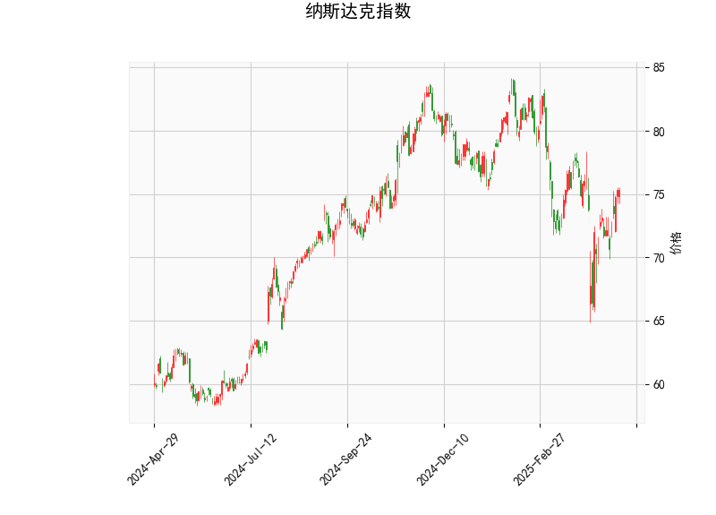

### 纳斯达克指数技术分析结果解读

#### 1. 对技术分析结果的详细分析
基于提供的纳斯达克指数数据，我们可以从多个技术指标入手，对当前市场态势进行评估。以下是对各指标的逐一分析：

- **当前价格（Current Price）**: 75.36。这表明纳斯达克指数当前处于一个相对稳定的水平，与近期均线（如Bollinger Bands的中轨）接近，暗示市场可能处于盘整阶段而非剧烈波动。

- **RSI（Relative Strength Index，相对强弱指数）**: 54.38。该值位于中性区间（30-70），显示市场当前没有明显的超买或超卖信号。具体而言，RSI高于50表明短期内买方力量略占上风，但整体仍保持平衡。如果RSI持续上升至70以上，可能预示过热风险；反之，若跌至30以下，则可能出现超卖反弹机会。

- **MACD（Moving Average Convergence Divergence，移动平均收敛散度）**: 
  - MACD线：-0.3063（负值）。
  - MACD信号线：-0.9181（更低的负值）。
  - MACD直方图：0.6117（正值）。
  这显示MACD线正在向上逼近信号线（尽管两者均为负），直方图的正值暗示短期内可能出现看涨交叉（Bullish Crossover）。这是一个潜在的转势信号，表明卖方压力可能正在减弱。如果MACD线成功穿越信号线向上，将进一步确认多头趋势；否则，市场可能继续维持弱势。

- **Bollinger Bands（布林带）**:
  - 上轨（Upper Band）：84.09。
  - 中轨（Middle Band）：76.15。
  - 下轨（Lower Band）：68.21。
  当前价格（75.36）位于中轨下方但高于下轨，表明指数处于一个相对中性的波动区间。Bollinger Bands的宽度显示市场波动性适中（未过度扩张）。如果价格向上突破上轨，可能触发强势上涨；反之，若跌破下轨，则可能出现回调或超卖情况。目前的定位暗示短期内可能有窄幅震荡。

- **K线形态（K线模式）**: ['CDLGAPSIDESIDEWHITE']，这是一种看涨K线模式，通常称为“并排白线间隙”。它表示价格在短期内出现向上间隙（Gap），伴随连续的阳线，暗示买方主导并可能推动价格进一步上涨。这种形态常被视为多头信号，尤其在盘整后出现时。但需注意，K线模式受市场整体环境影响，如果伴随其他指标（如RSI未超买），其可靠性较高。

总体而言，当前技术指标呈现中性偏看涨的格局。RSI和Bollinger Bands显示市场稳定，MACD的潜在交叉和K线形态提供了一些乐观信号，但尚未形成强烈趋势。投资者应结合基本面（如经济数据或企业财报）验证这些信号，以避免假突破。

#### 2. 近期可能存在的投资或套利机会和策略判断
基于上述分析，纳斯达克指数短期内可能存在一些投资机会，特别是如果多头信号得到强化。以下是对潜在机会和策略的评估与建议：

- **可能的投资机会**:
  - **看涨机会**: MACD直方图的正值和K线形态的看涨信号暗示短期内可能出现向上突破，尤其是如果价格接近或突破Bollinger Bands中轨（76.15）。RSI处于中性水平，表明市场未过度拥挤，适合逢低买入ETF（如QQQ）或相关股票指数基金。
  - **风险点**: 如果MACD线未能向上穿越信号线，或价格跌破下轨（68.21），则可能转为看跌，增加回调风险。当前全球经济不确定性（如通胀或地缘政治事件）可能放大波动，因此机会更适合短期交易者。
  - **套利潜力**: 在衍生品市场（如期权或期货），如果纳斯达克指数与相关资产（如科技股ETF）之间出现价格偏差，可能存在套利机会。例如，如果现货价格与期货价格脱节，投资者可通过跨市场套利（如买入现货、卖出期货）来捕捉无风险收益。但需注意，当前指标未显示明显的价格扭曲，套利机会可能较有限。

- **推荐的投资策略**:
  - **趋势跟踪策略**: 监控MACD线是否向上交叉信号线。如果发生，建议买入纳斯达克相关ETF或期权头寸，目标设在Bollinger Bands上轨（84.09）附近。止损位可设在下轨（68.21）下方，以控制风险。RSI低于70的水平支持这一策略，避免追高。
  - **波动率策略**: 利用Bollinger Bands的窄幅震荡进行区间交易。例如，在价格反弹至中轨时卖出，在接近下轨时买入。这适合中性市场环境，并可结合RSI作为辅助指标（e.g., 当RSI接近50时入场）。
  - **套利策略**: 如果发现期权隐含波动率与历史波动率偏差（e.g., 通过比较纳斯达克期权定价），可采用价差套利（如牛市价差或熊市价差）。例如，买入看涨期权（基于K线形态）和卖出虚值看涨期权，以锁定潜在上涨收益。同时，结合宏观数据（如美联储利率决策）来评估时机。
  - **风险管理建议**: 无论投资还是套利，都应控制仓位（e.g., 总仓位不超过20%用于此类操作），并设置严格的止损规则。短期内，建议优先观察市场是否确认多头趋势（如RSI升至60以上），以避免假信号。

总之，近期纳斯达克指数的投资机会以短期看涨为主，但需谨慎对待潜在回调。策略应以数据驱动为主，并结合风险控制措施。投资者可通过实时监控指标（如MACD交叉）来及时调整头寸。