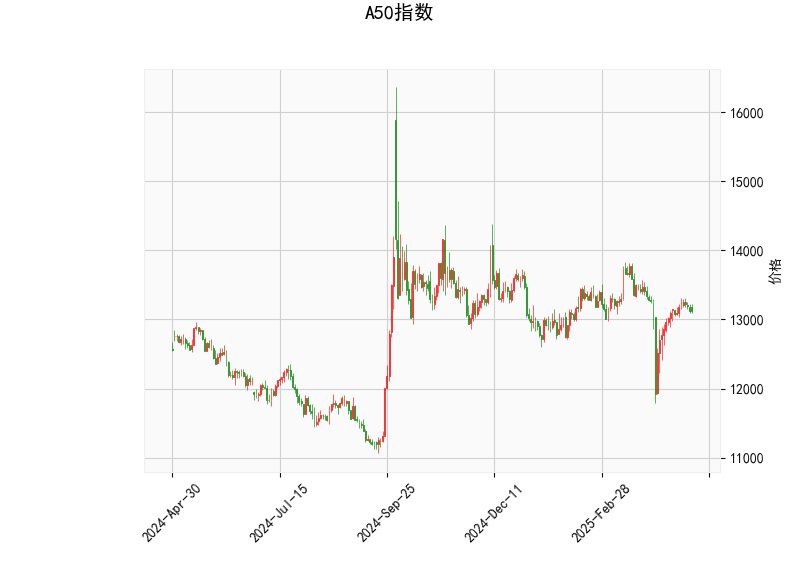

### 1. A50指数技术分析结果的解读

以下是对A50指数当前技术指标的详细分析，基于提供的指标数据（当前价为13115.0）。这些指标反映了市场的动量、趋势和波动性，帮助识别潜在的买卖信号。

- **RSI（相对强弱指数）分析**：  
  当前RSI值为49.34，这表明A50指数处于中性区域（RSI通常在30-70之间视为中性）。RSI低于50暗示短期内卖方力量略占上风，但尚未进入超卖区（RSI<30）。这可能表示市场缺乏强烈的趋势方向，投资者应关注后续RSI变化。如果RSI向上突破50，可能预示着看涨势头；反之，如果跌破30，则可能出现反弹机会。

- **MACD（移动平均收敛散度）分析**：  
  MACD线当前值为-3.84，信号线为-29.19，MACD直方图为25.35（正值）。尽管MACD线和信号线均为负值（表示短期趋势可能偏弱），但直方图的正值（MACD线高于信号线）暗示了潜在的看涨动量。这是一个短期积极信号，表明卖方力量可能正在减弱，市场可能从超卖状态反弹。然而，需要警惕如果直方图转为负值，将可能确认下行趋势。

- **布林带分析**：  
  当前价格13115.0位于中轨（13225.6）和下轨（12646.45）之间，距离上轨（13804.75）较远。这反映了市场处于相对稳定的盘整阶段，而不是强烈的趋势方向。价格接近中轨表明波动性较低，可能预示着短期内价格会继续在布林带内震荡。如果价格向上突破中轨并接近上轨，可能触发看涨信号；反之，如果跌破下轨，则可能进入超卖区域，增加反弹风险。

- **K线形态分析**：  
  检测到的K线形态包括“CDLLONGLINE”（长阳线）和“CDLMATCHINGLOW”（匹配低点）。长阳线通常表示强势上涨，暗示买方力量占优，可能是一个短期看涨信号。匹配低点形态则可能预示着底部形成或双底结构，表明市场可能从低位反弹。这两个形态结合，显示A50指数近期可能已触及支撑位，并有向上测试的潜力，但需结合其他指标确认，避免假突破。

总体而言，A50指数的技术指标显示出中性偏看涨的特征。市场可能处于盘整阶段，RSI和MACD的信号暗示潜在反弹，但缺乏强烈趋势。投资者应密切关注价格是否突破关键水平（如布林带中轨），以避免市场波动带来的不确定性。

### 2. 近期可能存在的投资或套利机会和策略判断

基于上述技术分析，A50指数短期内可能存在一定的投资机会，特别是反弹或盘整中的均值回归策略。以下是对潜在机会的评估和策略建议：

- **投资机会判断**：  
  - **看涨机会**：K线形态（如长阳线和匹配低点）结合MACD直方图的正值，暗示A50指数可能从当前水平反弹。如果价格向上突破布林带中轨（13225.6），短期内可能测试上轨（13804.75），提供买入机会。RSI接近50也支持中性到看涨的转变，适合风险偏好中等的投资者。
  - **看跌风险**：如果RSI跌破40或价格跌破下轨（12646.45），市场可能进一步下行，增加卖出或做空机会。但当前指标不支持强烈看跌，因此这更多是防御性考虑。
  - **套利机会**：A50指数作为期货或ETF，可能存在跨市场套利（如A股与A50期货的价差）。如果A50指数与相关资产（如沪深300）出现异常价差（例如，由于市场情绪导致短期脱节），投资者可利用均值回归进行套利。当前盘整状态可能放大这种机会，但需注意全球市场联动（如中美贸易动态）的影响。

- **投资策略建议**：  
  - **买入策略**：在价格接近下轨（12646.45）时考虑建仓，目标设在中轨（13225.6）以上。结合K线形态的反弹信号，使用MACD直方图作为确认指标（待直方图扩大）。风险控制：设置止损在下轨下方5-10%，以防范突发下行。
  - **卖出或观望策略**：如果RSI升至70以上或价格接近上轨（13804.75），考虑卖出以锁定利润。短期内，若MACD信号线继续下行，建议观望避免追高。
  - **套利策略**：监控A50指数与A股或其他指数（如恒生指数）的价差。如果发现异常（如A50相对低估），可采用多头A50和空头相关资产的组合套利。示例：在当前盘整期，如果A50期货与现货价差扩大，利用杠杆产品（如期权）进行无风险套利，但需评估交易成本和流动性。
  - **整体风险管理**：A50指数受全球经济事件影响较大，建议结合基本面分析（如中国经济数据或政策变动）。采用分批建仓和动态止盈止损，控制仓位在总资产的20-30%以内。长期投资者可等待趋势确认，而短期交易者应优先关注技术信号的交叉验证。

总之，近期A50指数的投资机会以反弹为主，套利机会依赖市场脱节。但市场不确定性较高，建议谨慎操作，结合多指标验证以降低风险。