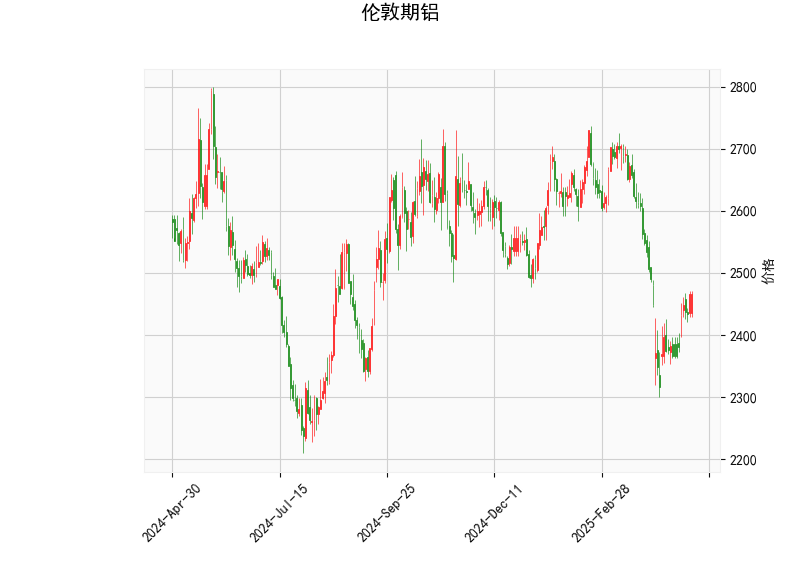

### 1. 对伦敦期铝的技术分析结果的分析

基于提供的伦敦期铝技术指标数据，我们可以从多个角度对当前市场状况进行解读。以下是对关键指标的详细分析：

- **当前价格（Current Price）**：价格为2465.5，这表明铝价处于相对稳定的区间。相比Bollinger Bands的中轨（2554.82），当前价格略低于中轨，暗示短期内可能存在下行压力，但仍高于下轨（2303.26），避免了进入超卖区域。这反映出市场可能在盘整或等待进一步催化剂。

- **RSI（Relative Strength Index）**：RSI值为51.51，这是一个中性水平（通常RSI超过70表示超买，低于30表示超卖）。当前RSI接近中性线50，表明铝价的买入和卖出力量大致平衡，没有明显的超买或超卖信号。这可能意味着市场短期内缺乏强烈动量，投资者需关注后续价格波动以确认趋势。

- **MACD（Moving Average Convergence Divergence）**：MACD线为-25.52，信号线为-44.45，直方图（MACD Hist）为18.92。从这些数据看，MACD线高于信号线（尽管两者均为负值），这可能预示着短期动量正在从看跌转向看涨，因为直方图为正值，表示多头力量开始增强。然而，MACD整体仍处于负值区域，意味着熊市趋势尚未完全逆转。这是一个潜在的“金叉”信号，但需进一步确认，以避免假突破。

- **Bollinger Bands（布林带）**：上轨为2806.37，中轨为2554.82，下轨为2303.26。当前价格2465.5位于中轨和下轨之间，具体处于下轨上方但远离上轨。这显示价格在Bollinger Bands的收缩或中性区间，暗示市场可能处于盘整阶段。如果价格继续向中轨或上轨靠拢，可能出现向上突破；反之，向下轨靠近则可能触发反弹或进一步下探。Bollinger Bands的宽度相对较窄，表明市场波动性较低。

- **K线形态**：形态为“CDLLONGLINE”（长线形态），这通常表示强烈的价格运动方向。如果是长阳线（如大阳线），它可能反映多头强势，暗示短期内可能有向上突破；如果是长阴线，则表示空头主导。但基于单一形态，需结合其他指标验证其可靠性。目前，这与MACD的潜在看涨信号相呼应，显示市场可能正从盘整转向积极。

总体而言，伦敦期铝的技术面显示出中性偏看涨的特征。RSI和Bollinger Bands表明市场不处于极端状态，而MACD和K线形态的组合暗示短期可能有向上动量。但整体趋势仍需外部因素（如全球经济数据或供需动态）来确认，避免单凭技术指标做决策。

### 2. 近期可能存在的投资或套利机会和策略

基于上述分析，伦敦期铝市场可能存在一些短期投资或套利机会。以下是对潜在机会的判断以及相应的策略建议。请注意，市场充满不确定性，实际操作应结合基本面分析和风险管理。

#### 可能的机会
- **短期投资机会**：
  - **看涨机会**：MACD直方图为正且高于信号线，结合K线长线形态，这可能预示价格反弹。当前价格接近Bollinger Bands的下轨，历史数据显示此区域往往是支撑位，因此如果价格企稳，可能迎来向上突破（目标指向中轨2554.82或更高）。RSI的中性水平也支持这种可能性，避免了超买风险。
  - **看跌风险**：如果MACD未能维持向上交叉，价格可能回落至下轨2303.26附近，特别是在全球需求疲软（如经济放缓影响铝消费）的情况下。这可能为逢高做空提供机会。
  - **套利机会**：期铝市场常与现货铝价或相关商品（如铜或能源）存在价差。当前技术面中性，可能出现跨市场套利，例如如果伦敦期铝与上海期铝价差扩大（基于历史数据，价差波动可达5-10%），投资者可通过反向操作（如在低价市场买入、高价市场卖出）获利。

- **潜在挑战**：
  - 市场波动性较低（Bollinger Bands较窄），短期内可能缺乏强烈趋势，增加假突破风险。
  - 外部因素如地缘政治或能源价格变动，可能放大不确定性，导致机会转瞬即逝。

#### 投资或套利策略建议
- **买入策略（Long Position）**：
  - **条件**：等待MACD线正式交叉信号线向上，且RSI保持在50以上，同时价格站稳中轨2554.82。这可视为入场信号。
  - **操作**：在2465.5附近买入，目标设在中轨或上轨2806.37，止损置于下轨2303.26以下（约2-5%的风险控制）。适用于中短期投资者，利用技术反弹获利。
  - **理由**：K线长线形态和MACD信号支持向上潜力，RSI中性避免了超买回调风险。

- **卖出策略（Short Position）**：
  - **条件**：如果价格回落并RSI跌破50，或MACD直方图转负，表明看跌势头增强。
  - **操作**：在接近中轨2554.82时卖出，目标指向下轨2303.26，止损设在上轨2806.37以上。持有时间控制在短期内，以避开潜在反弹。
  - **理由**：当前价格低于中轨，MACD仍为负，适合风险厌恶者捕捉下行机会。

- **套利策略**：
  - **跨市场套利**：监控伦敦期铝与亚洲市场（如LME与SHFE）的价差。如果价差扩大（例如，由于运输成本或政策差异），可采用“买入低价市场、卖出高价市场”的策略。例如，若伦敦铝价相对上海铝价偏低，可在伦敦买入并在上海卖出空头合约，待价差收窄获利。
  - **动量套利**：结合Bollinger Bands，利用价格在轨道间的波动。当前价格在中性区，可在下轨附近买入、在上轨附近卖出，实现波动套利。建议使用杠杆工具（如期货合约），但控制仓位不超过总资金的20%。
  - **风险管理**：所有策略均应设置严格止损（基于Bollinger Bands），并结合RSI避免过度交易。建议在实际操作前使用模拟账户测试。

总之，近期伦敦期铝的投资机会以短期反弹为主，套利则聚焦于跨市场价差。但需谨慎，技术分析仅为参考，结合宏观经济（如铝需求复苏或供应中断）方能优化决策。始终优先考虑个人风险承受能力。