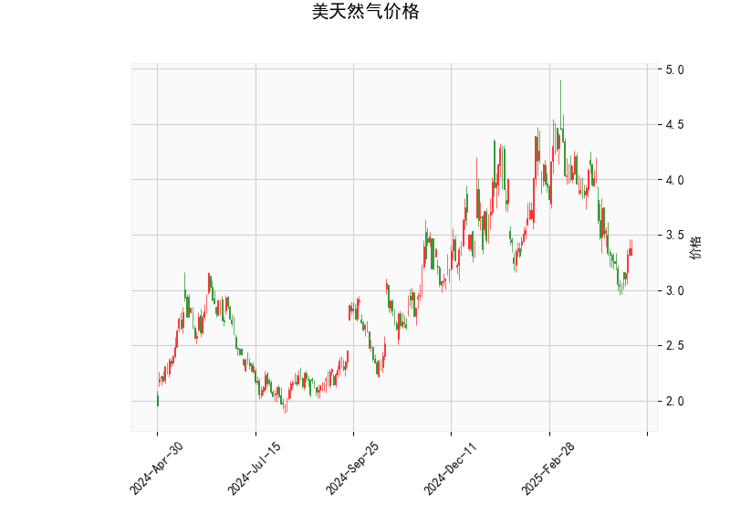

# 美天然气价格技术分析结果分析

## 1. 对技术分析结果的详细分析

基于提供的美天然气价格数据，我们对各个技术指标进行逐一解读，以评估当前市场态势。总体而言，指标显示出混合信号，结合RSI、MACD、布林带和K线形态，市场可能处于一个潜在转折点，但仍需谨慎观察。

- **当前价格（3.38）**：  
  当前价格位于布林带的中轨（3.81）附近，但更接近下轨（3.01），表明价格处于相对中性区域。短期内，这种位置可能暗示市场稳定，但如果价格进一步下跌至下轨下方，将增加超卖风险；反之，若向上突破中轨，可能触发反弹。

- **RSI（46.15）**：  
  RSI值低于50，显示市场可能处于轻微超卖状态。这通常被视为潜在看涨信号，因为它暗示卖方动能减弱，买方可能开始入场。然而，RSI未跌至30以下，因此尚未进入极端超卖区域。近期RSI若持续上升，可能预示价格反弹。

- **MACD指标**：  
  - MACD线（-0.165）低于信号线（-0.193），这通常表示短期看跌趋势，因为价格动量偏向卖方。  
  - MACD直方图（0.028）为正值，这是一个积极信号，表明动量可能正在从看跌转向看涨（直方图从负值向正值移动）。整体MACD显示市场可能在筑底，但尚未确认反转。如果MACD线向上穿越信号线，将加强看涨潜力。

- **布林带**：  
  - 上轨（4.62）、中轨（3.81）和下轨（3.01）。当前价格（3.38）位于中轨下方，接近下轨，这反映出价格波动较小且市场可能处于盘整阶段。布林带收窄通常预示未来波动性增加，如果价格向上突破中轨，可能形成看涨突破；反之，向下测试下轨则可能加剧下行压力。

- **K线形态（CDLBELTHOLD）**：  
  这是一个典型的看涨吞没形态，表明多头力量可能正在主导市场。该形态通常发生在价格底部，暗示卖方动能耗尽，买方可能推动反弹。结合其他指标，这增强了短期看涨的可能性，但需等待后续K线确认。

**总体技术分析总结**：  
指标呈现出矛盾：RSI和K线形态偏向看涨，MACD显示潜在转折，而布林带则反映中性盘整。整体市场可能处于弱势整理期，但如果看涨信号（如RSI上升或MACD金叉）得到强化，价格反弹的机会将增加。投资者应关注外部因素，如天气、地缘政治或能源需求变化，这些可能放大或逆转技术信号。

## 2. 近期可能存在的投资或套利机会和策略判断

基于上述分析，美天然气市场的短期机会主要围绕潜在反弹和波动性展开。以下是针对近期（1-3个月内）的投资和套利机会评估，以及相应的策略建议。请注意，天然气市场受季节性需求（如冬季取暖）和全球事件影响较大，风险较高，建议结合基本面分析使用。

### 潜在投资机会
- **看涨反弹机会**：  
  当前指标（如RSI超卖和CDLBELTHOLD形态）暗示可能存在短期反弹。如果价格向上突破布林带中轨（3.81），这将是一个买入信号。预计价格可能测试上轨（4.62），提供10-15%的潜在上涨空间。适合短期交易者或多头投资者。

- **波动性交易机会**：  
  布林带收窄表明市场可能即将出现剧烈波动。天然气价格易受天气或库存数据影响，如果近期报告显示库存下降，价格可能快速上扬。这为日内交易或波动率策略（如期权交易）创造机会。

- **套利机会**：  
  天然气市场与原油或其他能源商品相关，可能存在跨市场套利。例如，如果天然气价格相对原油 undervalued（当前天然气价格较低），投资者可考虑天然气与原油的价差套利（如买入天然气期货，同时卖出原油期货）。季节性套利也值得关注：冬季需求高峰期（如11-12月）可能导致价格上涨，提供买入并持有策略。

### 推荐策略
- **买入策略**：  
  - **条件**：等待RSI升至50以上或MACD金叉确认后买入。  
  - **操作**：在价格突破3.81时入场，目标设为4.62，止损置于下轨3.01下方。使用限价订单控制风险。  
  - **适合人群**：中短期投资者，资金量中等。

- **卖出或做空策略**：  
  - **条件**：如果MACD保持负值或价格跌破下轨（3.01），则考虑做空。  
  - **操作**：短期卖出，目标设为2.50-3.00区间，止损置于3.81以上。结合期权保护以降低损失。  
  - **适合人群**：风险偏好高的交易者。

- **套利策略**：  
  - **跨商品套利**：监控天然气与原油价差（如NG/CL比率）。如果比率低于历史均值（当前约0.08，历史均值0.10），可买入天然气期货并卖出原油期货，待价差收窄获利。  
  - **季节性策略**：在秋季（9-10月）布局多头头寸，预期冬季需求上涨。  
  - **风险管理**：使用对冲工具（如期权）以限制损失，确保仓位不超过总资金的20%。

### 风险与注意事项
- **市场风险**：天然气价格高度波动，受全球事件（如中东紧张局势或美国库存变化）影响。当前指标不稳定，可能会出现假突破。  
- **策略风险**：投资策略基于技术分析，不包括基本面（如经济数据或政策变化）。建议结合实时新闻监控，并设置严格止损。  
- **总体建议**：如果您是初级投资者，优先选择低杠杆策略；专业投资者可通过平台如MT4监控实时指标。最终决策应基于个人风险承受能力和完整市场分析。