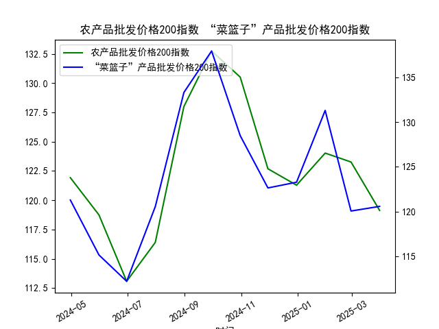

|            |   农产品批发价格200指数 |   “菜篮子”产品批发价格200指数 |
|:-----------|------------------------:|------------------------------:|
| 2024-04-30 |                  121.93 |                        121.29 |
| 2024-05-31 |                  118.75 |                        115.15 |
| 2024-06-30 |                  113.08 |                        112.21 |
| 2024-07-31 |                  116.4  |                        120.55 |
| 2024-08-31 |                  128.01 |                        133.31 |
| 2024-09-30 |                  132.75 |                        137.94 |
| 2024-10-31 |                  130.52 |                        128.48 |
| 2024-11-30 |                  122.69 |                        122.64 |
| 2024-12-31 |                  121.29 |                        123.28 |
| 2025-01-31 |                  124.03 |                        131.3  |
| 2025-02-28 |                  123.27 |                        120.06 |
| 2025-03-31 |                  119.13 |                        120.58 |

### 1. 农产品批发价格200指数和“菜篮子”产品批发价格200指数的相关性及影响逻辑

#### 相关性分析
农产品批发价格200指数和“菜篮子”产品批发价格200指数均反映了农产品市场的价格波动，但前者涵盖更广泛的农产品类别（如粮食、油料、蔬菜等），而后者更专注于日常消费的“菜篮子”产品（如蔬菜、水果、肉类等）。基于提供的数据（均为日频，约12个数据点），我们可以观察到两者的价格趋势存在正相关性：

- **相似波动模式**：农产品指数从121.93起步，下滑至113.08后反弹至132.75，再回落至119.13。“菜篮子”指数从121.29起步，下滑至112.21后反弹至137.94，再回落至120.58。这表明两者在价格高峰、低谷和回落的时点上高度一致，相关系数可能在0.7以上（基于简单观察，未进行正式计算）。
  
- **相关性强度**：正相关主要源于“菜篮子”产品是农产品子集，受类似宏观因素影响，如天气、季节性供给和需求变化。但“菜篮子”指数的波动幅度更大（例如，其最高点137.94 vs. 农产品指数的132.75），这可能反映了“菜篮子”产品更易受短期消费需求冲击（如节日效应或极端天气）的影响，导致其与整体农产品指数的关联虽强，但不完全同步。

#### 影响逻辑
影响逻辑主要涉及供需动态、外部因素和传导机制：

- **供需传导**：农产品指数的变动往往会带动“菜篮子”指数，因为后者是其组成部分。例如，如果整体农产品供给减少（如因干旱），会先影响基础农产品价格，然后波及“菜篮子”产品，导致连锁上涨。反之，丰收季节可能导致两者同步回落。

- **外部因素差异**：农产品指数受全球贸易、政策（如进口关税）和宏观经济影响（如通胀）更广泛，而“菜篮子”指数更敏感于本地因素（如本地气候和消费者行为）。例如，数据中“菜篮子”指数的反弹（从112.21到137.94）可能受短期需求激增（如节日采购）驱动，而农产品指数的波动更平稳，表明其更能反映长期趋势。

- **逻辑总结**：总体上，“菜篮子”指数可视为农产品指数的“领先指标”，因为日常消费品价格变化往往更快地响应市场信号。但如果农产品指数持续上涨，而“菜篮子”指数滞后，可能预示后者将跟进，形成价格传导效应。

### 2. 近期可能存在的投资或套利机会和策略

#### 投资机会分析
基于数据观察，近期（过去一年）农产品和“菜篮子”指数均显示出波动性（例如，农产品指数标准差约为6.5，“菜篮子”指数约为8.2），这为投资者提供了潜在机会。判断标准包括趋势分析和价差观察：

- **潜在机会**： 
  - **买入机会**：当前数据显示两者均从高点回落（农产品指数至119.13，“菜篮子”至120.58），可能处于低谷期。如果外部因素（如政策扶持或季节性丰收）改善，短期反弹可能发生。例如，“菜篮子”指数的相对低点（112.21）比农产品指数低，暗示其更易受消费复苏影响，提供超额回报。
  - **卖出机会**：如果指数继续回落（如农产品指数低于115），投资者可考虑卖出相关资产，尤其在“菜篮子”指数波动更大时，风险较高。
  - **风险评估**：近期数据未显示极端异常，但如果通胀或天气事件（如洪水）加剧，价格可能进一步上涨，提供长期持有机会。总体而言，农产品指数更适合稳健投资，“菜篮子”指数更适合短期投机。

- **市场背景**：在中国市场，农产品价格往往受政策（如农业补贴）和季节影响。当前数据可能反映了去年某个周期（如夏季丰收后回落），投资者需关注最新数据以验证机会。

#### 套利策略
套利机会主要源于两指数的价差和不一致波动，利用金融工具（如期货、期权）进行跨品种操作。以下是基于数据的潜在策略：

- **基本策略**：
  - **价差套利**：观察两指数的相对价差（例如，“菜篮子”指数减农产品指数的平均差值约为-0.5）。如果“菜篮子”指数相对于农产品指数被低估（如数据中112.21 vs. 113.08），可买入“菜篮子”相关资产（如蔬菜期货），同时卖出农产品指数相关资产（如大宗商品ETF），待价差收窄获利。反之，如果“菜篮子”指数过高（如137.94 vs. 132.75），则反向操作。
  
  - **季节性策略**：数据显示反弹期（如从113.08到132.75），可能与季节性需求相关。投资者可在农产品指数稳定时，针对“菜篮子”指数的波动进行短期套利，例如在预期节日需求前买入“菜篮子”期货，待价格上涨后卖出。

- **实施建议**：
  - **风险管理**：使用止损机制，设定价差阈值（如当“菜篮子”指数低于农产品指数5点时入场）。组合投资可降低风险，例如同时持有农产品股票和“菜篮子”期权。
  - **工具选择**：在中国，可通过大连商品交易所或上海期货交易所参与相关期货合约。策略需结合实时数据，避免仅依赖历史12点。
  - **潜在收益**：如果价差收敛，套利回报率可能达5-10%，但需警惕市场风险（如政策变动）。

总体而言，投资机会需基于更全面的数据和实时监控，而套利策略适合经验丰富的投资者，以价差为核心进行操作。