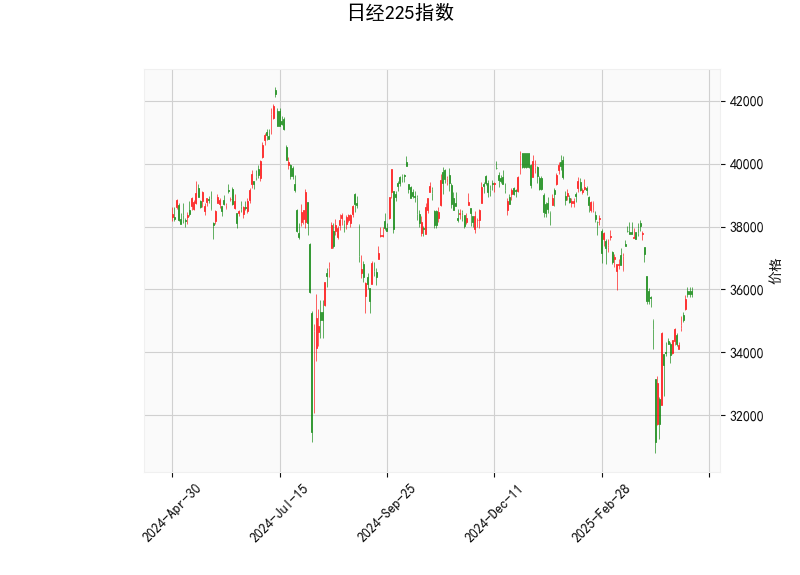

# 1. 日经225指数的技术分析

基于提供的日经225指数数据，我们可以从多个技术指标入手，进行全面分析。这些指标包括RSI、MACD、布林带以及K线形态，共同反映了市场的当前状态和潜在趋势。以下是对这些指标的详细解读：

- **当前价格（35839.99）**：日经225指数的当前价位位于36550.03的中期布林带附近，但略低于它。这表明价格处于一个相对中性的位置，没有明显超买或超卖的极端信号，但也暗示了潜在的波动性。如果价格继续向上逼近上轨（40473.64），可能形成看涨势头；反之，向下测试下轨（32626.41）则可能触发回调。

- **RSI（53.76）**：RSI（相对强弱指数）当前值为53.76，处于中性区域（30-70之间）。这表示市场并未出现过度买入或卖出的情况，暗示短期内指数可能保持稳定或有温和上涨的潜力。如果RSI升至70以上，将进入超买区，增加回调风险；反之，跌至30以下则可能预示超卖反弹。

- **MACD指标**：
  - MACD线（-151.28）和信号线（-497.48）均处于负值，但MACD直方图（346.20）为正。这是一个关键信号，因为直方图的正值表明MACD线正在向上穿越信号线（金叉信号），这通常被视为看涨的短期趋势变化。尽管整体MACD仍为负（显示熊市势头），但这个交叉暗示了潜在的反转，可能带动价格反弹。投资者应密切关注MACD线的后续走势，如果金叉确认，上涨动力可能增强。

- **布林带**：
  - 上轨（40473.64）、中轨（36550.03）和下轨（32626.41）显示布林带处于相对收窄状态。当前价格位于中轨下方，距离下轨有一定距离，这意味着指数尚未进入超卖区域。但如果价格回落至下轨附近，可能形成支撑位；反之，向上突破中轨并接近上轨，则可能触发强势上涨。布林带的宽度暗示市场波动性适中，没有剧烈波动。

- **K线形态（CDLMATCHINGLOW）**：这个形态是一种经典的看涨信号，通常出现在价格底部，表明市场可能形成双底或短期反转。结合其他指标，它强化了潜在的反弹机会，但需验证后续K线是否确认这一模式。如果后续价格企稳或向上突破，这种形态的可靠性将进一步提升。

总体而言，这些指标显示日经225指数当前处于一个微妙的中性偏看涨阶段。RSI和MACD的信号暗示短期内可能有向上趋势，而布林带和K线形态提供了潜在支撑。市场正从之前的下行压力中恢复，但仍需关注外部因素如全球经济数据或地缘政治事件，以避免突发逆转。

# 2. 近期可能存在的投资或套利机会和策略

基于上述技术分析，日经225指数显示出一些潜在的投资和套利机会，特别是考虑到看涨信号的出现。以下是对近期机会的判断和策略建议，重点强调风险控制和实际可操作性：

- **潜在投资机会**：
  - **短期反弹机会**：MACD的金叉信号和CDLMATCHINGLOW形态暗示指数可能从当前水平反弹，尤其如果RSI继续上升至60以上。这为多头投资者提供了进入点，例如通过买入日经225指数相关的ETF（如EWJ）或期货合约。预计反弹目标可能指向布林带中轨（36550.03）或更高。
  - **套利机会**：如果市场预期短期上涨，可以探索跨市场套利，例如在日经225看涨的同时，结合汇率波动（如日元对美元）进行外汇套利。另一个机会是期权套利，例如买入看涨期权（Call Option）而卖出看跌期权（Put Option），以捕捉波动性扩大时的收益。但需注意，当前MACD仍为负，增加了短期回调的风险。
  - **风险因素**：日经225作为日本股市的代表，易受全球经济周期影响（如通胀数据或美联储政策）。如果全球风险厌恶情绪升温，指数可能回落至下布林带，抹去潜在机会。

- **投资策略建议**：
  - **买入策略**：在MACD金叉确认后（即MACD线持续向上），考虑小额买入指数ETF或相关股票。结合RSI的上升趋势，作为进场信号。目标位可设在中轨（36550.03）附近，止损位设在下轨（32626.41）下方，以控制损失在5-10%以内。
  - **套利策略**：采用“跨市套利”方法，例如在日经225看涨的同时，卖出相关波动率较低的资产（如债券ETF），以锁定价差收益。或者，使用期权策略如“牛市价差”（Bull Call Spread），买入近期到期看涨期权并卖出更高行权价的期权，降低成本并放大潜在回报。
  - **风险管理与多元化**：始终设定止损订单，避免情绪化交易。建议将投资组合多元化，例如结合基本面分析（如日本企业盈利数据）或与其他亚洲指数（如恒生指数）相关联。同时，监控全球事件，如果RSI跌破50，及时减仓以规避回调。
  - **整体建议**：这些机会适合中短期投资者（1-3个月），但并非高概率事件。保守投资者应等待更多确认信号，如价格突破中轨。如果您是初学者，建议先通过模拟交易测试策略。

总之，近期日经225指数的技术面显示出谨慎乐观的信号，但投资决策应结合宏观环境和个人风险偏好。始终记住，技术分析并非万无一失，结合其他工具（如基本面分析）才能提升成功率。